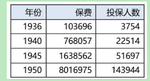

# 巴菲特：1951年最看好的股票：GEICO 保险

# 巴菲特：1951年最看好的股票：GEICO 保险

访谈与文章

在经济繁荣、就业充分、公司盈利和股息都创下新高的背景下，股票的价格不可能低迷。过去五年里，这波经济繁荣势头强劲，几乎没遇到丝毫阻碍，大多数行业都借着这波经济繁荣而兴旺发达。

汽车[保险](../keywords/087-bao-xian.md)行业却没分享到经济繁荣的好处。二战结束后的一段时间里，汽车保险行业陷入巨亏。1949年，情况开始好转。1950年，财产保险公司再次遭遇重挫，[承保](../keywords/089-cheng-bao.md)收益接近过去15年的最低水平。最近财产保险公司发布的业绩乏善可陈，特别是有大量汽车保险业务的，在牛市中热情高涨的人们对保险公司的股票了无兴趣。按正常盈利能力和资产因素衡量，许多财产保险公司的股票被低估了。

**汽车保险是一个受周期波动影响很小的行业**。对于绝大多数投保人来说，汽车保险是必须买的。投保人每年都要续保，保险公司根据去年的出险情况调整保费。从1945年到1951年，保费的增长速度低于物价上涨速度，导致汽车保险公司陷入困境。将来物价降下来，情况会有所好转。

**这个行业有很多优势，例如，没有存货、不需要收账、不需要雇佣大量劳动力，不需要原材料，也不存在产品过时和设备过时的问题。**

[GEICO](../articles/company/09-geico.md) 保险(Government Employes Insurance Co.,政府雇员保险公司)成立于30年代中期，在全国范围内经营汽车保险业务，符合标准的目标客户包括：(1)联邦政府、州政府和市政府的公务员；(2)现役和后备军官以及工资标准为前三等级的士兵；(3)服役期间符合标准的退伍军人；(4)公司的老客户；(5)大中专院校的教师员工；(6)专门从事国防工作的政府雇员；(7)公司的股东。

GEICO 保险不聘请保险代理人，也不设分公司。因此，它的标准汽车保险合同的保费最多比一般保险公司的保费便宜30%。收到理赔后，该公司遍布全国的500多位业务员能快速处理。

“成长型公司”这个词这几年已经被用烂了。在比较宽松的竞争环境中，**许多公司销售额增速还赶不上通货膨胀，竟然也被称为成长型公司**。如下列数据所示，GEICO 保险是名副其实的成长型公司。

没错，昨天的成长无法为今天的投资者带来利润。**但是，有充分的理由可以相信，GEICO 保险的成长潜力还远远没有释放出来**。1950年以前，在美国包括华盛顿特区和夏威夷在内的50个行政辖区内，该公司仅在其中的15个行政辖区获得了牌照。1950年年初，它在纽约州只有不到3000个投保人。纽约州人口密集，保费价格比人口稀少的州更高，GEICO 保险应该更有竞争力。

**当经济不景气、价格竞争加剧时，GEICO 保险凭借更低的保费肯定能比竞争对手获得更多生意**。随着通货膨胀加剧，保费越来越高，GEICO 保险实际为投保人节省的保费金额也越来越高。

GEICO 保险不设代理，所以没有压力，完全可以拒绝不合格的申请人、不续签风险较高的保单。有些州的保费太低，它可以暂时先不在这些州做生意。

**GEICO 保险最诱人的地方或许是它超高的利润率**。1949年，GEICO 保险的承保利润与满期保费之比是27.5%。按照贝氏评级报告统计，135家财产保险和担保公司的这一数据平均值为-3.7%。1950年，整个行业都不景气，贝氏评级报告统计的行业利润率下降到3.0%，GEICO 保险的利润率也下降了，但仍然高达18.0%。GEICO 保险不是所有意外保险都做，但是人身伤害保险和财产损失保险在它的业务中所占比重较大，这两项业务的盈利能力都比较差。它还承销了大量车辆碰撞保险，这部分业务1950年的盈利能力较强。

1951年上半年，几乎所有保险公司的财产保险业务都出现了亏损，其中人身伤害保险和财产损失保险是最不赚钱的。GEICO 保险的利润率降到了9%多一点，但马萨诸塞州的保证保险公司亏损16%，新阿姆斯特丹财险公司亏损8%，标准意外保险公司亏损9%。

**GEICO 保险处于快速发展阶段，现金分红很低是正常现象**。由于派股和1拆25拆股，流通股从1948年6

月1日的3000股增长到1951年11月10日的25万股。它还发放了配股权，可用于认购附属公司的股份。

1948年，[本杰明·格雷厄姆](../articles/person/01-benjamin-graham.md)管理的投资信托购买了这家公司大量的股份，并将它的大量股票分配给信托的投资者，格雷厄姆是该公司的[董事会](../keywords/036-dong-shi-hui.md)主席。利奥·古德温(Leo Goodwin)是GEICO 保险的创办者，他带领公司高速发展，目前担任公司总裁。1950年年末，董事会中有10名董事，他们合计持有该公司流通股的三分之一左右。

1949年，该公司每股盈利是4.71[美元](../keywords/116-mei-yuan.md)。1950年，业务规模缩减，该公司的每股盈利是3.92美元。除了上述盈利之外，**这两年该公司都积累了大量未到期保费储备**。1951年的盈利应该比1950年低，但是今年夏天经历了一轮保费上调，这应该会在1952年的盈利中体现出来。从1947年到1950年，随着公司资产增长，它的投资收益翻了两番。

目前，该公司的股价是1950年盈利的8倍，1950年还是行业不景气的一年。**这个价格没体现出该公司蕴含的巨大成长潜力。**
