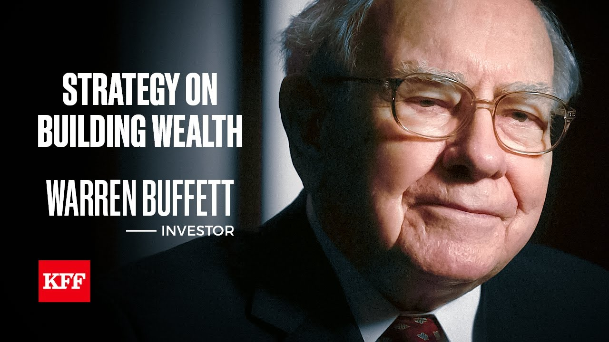

# 巴菲特：2021年专访《成为巴菲特》

# 巴菲特：2021年专访《成为巴菲特》

访谈与文章

## 《成为巴菲特》

> 2021年巴菲特接受HBO专访，拍了个纪录片《成为巴菲特》，时长1小时，在这部纪录片中，[沃伦·巴菲特](../articles/person/13-warren-buffett.md)深入分享了他的投资理念和人生观。他强调了“永远不要亏钱”的重要性，并解释了这一原则背后的深层含义，即在投资中始终保持谨慎，避免不必要的风险。
> 巴菲特回顾了自己的成长历程，从年少时对数字的热爱，到后来在哥伦比亚大学师从[本杰明·格雷厄姆](../articles/person/01-benjamin-graham.md)，逐步形成了自己的[价值投资](../keywords/024-jia-zhi-tou-zi.md)理念。他谈到，投资不仅仅是购买股票，更是购买企业的一部分，因此了解企业的本质和长期前景至关重要。
> 在访谈中，巴菲特还分享了他对生活的看法。他提到，与值得信赖的人合作，以及保持对工作的热情，是他成功的关键因素之一。他还谈到了家庭对他的影响，尤其是妻子苏茜在他人生中的重要作用。

**采访视频时长50分钟，以下是完整的内容**

### 伯克希尔·哈撒韦股东大会

伯克希尔·哈撒韦的股东大会在某种程度上是一堂商业课，同时它又是一个有趣的节日，它有点像每年都会吸引人们前来的狂欢节。对我们来说，这是一个可以尽情玩乐的机会，也是与那些把钱交托给我们的人见面的机会。我们希望确保他们度过愉快的时光，并且我们也希望他们不仅了解伯克希尔本身，还了解他们应该对投资总体持有的一种态度。

### 伯克希尔·哈撒韦团队

我们是一个名为伯克希尔的公司，但这种关系不仅仅止于此，就我们对股东的感觉而言，我们把他们视为我们的合伙人。查理和我是管理合伙人，其余的是沉默合伙人，但我们持有的是合作伙伴的态度。他们不是一些没有面孔的一群人，这也是为什么在年度大会上，我很喜欢看到大约四万人，那真的赋予了我们每天所做事情以真实的意义。

### 关于撰写年度报告

你知道，我可能是为数不多的——实际喜欢写年度报告的——[首席执行官](../keywords/033-ceo.md)，或者像有些作家说的那样，我喜欢“写完”年度报告。写的过程本身可能是很费力的，但我想要呃，我想要告诉他们——或者说跟他们谈谈，如果我们的位置互换，也就是他们在经营公司而我是股东，那我会想知道些什么。所以我脑海中会设想我的两个姐妹，多丽丝和伯蒂，她们非常非常聪明，把她们净资产中很高比例都投入了伯克希尔，所以她们感兴趣，但她们不会天天关注商业新闻。所以我假装她们已经出门一年了，而我现在在向她们汇报情况，告诉她们如果她们在经营这家公司，而我是那个沉默合伙人，我会想了解些什么。

### 关于《击球的科学》

是的，特德·威廉姆斯写过一本书，叫《击球的科学》。书里有他在击球时的照片，击球区被划分成了，我记得是77个小方格，从胸前的字母位置一直到底部膝盖的位置，覆盖整个本垒板宽度。他说，在击球中最重要的事情就是等待合适的球。如果他等到了正好落在甜区的球，他就能打出四成的打击率；但如果他不得不打那些落在角落的球，他的打击率可能只有二成三五。

而在投资中，我处在一个“不会被判好球”的行业，这就是你能处在的最好的行业。如果特德的球数到了0好2坏或1好2坏，而球又落在那个他只能打出二成三五的角落位置，他仍然得挥棒，不然就会被三振出局。而在投资中，没有人会判你好球。我可以看一千家公司，我不需要对每一家都判断正确，甚至不需要对其中一半、一刻对得上就行。唯一让我被“判好球”的方式就是我出手而没打中。

所以我可以挑选自己想打的球，我可以在那等着，而投手可以一直投球，但只要那些球不在我的甜区，我就不需要挥棒。而这在大多数行业中是一个巨大的优势。当然问题在于，如果你面前有一群人在大喊：“挥棒啊，你这废物！”——你就一直站在那里，扛着球棒一次次等球，那你可能会忍不住挥向错误的球。所以你必须确保在心理上不会陷入一种状态，让你觉得你必须去挥那些根本不在你的甜区的球。

### 关于决策

我大概每两年做出一个很棒的决定，你在投资中一生只需要做出非常非常少数的正确决定。你可以说，一个在50年前买入伯克希尔·哈撒韦的人，只需要做出一个决定就够了。

人们在[股票市场](../keywords/099-gu-piao-shi-chang.md)中太频繁地采取行动，这种冲动来自于股票的高[流动性](../keywords/102-liu-dong-xing.md)。他们知道自己不能每天买卖农场，也不能每天买卖公寓楼，但他们可以每天买卖股票——而这是一个流动性极高、交易成本非常低的市场。本来这应该是一个巨大的优势，但人们却把它变成了劣势，因为他们觉得既然有这种交易的机会，就必须每天都去利用它。

实际上，频繁交易只会让他们支付很多佣金。最主要的做法是，买入一家优秀的企业，然后就坐在那里，什么都别动。

我得说，我几乎没收到什么恶意邮件，呃，呃，我倒是收到很多求助信。曾经有个家伙问我要13亿[美元](../keywords/116-mei-yuan.md)，他写信给我大概70次了，而且从没降低过他要的金额。我甚至有点佩服他那种“绝不谈判”的态度。

也许在社会议题方面会有点争议吧，比如当我写[税收](../keywords/120-shui-shou.md)问题时，我收到几封信说：“既然你觉得交税这么好，你干脆把你所有的钱都捐给美国政府好了。”但总体来说，我收到的恶意邮件真的非常非常少。

### 关于奥马哈和内布拉斯加州

奥马哈和内布拉斯加就是我的家。我小时候在这儿过得很愉快，直到大概12岁时我们搬去了华盛顿。我交了很多朋友，这里的一切都让我觉得像是“家”。我回过我的小学——罗斯希尔小学——至少有六次了，我去参加那儿的市集之类的活动，有时候甚至还会去给几个小学班级讲课。

这里有很强的连贯性、社区感，还有友情。我认识的人里，现在可能都认识他们的父母甚至祖父母了。我去餐馆吃饭时，常常会有很多人跟我打招呼：“嗨，沃伦！”——他们有的是我认识的，有的是只是热情的当地人。

我的孩子们也在这里度过了快乐的童年。他们的叔叔、阿姨、祖父母都住在一两英里范围内。这里是个非常稳固、友好、适合成长和经商的地方。

我们办公室里有25名员工。如果你回到去年的圣诞派对看看——我们今年还会拍一张集体照——你会发现，今年的25个人和去年一模一样，连一个都没有变。现在我们公司有35万名员工，而总部只有这25人。我想，世界上没有哪家公司能做到这样：没有增加一个人、没有减少一个人、也没有更换一个人。

### 在奥马哈工作

在奥马哈工作无疑让我的工作既更愉快，也更高效。我的一切安排都像是量身定制的——我住的地方离办公室只有五分钟路程，而且我已经来回走这段五分钟的路，嗯，有53年了。呃，你知道的，我在工作中没有任何压力，真的一点都没有。我想这可能不仅帮助我活得更久，而且无疑也让我活得更快乐。

### 早期的合伙事业

1956年初，我从纽约回到家乡时，我完全不知道接下来要做什么。我知道我会去上几门课，也会读很多书，但我完全没有打算成立一个投资合伙企业。

不过回家几个月后，家里的一些亲戚问我：“我们的钱该怎么处理？”我回答说，我不会再去做卖股票的生意了，但如果你们愿意跟我一起做一个合伙项目——有点类似我在本·格雷厄姆那儿工作时的模式——我很乐意来做。

所以回家几个月后，我成立了第一个合伙企业。那时我还在租房子，从来没买过房子。我租的是离家族开的杂货店一个半街区远的房子。房子里有一个小房间连着卧室，那就成了我的办公室。

然后在两年后的1958年，我买下了现在仍然住着的那所房子，那间房子也有一个卧室外的小房间，我又在那个房间里工作了大约四年。所以有大约六年时间，我是在家工作的。每天我会开车出去取信件，写支票。后来我运营了11个合伙企业，所有的支票都是我一个人写的，我还自己报了11份所得税申报。我代表不同的合伙企业接收股票，我就是一个单枪匹马的团队，这样干了整整六年。

### Kiewit Plaza 办公大楼

时间来到1962年初，我搬到了Kiewit Plaza。他们那时正好刚在建这座楼，正在收尾阶段。我雇了两个人，一个是秘书，另一个是跟我一起分析投资的同事，比尔·斯科特。

比尔和我现在还是朋友，他至今仍住在奥马哈。从那时开始，我们开始像一个真正的公司了。等我搬进Kiewit Plaza时，我们已经有了700万美元的投资。最开始的那个合伙企业，只是以105,100美元起家的——我出了那100美元，其余的105,000美元是其他人出的。

后来，随着时间推移，有更多人看到前面那些合伙企业的运作成效，我犯了个错误：又去成立了新的合伙企业。结果就造成了多份支票、多份报税、多项管理工作。最终，把它们合并起来才变得合理。所以当我在1962年1月1日把它们合并时，我们已经有了700万美元，其中有很大一部分是这些年新加入的人带来的资金，但也有相当一部分是前几年积累的利润。

### 结束合伙事业

我结束合伙事业——其实那时已经只剩一个合伙企业了——是在1969年年底。我之所以结束它，是因为我真的看不到投资领域还有什么好机会。而且60年代末市场上也出现了很多疯狂的现象，我虽然明白那些人都在做什么，但我并不认同他们的做法，所以我不想加入那场游戏。

另一方面，我也不喜欢坐视不动却让自己的业绩看起来很差。所以我决定把钱还给合伙人。我不希望我的好胜心理驱使我继续参与一场我已经觉得自己不再具备优势的游戏。

所以这其实是一个生活方式的决定。我已经拥有了我所需的一切，而合伙人们也都赚到了钱。此外，我安排了几位非常优秀的朋友继续帮助他们管理资产。

当然我也有一些社会方面的想法，但这些想法并不与我的决定冲突。我本可以一直双轨并行地过下去——从某种意义上说，我确实也这样做了——但在1969年决定解散合伙企业的时候，我并没有规划好后面的所有事情。

### 开始留长头发

曾经在60年代末，我太太苏茜对我说：“我不介意嫁给全国倒数第二个还剪寸头的人，但我真的不想嫁给最后一个还留寸头的人。”所以在那时，我就不再留寸头了。

### Stage Delicatessen 派对

我们办了一场很棒的派对，苏茜特别擅长筹划派对，她很有想象力。我们有很多朋友。呃，我很喜欢纽约的 Stage Delicatessen，所以每次去纽约，我和苏茜都会去那里。于是她决定在奥马哈举办一场“Stage Delicatessen 主题派对”。

我不记得那天晚上来了多少人，但真的来了很多人，大家都玩得很开心。那是六十年代，苏茜总是能想出各种点子，她真的很擅长办派对。她全身心投入其中，想出很多很棒的创意。而我嘛，就是去吃吃喝喝，然后负责买单。

### 掌控伯克希尔·哈撒韦

这个合伙企业在1965年获得了对伯克希尔·哈撒韦的控股权。虽然我从未担任董事长或总裁的头衔，但我确实在管理伯克希尔·哈撒韦，因为我们拥有控股权，所以所有的决策都是由我来做的。我[收购](../keywords/029-shou-gou.md)了[National Indemnity](../articles/company/11-national-indemnity.md)公司，还买下了报业资产。负责纺织业务的那位先生在采购新设备前也会向我请示。所以我是CEO，只是我从来没有拿那个头衔而已。

马尔科姆·蔡斯是当时的董事长，他是一位非常好的人，也在我获得伯克希尔控制权的过程中给予了帮助，所以没有理由去改他的头衔。他仍然是董事长，但并不负责经营事务，他把业务管理权交给了我。

当我们在1969年年底解散合伙企业、将伯克希尔股票分发出去后，我才正式担任董事长，这也只是为了形式上的确认。因为原本的控股股权已经因合伙人解散而分散开来。但实际上，从1969年到1970年，什么都没有改变。

### 在社会议题上的发声

我觉得，在民权、计划生育等一些社会议题上发声的愿望，其实很自然。我的想法是：如果我都不能发声，那谁还能发声？毕竟，我不会因为在某个地方发表言论而被我的雇主解雇。

我在一些社会政策上确实有强烈看法。当然你不能总是随便发言——一个整天到处表达观点的有钱人听多了也会让人厌烦。所以我不想太频繁地发声。但当我看到自己缴的税率比办公室里其他任何一个人都低，那让我感到不安。在这个历史上最富有的社会里，[财富分配](../keywords/109-cai-fu-fen-pei.md)的不平等让我感到困扰。

我并不想在改变体制的过程中抛弃这个伟大的国家——它是人类历史上最伟大的社会，但我有时候确实觉得应该站出来说话。我很喜欢经营伯克希尔，但我也不能假装自己不是这个国家的公民。我在股东大会上也说过，我愿意拿一份很小的工资，但我不愿意把我的道德观“交付信托”不再使用——这不是我这份工作的附带条款。

如果有些伯克希尔的股东对我在税务等话题上的发声感到不适，他们要么接受，要么选择别的投资对象。因为我并不觉得，自己因为是大公司的负责人，就该放弃作为一个公民的权利。

美国对我和我的家庭实在是太好了。你想想，世界上有70亿人，美国只有3亿多一点，而我非常非常幸运地出生在这个国家，而且正好赶上了美国史无前例的繁荣时期。

我今天之所以成功，并不是因为我比邻居更优秀，而是因为我的大脑结构刚好适合某种事物。就像有人适合下棋、有人擅长桥牌、有人会写音乐，我碰巧擅长一件在这个社会中回报极高的事——但这件事如果在200年前、或者在其他很多国家，可能根本赚不到钱。

所以，美国对我来说是非凡的，这个国家未来也会更好。我的愿望并不是让所有人都“平等”，但我希望没有任何一个美国人应该在这个国家拥有糟糕的经济前景。我们完全有能力做到——只要一个人愿意努力工作，就能在这个社会中获得体面的生活结果。

### 我收到过最好的“实物”礼物

嗯，我收到过最好的礼物，就是我出生时拥有了那位父亲。那完全不是我能决定的事情。

此外，我在基因上也得到了某种“布线”的恩赐，这种天赋在一个高度发达的市场体系中非常有用——这个体系里桌上摆满了筹码，而我恰好擅长这场游戏。其他人可能擅长用手做事，比如医生，他们能进行我永远做不到的外科手术；有的人可能在艺术或建筑方面极具天赋。每个人都有不同的天赋，而我碰巧获得了一种在这个时代、在这个国家，具有巨大商业价值的能力。

但我真正觉得自己“被眷顾”的，是我这一生中遇到的人。其中一些人，是我有意识地选择与之交往的——这点我会给自己一点点功劳。但如果从我父亲开始算起，那是我毫无选择权的一个起点，而那给了我人生前二十年，甚至整个生命中，一个多么美妙的开端。

### 关于查理·芒格

查理·芒格是一个非常棒的合伙人。他聪明得不可思议。他的知识面比我广得多，在我可能不擅长的一百个领域里，他都比我更优秀。他非常擅长用很少的字数表达非常重要的思想，而且他总是坦诚地告诉我真实的看法。

我很认真地听他的话。事实上，就在上周，因为他对我说的一句话，大概只有十个字，我就改变了自己的某个行为。

在投资方面，他对我的影响很大。他让我从本·格雷厄姆的思想中走出一些，引导我去寻找“优秀公司的合理价格”，而不是“普通公司的超低价格”。这种思维转变意义重大，因为它让伯克希尔能够实现规模化——这是靠原来那些廉价收购低质量公司无法做到的。

### 关于苏茜在我成功中的角色

苏茜……当我十几岁的时候，我已经在商业方面具备了相当不错的能力，但我对这个世界还没真正弄明白。我是个不平衡的人，也许现在仍是。

而苏茜，是那个“把我拼凑完整”的人。她就像拿着小洒水壶的人，而我就像是一粒种子埋在土里——但正是因为有了她那壶水，我才能成长、成熟。

她是一个非常美好的人，她相信我。她“把我组合起来”。如果没有她，我不仅不会成为今天这个人，我在商业上也不会取得同样的成功。

她让我变得更完整。她从不在意金钱或商业。有一次我们和我的一个朋友——赫尔·沃尔夫——在纽约吃饭，回程时我们坐地铁回曼哈顿。他家住得稍远。路上她问我：“沃伦，一百万里面有几个十万啊？”

我当时就知道，自己可绝不能把支票簿交给她。

### 关于爱上苏茜并结婚的故事

嗯，我也说不清具体是怎么回事——你可能得去问罗杰斯与汉默斯坦那样的人（指创作浪漫爱情故事的人），才能解释清楚当你遇到某人、仿佛“那个房间另一端的陌生人”时，到底发生了什么。但我知道，她就是我的那个人。所以我没有浪费时间。

虽然我起步不顺，但我追得非常热烈，呃，非常坚定。她19岁时嫁给了我，我当时是21岁。戒指是我买的。我曾告诉比尔·盖茨，在他准备结婚时我还试图卖他一枚戒指——他在1994年1月1日结婚——我跟他说，我当年给苏茜买戒指花了我净资产的6%。所以我说：“你来我们珠宝店看看吧，这算是个参考标准。你可以略微调整一下，但6%大致就是个合理的比例。”

我们的婚礼那天其实挺有意思的。那时我在内布拉斯加州国民警卫队服役。1952年4月19日，密苏里河开始泛滥，我原定下午三点结婚。结果中午我接到了一个电话。

我接起电话，那人说：“巴菲特下士？”我回答：“是的，长官。”他说：“我是墨菲上尉。”然后他问我：“你几点结婚？”我说：“三点。”他说：“我们已经被动员了，下午五点到军械库报到。”

这对结婚日来说，显然不是个好兆头。

但过了一会儿，我又接到电话，是第34师的司令将军。他说：“我撤销了墨菲上尉的命令。你去度蜜月吧，好好享受。”

幸运的是，最初那个墨菲上尉说话有些口吃。要不是这样，我可能会以为是婚礼上的伴郎在恶作剧开玩笑。要是我真的回了什么刻薄的话，可能就得去蹲禁闭几个月了。

我在婚礼上没有戴眼镜。那时候我几乎看不见什么（现在一只眼睛稍微矫正了一点），但我太紧张了，就决定把眼镜摘了——这样我就看不见坐在台下的所有人了。

### 关于苏茜与歌唱

苏茜有一副极好的嗓音，她一直都很喜欢唱歌。我也喜欢唱歌，但可惜的是，我没有她那样的嗓音。到了1970年代中期，她决定想尝试在观众面前演唱。

刚开始在众人面前唱歌其实并不轻松，也没什么乐趣，但我鼓励她去尝试。她开始在本地做些表演，也偶尔在纽约唱几场。我的朋友比尔·罗文帮她联系表演机会，我们后来还给他起了个外号叫“百老汇比尔”，因为他总是在格林尼治村一带到处联系演出。

她唱得真的非常非常好。

### 关于我的饮食习惯

我喜欢吃的东西，其实就是我六岁生日那天吃的那些。我觉得那天的菜单太棒了：汉堡、热狗、可乐，还有巧克力圣代。我很早就找到了适合我的食物口味，而且一直坚持到85岁，现在看来效果还挺不错。

我从来不觉得有什么必要去吃那些我排在第40喜欢的食物，既然我可以吃我最喜欢的。说实话，我吃过很多五百美元甚至上千美元的饭局，但我发现它们都比不上一个做得好的汉堡、一份新鲜的薯条、再加上一罐可乐。

我实在看不出为什么要为了迎合别人的口味去吃东西。我知道，如果我一辈子都吃西兰花、菠菜、球芽甘蓝和芦笋，我不认为我会活得更久。其实我倒觉得，那种生活会让我“觉得”时间特别漫长。

我的饮食方式对我来说一直很有效。当然我不是在鼓励别人这么吃，但对我自己来说，它真的挺奏效的。

### 关于我的母亲

我母亲过得不容易。她的母亲最后住进了精神病院，她自己也背负了家里很多重担。她非常敬爱的哥哥早年去世，家人都把她看作家庭的支柱。

她当然跟随我父亲去了华盛顿，参与了我父亲所有事务，尽心尽力。但我几乎可以肯定，她当时得的是偏头痛——当然那时他们有不同的叫法。她常常背负着整个世界的压力。

她有时会变得很难相处，有时又会非常温暖。可一旦她情绪不好，家里的三个孩子都能感觉到。她非常聪明，也很外向，是我父亲的优秀助选手。但她也承受了很多心理上的压力。

高中毕业后，她还工作了几年，凑够钱去内布拉斯加大学念书，在那儿遇见了我父亲。我想她在成长过程中有很多不快乐的经历，只是她从不说。这些可能在某种程度上影响了她的态度。

至于那些头痛，他们当时用了别的术语来形容，但我认为那是偏头痛。她经常处在身体疼痛之中。

### 父亲给我的昵称

我父亲给我起过各种各样的昵称。他有时候叫我“火球”（Fireball），因为我对股票市场非常着迷。他还会叫我“杰西·利弗莫尔”，那是一位著名的股票[投机](../keywords/106-tou-ji.md)者。他有很多不同的叫法，但“火球”大概是他最常用的称呼。

我精力旺盛——其实到现在，只要是我感兴趣的事，我还是很有活力。我那时候好奇心很强，也很喜欢和大人聊天。只要家里有他的朋友来访，或者有家族朋友来，我都会玩得很开心。我通常喜欢和那些男士聊天，但如果我在邻居家附近溜达，也会和那些家庭主妇聊聊天。

我精力充沛、想法很多，还会自己开始一些小生意什么的。我觉得他被我的这些举动逗乐了，也许这就是“火球”这个称号的来源。

### 在父亲办公室阅读投资书籍

我最早接触到的投资书，其实是在我父亲办公室里读到的。周六我会去找他，他通常会在Johnny’s Cafe和他的一个或两个合作伙伴一起吃午饭，他们在南奥马哈经营一家饲料公司。

我特别喜欢跟去吃午饭，但我会提前到办公室，在那儿看书。没多久我就把办公室里所有的书都读完了。于是我开始去公共图书馆。我喜欢钻进放商业书的书架之间，把所有投资类的书都看一遍。

在我们搬去华盛顿之前，也就是我12岁之前，我已经把那些书全都读过了，其中一些还看了不止一次。我真的非常热爱阅读。那时候我们家里并不买书，图书馆对我来说就是天堂。

我常常乘电车去YMCA，再去图书馆，然后在晚饭前回家。

我甚至有一次被锁在图书馆里——当时是奥马哈大学的图书馆。我沉浸在书架深处看书，结果他们关门时没发现我。我被困在里面几个小时，最后还是我岳父（那时他是那里的院长）把管理员叫来，把我放了出来。

### 性格与社交

我们还住在奥马哈、还没搬去华盛顿之前，我的性格就非常外向。我不只和同龄人交往，也很喜欢和大人说话。虽然我对女孩会害羞（在那个年代这也挺正常），但我总是喜欢与人相处。

### 专注的重要性

“专注”一直是我性格中很强烈的一部分。如果我对一件事产生兴趣，我就会非常非常投入。

无论是哪个主题，只要我感兴趣，我就会想读它、聊它、认识这个领域的人。这一点，我的很多朋友也有，比如查理·芒格就是一个极度专注的人。

我认为，如果我没有这种极强的专注力，我绝对不可能在商业上做到今天的程度。我会在晚上逐页翻阅那种两千页的《穆迪手册》，逐家公司研究，思考每一项业务。这种专注真的给我带来了巨大的回报。

### 与姐妹们的关系

我有两个姐妹，年龄上一个在我前面两岁（多丽丝），一个在我后面两岁（伯蒂），可以说我们三人是等距的。我们小时候在一起玩得很开心。

随着年龄增长，关系自然会有些变化。多丽丝是老大，她最早对男孩子感兴趣，而这种年龄差在某种程度上也会影响我们在特定时期的互动模式。但我一直非常喜欢我的两个姐妹。

我们之间也会有点竞争。比如小学时我们会有拼写比赛，每个班选出六个学生，去跟高年级的六个学生比拼，一直拼写到只剩下六个人，然后再进入更高一层的挑战。我一直想超过比我高两个年级的多丽丝，我相信伯蒂也一定想超过我。所以我们在某些方面是有竞争意识的。

我们一起坐车时也很开心，一起唱歌、做各种事。我很幸运在出生时就有她们做我的姐妹。

我是在1930年出生的，那时候，出生时是男孩还是女孩，差别是巨大的。我的两个姐妹和我一样聪明，甚至性格比我更好，尤其是在我们小时候。但那时候，没有人会说父母不平等对待我们，也没有老师会说我们受到不一样的教育待遇——但“期待”是不同的。

因为我是个男孩，他们被期望的，是找个好丈夫，也许在婚前可以当个秘书之类的，从事一些临时工作。而我这边的期待是——“前途无量”。这真是天壤之别。

我很早就意识到这极其不公平，后来在生活中我又遇到许多类似例子。但最早让我注意到这种性别差异的，就是我身边这两个非常聪明、极具人格魅力的姐妹。她们是极好的人，没有人会当面说：“你们没有沃伦那样的机会”，父母也绝不会这样讲，但那种差异无所不在，存在于整个社会之中。

### 关于商业与情绪

在投资领域，如果你带着情绪去操作，是不会做得好的。事实就是事实，[理性](../keywords/073-li-xing.md)就是理性。

你可能会对某只股票有各种情绪——你可能爱那些涨得多的，恨那些跌下来的——但那完全没意义。股票又不知道你是它的股东，你对它再有感情，它对你一点感情都没有。它的表现只反映它背后那家公司的表现。

所以我和查理·芒格做投资决策、做商业判断的时候，是不掺杂情绪的。当然，这不代表我们对生活、对身边的人没有情感——我们在很多方面都是充满感情的人。

但如果你把情绪掺进了商业和投资决策里，那你很可能会做出很多愚蠢的决定。

### 美国商业的变化

我确实认为，美国的商业——显然这个国家经历了发展，出现了许多新产品和新领域——但从本质上来说，**管理者的角色其实并没有发生根本性变化**。你始终需要那些具有领导力的人，需要那些能“看见山头另一边”的人，需要能带领他人前行的人。

你还需要那些对现状永远不满足、总想找到更好方式制造产品、开拓市场的人。

这个国家的市场体系，确实在激发人类潜能方面非常了不起，而且几十年来一直持续在这样做。这也是为什么在我一生中，美国的人均实际GDP已经上涨了6倍。

当你回顾人类历史上那些世纪末和世纪初生活几乎没有变化的年代，再看看美国自1776年以来飞速的进步，你会意识到，我们确实找到了“秘密配方”——那就是市场体系。

当然，这个体系也存在一些需要调节的地方。但不可否认的是，**它在生产人们所需的商品与服务方面，比世界上任何其他系统都更有效。**

### 关于不平等的危险

一个**高度发达的市场体系的自然属性**，就是将更多的奖励集中到那些极其适应它的人身上。而与此同时，那些虽然对这些成功者的成就不可或缺、但却不具备高市场价值技能的人，反而会越来越被甩在后面。

如果没有税收或其他形式的政府政策来缓解这种差距，这个**财富鸿沟就会持续扩大**。

你看看，比如纽约的某位套利专家，因为能发现极小的价格差异，每年能赚上千万美元；而与此同时，在阿富汗前线的士兵每天在挨枪子，却每月只挣微薄的薪水。

市场系统在生产商品与服务上确实很出色，但**它分配这些财富的方式，会越来越不平均**。这并不是因为人们本身“邪恶”或者冷酷，而是这个系统自身的逻辑。

所以，政府必须承担起平衡作用，确保在这个极其富裕的社会中，那些努力工作、遵纪守法的公民不会以一种极其悲惨的方式被甩在后面。

### 关于慈善

慈善源于一个认识：**这笔钱对我而言已经没有任何实际用途了**。它买不到我想要的任何东西。就算我只动用我净资产的1%，甚至0.1%，我都能过上我想要的生活。

但这笔钱对别人却有极大的价值——它能挽救生命、提供教育，做很多有意义的事情。所以，把这些资源转移给真正需要它的人，是很自然的选择。**这笔钱对我毫无用处，却对别人能产生巨大影响，继续留着它就是浪费。**

### 关于贪婪与投资

我不觉得自己是靠“贪婪”成功的，**贪婪反而曾让我惹上麻烦**。在我看来，投资并不是靠贪婪，而是**合理地把资本投放到那些能带来好回报的地方**。

通常来说，贪婪往往和嫉妒有点关系，那是一种“为了钱而赚钱”的冲动。但钱其实到了某个程度之后，对你的生活并不会再有什么实质帮助了。所以，**靠贪婪去追求金钱，其实是非理性的。**

我做的事情，是我认为聪明、合理的。我是为我自己做，也为伯克希尔的股东们做。我不希望和贪婪的人做合伙人。如果我的合伙人是贪婪的，那我就有麻烦了。我宁愿他们另找去处。

我想要的合伙人，是那些**对长期、智慧决策所带来的合理回报有期待**的人。

（顺便一提）我每天都会读《奥马哈世界先驱报》《纽约时报》《华尔街日报》《金融时报》，还有《今日美国》。

### 我犯过最严重的错误

嗯，可能我犯过最严重的错误，其实是**对人的理解不够深刻**。这类错误比技术层面上的错误要严重得多。

从技术角度讲，我现在的脑力肯定不如50年前了。你要是让我参加一个测试，比如记忆力测试、理解新概念的速度、心算能力之类的——这些我现在都不如我20岁或30岁时的水平。

但另一方面，我现在对人性的理解远比我年轻时深入得多。我很希望自己在20岁的时候，就能像现在一样理解人。如果那样的话，很多事情都会变得更好。

### 金融世界的阴暗面

在任何社会中都会存在骗子。我并不认为我们的社会比别的社会培养了更多这种人，但总会有些人因为各种原因，走上了错误的道路。

有时候这种事情发生在商业领域，有时候是在投资领域。而由于我自己的背景，有时候我能比监管机构更早识别出这些在投资世界里搞鬼的人。

我和查理·芒格都曾指出过一些我们认为是**不道德、或直接欺诈的行为**。这种现象是永远不会消失的。因为投资、金融、商业领域里都有**巨额金钱**流动，而**在这种体系中，总会有人想出各种方式去作弊**。

这些手段也会随着时间推移变得更复杂。而监管机构往往跟不上这些变化，反应很慢。

我个人认为——虽然这点无法量化地证明——**牛市期间这种问题会更多**。当股价快速上涨时，人们的道德往往也会松动，大家会觉得：“反正别人也在这么做，那我为什么不能做？”

这就是我在1969年决定关闭合伙企业的原因之一。那时候，很多人通过各种“玩法”在股市中迅速发财，而我不想参与这样的游戏。

我也不喜欢我的投资结果拿去和那些人相比，因为他们会在这场游戏里“赢”，但我根本不想按他们的规则玩。

### 1968年与格雷厄姆的一次会议

我们“格雷厄姆学派”的第一次聚会是在1968年。当时我们11个人和本·格雷厄姆见面，我们其实就是在问：“这一切到底还能持续多久？”

那时华尔街上各种“花招”满天飞，媒体称赞这些人，投资者把他们当英雄。但他们做的事情，其实就是靠[会计](../keywords/055-kuai-ji.md)手段在制造幻觉。

格雷厄姆告诉我们：“这种情况可能会持续很久，但终究会结束。”

当然，后来确实如他所说——一切终将归于现实。

### 关于诚实

诚实是必须具备的品质。首先，我必须对伯克希尔·哈撒韦的股东保持诚实。我想我们现在有超过一百万股东，他们是我的合伙人，把钱托付给我管理。

这也是为什么在年度报告中，我会尽力向他们讲明我犯过的错误，而不仅仅是展示成绩。我相信年报应该是“年度报告”，**而不是“年度宣传册”**。

就像查理说的那样——当你一直说真话时，**你根本不用记住自己以前说过什么**，这会让事情简单很多。

### 关于伯克希尔·哈撒韦的未来

等到我不再掌舵时，伯克希尔的文化会依然延续下去。我们的文化非常深厚，我不敢说它是“独一无二”的，但它肯定是**非常特别的**。这种文化渗透在我们的[董事会](../keywords/036-dong-shi-hui.md)、股东群体、以及管理层中。

我认为，如果有人试图对这种文化进行大规模改变，它会像**外来异物一样被排斥掉**。

我们现在规模太大了，不可能再取得过去那种百分比级别的增长了，但我们仍然可以是一个**非常出色的企业**，而且我相信这种特质会持续很长时间，不会轻易改变。

随着时间推移，管理的资金总额会越来越大，但**伯克希尔的基本原则不会变**。这也是为什么我把这些原则写在每年年报的最后面，我已经坚持这么做了大约35年了。其他公司没人这么写，但我们希望股东理解：**这就是我们看待公司的方式**。

当我写下这些原则时，不只是为了向大家说明我们的理念，**也是在为我自己、甚至为我的继任者设定框架**。通过年报中某些部分的措辞，我也在有意识地给未来的管理人“画边界”。

伯克希尔必须是一家结构清晰、运作独特的公司。我已经花了50多年时间建立这种结构，我几乎可以确定，未来的继任者——无论是一个人还是多个管理者——都将会延续这一基本方向。他们当然会在具体事务上采取不同做法，但**在根本经营原则上，他们会维持一致**。

### 关于幸运与人生

我在家庭、人生、地域和时代上都非常幸运。我出生在1930年，而不是1730年，这让我感到无比庆幸。每次我去看牙医时都会想到这一点（笑）。

这个世界和几百年前完全不同。你想想几百年前的分娩条件，那种生活与现在根本无法相比。

**人生中的很多事其实都不由你决定**。你出生时是男是女，是白人还是黑人，这些都不是你自己决定的，但在1930年的美国，这些身份的差别几乎是天壤之别。

如果我当年出生是黑人，我的命运可能会完全不同，那不是因为我这个人有什么不同，而是因为社会环境和机会完全不同。

这并不是个人的功劳，而是**命运的配牌问题**。我只是恰好抽到了好牌。

（全）
