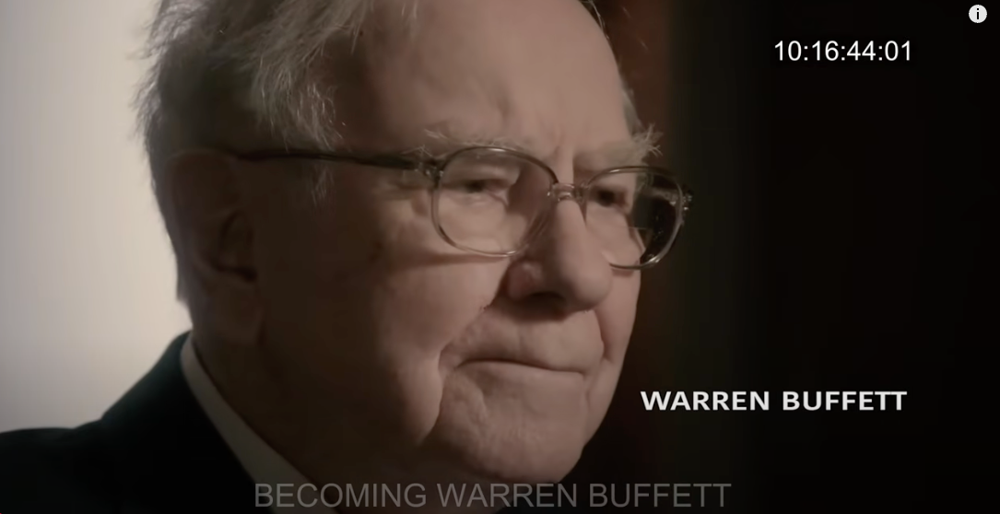
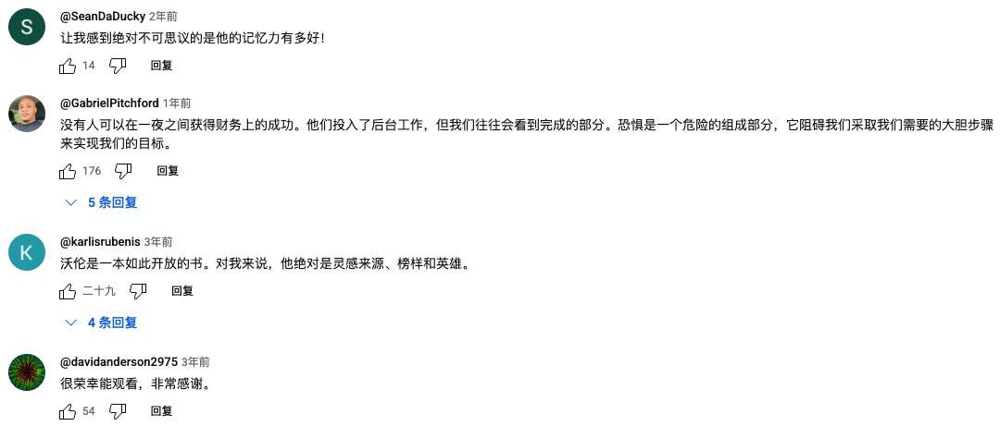

# 巴菲特：2021年采访《沃伦·巴菲特的投资策略：如何像传奇一样生活和投资（完整访谈）》

# 巴菲特：2021年采访《沃伦·巴菲特的投资策略：如何像传奇一样生活和投资（完整访谈）》

访谈与文章

> [沃伦·巴菲特](../articles/person/13-warren-buffett.md)于1930年8月30日出生于内布拉斯加州的奥马哈。他在童年早期就表现出了金融和商业事务的诀窍，并在16岁时进入宾夕法尼亚大学学习商业，然后转学到内布拉斯加大学完成学位。他在哥伦比亚大学获得经济学硕士学位，并在纽约金融学院继续深造。1956年，巴菲特成立了巴菲特合伙有限公司，导致[收购](../keywords/029-shou-gou.md)了一家名为[伯克希尔](../articles/company/03-berkshire.md)哈撒韦公司的纺织公司，他最终将其扩展到媒体资产，如[华盛顿邮报](../articles/company/13-washington-post.md)、[保险](../keywords/087-bao-xian.md)和石油。他赢得了“奥马哈神谕”的绰号，甚至设法使看似糟糕的投资获利，最著名的是1987年丑闻缠身的所罗门兄弟。1989年至2006年，在伯克希尔哈撒韦公司对[可口可乐](../articles/company/07-coca-cola.md)进行重大投资后，巴菲特成为公司董事。2006年，巴菲特宣布他将把他的财富用于[慈善](../keywords/070-ci-shan.md)事业，其中85% 捐给了比尔和梅琳达·盖茨基金会，这成为美国历史上最大的慈善捐赠行为。
> 在本次采访中，巴菲特讨论了他的童年、他的影响、他的家庭、失去妻子苏西、奥马哈、伯克希尔哈撒韦公司、商业建议以及他与查理芒格的友谊以及许多其他话题。

## 《沃伦·巴菲特的投资策略：如何像传奇一样生活和投资（完整访谈）》

**视频时长：1小时40分钟，以下是完整的内容**

### 开场

我很喜欢那场表演，不过一开始的时候是——呃——以我在华盛顿读初中时，大概是初二中段时期的成绩单作为开头的。从那之后，剧情就慢慢好起来了——或者说，是彼得让它变得更好了。每次我看他的演出，他总会稍微调整一些细节。

有一次我们在洛杉矶演出，我也参与了一下，我还带上了我的尤克里里。也不知道为什么，他后来就没再邀请我一起表演了。不过我很期待能继续去看他的演出。

### 我的社会意识

我想，我很多观念，可能都是从我父亲那里得来的。我们三个孩子都无条件地爱他，就像他无条件地爱我们一样。他从不会以任何说教的方式对我们讲话，但我们从他的一些言语中，尤其是从他的行为里，学到了很多东西。

他给我们传递的理念，是“每一个生命都有同等的价值”。从我记事起，这个想法就深深根植在我和我的两个妹妹心中。

有时候我会谈到“卵巢彩票”这个说法——其实，我今天能有这样的地位，更多的是运气。对我来说，最重要的一件事，是我来自谁——是谁生下了我。我拥有的父母，我的基因天赋——这一切都不是我自己决定的。

### 童年时期的奥马哈与种族隔离

我父亲曾经在饭桌上谈起过奥马哈那起著名的私刑事件，时间大概是在1920年前后，可能差个一两年。他当时亲眼看到失控的暴民场面。

后来，《奥马哈世界先驱报》还为此写了一篇非常著名的社论，探讨“暴民统治”的危险——我记得那篇社论好像还得了普利策奖，但我不太确定。我父亲常常在饭桌上告诉我们，暴民思维一旦主导局面，会造成怎样的后果。那场私刑当然是一个例子，但这种情形在很多地方也都适用。

在奥马哈时，我自己对种族隔离并没有特别清晰的记忆。

但后来我们搬去了华盛顿，我在那里上了爱丽丝·迪尔初中，离我们学校不远的地方——可能只有几个街区远——有一所黑人孩子就读的学校。实际上，我在那也交了一些黑人朋友，其中一个是送[报纸](../articles/industry/01-bao-zhi.md)的男孩，我和他关系不错。

我还曾在切维·蔡斯乡村俱乐部当球童，那里的球童就我一个是白人。幸运的是，我“不值一打”，没人觉得我值得打；如果像我这样的人多一些，也许麻烦会更多。但我确实亲眼看到了正在发生的事情。

在弗吉尼亚州的弗雷德里克斯堡，我也见过类似的场景。比如在电影院里，黑人和白人要坐在不同的区域。

这些事，从来都让我无法理解——它们一点道理也没有。

### 奥马哈的公平住房运动

嗯，嗯，我确实在这方面出过一点力，那是在六十年代，当时林肯市正在推动公平住房立法。我的妻子在这方面比我更积极。她一直在努力，参与了一个由三人组成的小组：一个犹太人、一个黑人，而她则是那个“白盎格鲁-撒克逊新教徒”（WASP）。他们一起到各个俱乐部、社区做演讲，传播公平住房的理念。所以在这件事上，她远比我更投入。

而我在精神上是百分之百支持她的，只是那时我自己更多地把精力放在了投资上。

在六十年代末，还发生了一件事。当时我打算加入一家一直以来都是犹太人专属的乡村俱乐部，这件事引发了不小的骚动，持续了好几个月。不过事情过去之后，一切也慢慢平息了。我原本所在的俱乐部曾拒绝接纳我的一位犹太朋友，这让我非常恼火，也正是因此我决定加入那家犹太俱乐部。

那是在1969年左右，当时的社会氛围和现在很不同。几年的时间之后，这种状况发生了显著变化。

我还记得棒球明星鲍勃·吉布森。他当时是一位极为出色的球员。奥马哈曾举办一个叫做“萨尔本舞会”（The Ak-Sar-Ben Ball）的活动，是个很重要的市民和社交盛事。以前，这个活动的场地——萨尔本礼堂——能聚集八千到一万人。然而，在那样规模的活动中，你看不到一个黑人面孔。

直到后来，他们终于邀请了鲍勃的一两个女儿来参与，这才成为一次重要的突破。那是在七十年代中期，是一个意义重大的转变。

当然，社会还有很大的进步空间，但我在自己这一生中，确实也亲眼见证了一些积极的变化。就性别平等方面，我看到的进展甚至比种族平等还要明显。我也亲眼看到反犹主义显著减少——几乎快消失了。也许现在那些仍然有那种想法的人只是不对我说罢了，但至少在公开层面，它已经不再像以前那样严重了。

六十年代，我是扶轮社（Rotary Club）的成员。有一天，他们让我加入一个秘密的会员遴选委员会，在那个过程中，我听到了一些让我震惊的话。我才意识到，就在1960年代的内布拉斯加，还有人会说“我们已经有够多犹太人了”这种话。那让我深感不可思议。

### 我从商学院毕业后的第一份工作

我从哥伦比亚大学商学院毕业的时候，我在那里有一位英雄人物——本·格雷厄姆。他在我人生的许多方面都给了我极大的帮助。当我刚进学校时，我就问他：“我可以无薪为您工作吗？”我其实是希望他一旦答应让我工作，之后也许会决定给我薪水。

但他告诉我，他的小公司只雇了六七个人，而且在当时的华尔街，存在着很强的偏见——华尔街当时是分裂的，有“犹太公司”和“非犹太公司”之分。有些公司，比如Loeb，大家都知道是犹太背景的；还有些公司，则完全被视为“白人基督徒公司”。

本说，由于他自己也曾亲身经历这种偏见，他觉得既然他们公司只有那么点职位空缺，而且到那时为止他们雇用的都是犹太人，那也就继续那样安排了。

于是我回到了奥马哈，开始卖股票。但我并没有就此放弃，一直不断地给他们写信、表达兴趣。几年后，他们终于雇用了我——我是他们雇的第一个非犹太人。

### 听马丁·路德·金的演讲

我还记得那次演讲，是马丁·路德·金在1967年秋天发表的。那是我听过最鼓舞人心的演讲之一。我多年一直试图找一份演讲的副本，终于在一两年前，一位现在在摩尔豪斯学院工作的朋友找到了，并寄给了我。

当我再次[阅读](../keywords/082-yue-du.md)那篇演讲稿时，发现它比我当年现场听时还要震撼。那是一场非凡的演讲。

我当然早就知道马丁·路德·金是谁，但“知道”他，和“亲耳聆听”他，是两种完全不同的体验。他的讲话让我当场起立，全身震动。我的妻子也在现场，我们当时有着完全相同的感受。

但可悲的是，六个月之后，他就去世了。他在那场演讲中提到：“真理永远站在刑架上，错误永远坐在王座上，但刑架将左右未来。”六个月后他真的殉道了，但正如他说的——那个“刑架”，确实改变了未来。

### 作为一个共和党家庭里的民主党人

可能是“基因突变”了（笑）。我是在一个非常传统的共和党家庭里长大的。家里吃晚饭时，我要是没说几句罗斯福的坏话，是不许吃汉堡的（笑）。我父亲是以共和党身份当选的，我和我姐姐还曾为他助选。

1960年，我还曾参加过共和党全国代表大会的代表竞选——虽然理由和传统的政治目的无关。直到我父亲去世之后，我才更改了我的党派登记。那时我觉得没必要早做这件事。但其实在他去世前的几年，我的政治理念就已经开始发生变化，并不是一夜之间的转变。

我曾是宾夕法尼亚大学“青年共和党人”俱乐部的主席，还计划在杜威当选那天骑着大象沿伍德兰大道游行。结果嘛……伊利诺伊的选票结果出来后，我的“高光时刻”也就没了（笑）。

我转变最大的是因为民权问题。我觉得，在那个时期，无论民主党还是共和党，其实对民权都不是特别在意。但我感觉民主党更有可能真正采取行动。

我觉得，非常荒谬的是，在这个国家建立近两百年后，种族不平等仍然存在。1776年，托马斯·杰斐逊写道：“人人生而平等。”可是在制定宪法时，他们却突然决定：如果你是黑人，你只能算“三分之一个人”。这听起来就像疯话。

而在宪法第二条第一款中，在描述总统时，他们使用的是“男性”代词，而在描述众议院、参议院或司法部门时，并没有这么做。这等于是他们在那一刻“露了真面目”，把他们真正的思想写了出来。想想看，这离独立宣言也才过去13年而已。真是令人惊讶。

### 关于投票给约翰·F·肯尼迪（JFK）

我确实投票给了JFK，但我并没有积极为他助选。那时我父亲还在世，而我姐姐——我大姐——正在非常积极地为戈德华特（[Gold](../keywords/112-huang-jin.md)water）助选。她当时发起或参与了一个名为“为戈德华特献金”（Gold for Goldwater）的活动。所以，我们家其实像是有两个分支相互抵消的局面——一边支持民主党，一边支持共和党（笑）。

### 关于尼克松

说到尼克松，总有一些非常有意思的故事。1940年，我父亲第一次竞选国会议员，并在1942年成功当选。1946年，共和党赢得了众议院控制权，这是自1930年以来的第一次。

有一天晚上，共和党领袖乔·马丁来到我们家，他即将成为众议院议长。他告诉我父亲，由于共和党赢得多数，众议院美洲活动委员会（House Un-American Activities Committee）有一个空缺席位，并将这个席位提议给我父亲。

但我父亲说：“不了，谢谢。”他对那个职位不感兴趣。

于是乔·马丁转身找了一位新当选的国会议员——名叫理查德·尼克松——把那个席位给了他。历史，就是这样发展起来的。

我一直对政治非常着迷，政治人物更是令我感到着迷。尼克松是个非常有趣的人，他非常聪明，但最终却是自我毁灭。

我这辈子都很想读一本书——如果有人写出来的话——叫《为什么聪明人会做傻事》。我在金融界、政治界，甚至婚姻关系里都见过这种现象。为什么那些聪明的人，偏偏会做出愚蠢的决定？尼克松就是一个典型的例子。他最终毁了自己。

不过他也在财务上“帮”了我一把。我得感谢他，因为正是因为他，我才能以极低的价格买入《华盛顿邮报》的股票。

事情是这样的：尼克松鼓励BB·雷博佐（BB Rebozo）去挑战《华盛顿邮报》在佛罗里达拥有的两个电视台执照——分别位于杰克逊维尔和迈阿密。受此影响，《华盛顿邮报》的股价从每股大约37[美元](../keywords/116-mei-yuan.md)迅速跌到了16美元。

但即便那两个电视台执照真的被撤销，股票的实际价值也远高于那个价位。而事实上，那两个执照最终并没有被撤销。

所以，从经济角度来说，尼克松总统无意中帮了我一个大忙。正是他让BB去挑战那些牌照，我才得以用超低价购入那些股票。

### 关于凯瑟琳·格雷厄姆

凯瑟琳·格雷厄姆是位了不起的女性。她是尤金·迈耶的女儿——迈耶是华尔街和华盛顿都非常有影响力的人物。他一开始在华尔街从很小的资金起家，后来一路做到非常高的位置。他曾是美联储主席，我想他也是重建金融公司（RFC）的首任负责人，也可能是世界[银行](../articles/industry/05-yin-hang.md)的第一任行长。他确实是个了不起的人。

他有五个孩子，而凯瑟琳·格雷厄姆最终成了《华盛顿邮报》的继承人。尤金·迈耶在三十年代初买下了《邮报》，但这份报纸年复一年地亏损，一直到大约1960年与《时代先驱报》合并后，情况才有了改善。

凯瑟琳从小就因为母亲和丈夫的影响，对自己的商业能力和很多其他能力感到不自信。她心里一直有种观念，觉得男人在商业上或者任何与之相关的领域都比女人强。但她内心其实很有力量。

她丈夫去世后，她面临选择：要么亲自接手报纸，要么就退居幕后，只靠[分红](../keywords/020-fen-hong.md)过日子。她咬紧牙关、强忍住膝盖打颤，决定亲自担起责任，接手管理《华盛顿邮报》公司。

在“水门事件”期间，她坚定支持报社主编本·布拉德利——那时很多政治人物都在反对他们，其他媒体也并未及时跟进。《华盛顿邮报》几乎是孤军奋战。最终，那场调查报道改变了整个世界。

实际上，在此之前的1971年，她也在“五角大楼文件”事件中做出过类似的决定。当时丹尼尔·艾尔斯伯格将机密文件交给了《邮报》，虽然《纽约时报》先拿到了资料，但后来因法律压力遭到限制，而凯瑟琳对本·布拉德利说的原话是：“刊登总统的事吧。”

### 展望未来

如果你只能在“回顾过去”和“展望未来”之间选择，相信我，选择“展望未来”。我从来不太执着于纠结自己的错误——那没有意义。你唯一能改变的，是未来。

我做的这个行业，本来就意味着会犯很多错误，这是这个行业的一部分。你必须继续往前走。当然，当凯·格雷厄姆去世时，我真的受到了很大打击，那是一个特别沉重的时刻。

我从来没有这么说过，但我想，现在说也很合适——我是一个“平等主义者”（I equal-itist）。我不认为任何人有理由把自己视作“精英”。当然，有些人可能天生智商更高，或者能把橄榄球踢得更远、跳得更高，甚至跳舞跳得更好。他们确实也会努力磨练自己的技能，但回到根本上说——每一个人都拥有同等的价值。

我完全有可能不是现在的我。1930年我出生那天，出生在美国的几率是大约40比1。我赢了“卵巢彩票”第一轮。更重要的是，我是个男性——如果我是女性，我的命运将会大不相同。再把这算作50对50的几率，那么总体来看，我出生为一个美国男性的几率是80比1。这一点在我的整个人生中都起到了极其重要的作用。

所以，如果因此我就认为自己比别人“更高贵”、“更优越”——那种想法对我来说完全站不住脚。我根本无法认同那种逻辑。

### 关于女性权利

说起来真是令人吃惊——第十九修正案直到1920年才通过，也就是说，我们用了很长时间才正式承认女性的投票权。

我生于1930年，我有两个姐姐，一个比我大几岁，一个比我小几岁。她们和我一样聪明，但她们在生活中并没有获得和我一样的机会。虽然没人明确说过什么，但那种差别是实实在在的。

我的父母当然平等地爱我们每一个人，但对我们的期望是不一样的。老师们也一样，他们都很善良，很乐意帮助我们每一个人，但他们在无意中传递的信息是：我姐姐的人生任务，是要“嫁得好”；如果她们选择去工作，那就应该去当零售店员、护士、老师，或者最多就是做秘书——就这些。

所以在美国，我们实际上让一半的天赋被边缘化。这个现实总让我觉得完全不合理。也让我意识到，自己作为一个男性，是多么幸运。

但从另一个角度看，也有些令人振奋。想想看，美国过去取得的所有成就，都是在只使用“半边天赋”的前提下完成的。那么未来呢？如果我们真正释放出全部潜力，那又将会怎样？我对美国的未来一直非常乐观，而部分原因正是因为我们现在终于在改正那些“愚蠢的错误”。

这些错误并不是经过深思熟虑后才做出的决定，它们其实是几千年来父权行为模式自然演变的结果。我们让一半的人才在一旁“坐板凳”。现在我们正慢慢走出那种状况，但还有很长的路要走。

对我个人而言，性别本不该有什么区别。但考虑到女性长时间以来一直处于劣势地位，如果在某件事上我面前有一个“50对50”的选择机会，我宁愿把机会给女性。

### 与最优秀的人为伍

我这辈子非常幸运，能在工作、生活、社交等各方面，自由选择与谁相处。我觉得，那种随便结交人的做法，是挺荒唐的。最理想的方式，是去接近那些比你更优秀的人。因为，你的行为会随着你周围的圈子而改变。

我经常对学生说：“找个比你优秀的人结婚。”虽然数学上每个人都“往上找”是不可能的（笑），但这背后的逻辑没错——你会向你身边人的方向靠拢。

既然如此，为什么不去接近那些最优秀的人呢？

我人生中有过不少“[榜样](../keywords/067-bang-yang.md)型”的人物。能够和他们为伍，对我影响深远。如果我对自己交往的人毫无选择，也许我今天会变成完全不同的人，也不会有现在这样丰富而愉快的人生经历。

### 我的英雄

你问我谁是我的英雄——那就得从我父亲开始讲起。然后是本·格雷厄姆，接着是我的合伙人[查理·芒格](../articles/person/03-charlie-munger.md)，凯·格雷厄姆当然也是。我的妻子们——无论是哪一段婚姻——对我也都是英雄般的存在。她们为我做了很多事情，而从不期待回报。

我很幸运，我的朋友们做十件事是出于真心，他们想着做第十一件，而不是想着从我这里能得到什么作为回报。我这一生中，从未有哪一位我视为英雄的人让我失望过。那种对你极其崇敬的人最后让你彻底失望的经历，我从未经历过，那会是非常痛苦的事。

### 关于忠诚

以我在商业上的合伙人查理·芒格为例，我们之间从不算谁做得多、谁做得少，完全不记账。这种精神在婚姻中也同样重要。

我还记得1951年1月的一个冬天，我遇见了一个叫罗默·戴维森（Lorimer Davidson）的人，他在[GEICO](../articles/company/09-geico.md)工作。他花了四个小时和我谈话，毫无保留地教我那些后来彻底改变我人生的知识。他从我这里什么都没图——我当时是个周六跑去敲门的年轻人，一个清洁工最后才让我进去，而戴维森是办公室里唯一的人。

他用那四个小时给我上了一堂终身难忘的课。当你人生中遇到这样的人，那是莫大的幸运。

还有本·格雷厄姆，他从未向我索求过任何回报。他在哥伦比亚大学教书教了二十五年，培养的是他未来的竞争对手。他教书的目的就是“种树让别人乘凉”，哪怕他收了钱，也可能都捐回了学校。他的奉献精神，是无与伦比的。

我一生中遇到过不少这样的人，这是一种福气。

### 将智慧传承给下一代

我喜欢教学。所以说，如果有人说我在“牺牲自己”去教书，那是误解。84岁了，我每年还是会接待大约40所学校的学生，有些来自美国，也有些从国外飞来——像巴西、中国这些地方。

有一年我既接待了哈佛，也接待了加拿大的西安大略大学。

每年开学时我心里都在想：“这次还要继续做吗？”可只要我一开口，和学生开始互动，我马上就充满能量了。这实在太有趣了。你面前坐着一群未来还有无限可能的人，他们正在形成自己的观念和行为模式，他们求知若渴，有的甚至千里迢迢飞来见我。

老实说，我从中获得的，可能比他们还多。

我让他们自由提问，我会告诉他们：“尽管往我头上砸问题，别客气。”这样反而更有意思。如果只是轻松的“软球问题”，那我反倒觉得没意思。

我们可以谈投资，可以谈商业，但也可以谈慈善、婚姻、职业发展——什么都可以。

我记得有一次，有位来自芝加哥大学的年轻女性问的第一个问题是：“你是不是得是个‘女强人’，才能成功？”我想我成功地说服了她，不需要那样。我的猜测是——她现在应该混得不错。

所以说，教学真的带来非常好的感受。我从21岁起就开始教书，到现在依然乐在其中。

### 与学生对话的意义

我真的很愿意与学生交流。如果你让我去跟一群五六十岁的人说话，那他们通常只想要两样东西：预测和娱乐。他们不会改变自己的行为模式——太晚了。有人曾说过：“习惯的锁链在轻时无感，但等你察觉时已经重得难以挣脱。”这句话太对了。

当你到了那个年纪，什么“重大转变”已经不太可能发生了。但学生不同——他们还在成长中，他们的人生轨迹还可以被影响。

我确实收到了许多学生的来信，他们告诉我我们的对话对他们产生了实际影响。可能是他们决定要嫁给或娶一个什么样的人，或者说他们和伴侣在结婚前的沟通方式，甚至是他们如何选择职业、如何处理人际关系……各种可能性。

我不知道具体会产生什么样的变化，但我知道——真的知道——它确实带来了改变。而且对我来说，这也是一次愉快的经历。

### 人们看不见的一面

我工作中最艰难的事之一，是解雇一位[经理人](../keywords/043-jing-li-ren.md)。伯克希尔·哈撒韦没有规定什么“65岁退休”之类的制度。所以，如果我告诉一个人“是时候退休了”，那他知道——这是我对他本人所作的判断。

这些经理人是我的朋友。我通常亲自告诉他们（虽然不是每一例，但大多数情况下都是我亲自来），尤其当他们是我朋友的时候——而大多数确实是。

说实话，我愿意付很多钱，只为了不必亲自做这种事。但这是我的职责。资本主义有时很残酷，自由市场体系虽然在整体上是最有效的，它能创造出前所未有的商品与服务，但它对个体、对特定的行业、特定公司来说，有时会是相当无情的。

而我有责任确保正确的人在管理企业。但有时候，哪怕曾经是“对的人”，也可能因为某些原因“耗尽了能量”。也有的情况是，某位经理人罹患阿尔茨海默症，或其他会严重影响工作的疾病。

我会坐飞机亲自去告诉他们，告诉他们——“你该退休了”。

这些时候，往往到最后，反而是他们在安慰我——因为我自己内心太难受了。这绝对不是愉快的任务。

但我必须做出这种艰难的决定。这是痛苦的事，以后也永远都会是痛苦的事，但它必须被做。

将来，也会有人来对我说这些话。我已经告诉我的孩子们：“当我开始变得糊涂的时候，你们要告诉我。”不过我补充了一句：“你们三个得一起说。如果只有一个人来，那我就把你从遗嘱里除名。”（笑）

### 内心的声音

哦，我觉得那其实大多时候是一种恩赐。因为这正是你在做决定时依赖的东西。我喜欢独自坐着思考，我花很多时间在这上面。

有时候确实没什么产出，显得没效率，但我依然觉得这种过程令人愉快。尤其是思考一些商业或投资的问题——这些问题相对容易。真正难的是“人”的问题。有些人际关系的困扰，是根本没有“好答案”的；但商业问题，几乎总能找到一个不错的解法。

### 沃伦如何衡量成功

在金钱这个话题上，我觉得对大多数人来说，有句话说得挺好——我记得这好像是伯特兰·罗素说的（虽然我后来试图查证，没找到原话）：**“成功是得到你想要的东西，而幸福是喜欢你所拥有的东西。”**

如果要为“成功”下定义，我觉得很多时候可以从一个故事来理解：

奥马哈有一位波兰裔犹太女性，她在二战时被送进了集中营。那是纳粹时期的德国，她的一些家人也与她一同被带进去。她当时站在一个队伍里，而她的姐姐在另一个队伍里——他们不是所有人都活着出来的。她经历了极其可怕的岁月。

她大约在80岁时跟我说了一句话，当时我应该70岁左右。她说：“沃伦，我交朋友很慢。因为我每次看一个人，都会在心里问自己一句：‘他会不会藏我？’”

我认为，如果你到了65岁、70岁、甚至80岁时，有很多人愿意“藏你”，那你就是一个成功的人。

这其实换句话说，就是：有很多人真的爱你。如果你到了晚年，有人为你举办表彰晚宴，或捐钱把商学院以你命名，但没有人愿意“藏你”，那你其实是个失败者。

我确实认识一些非常富有的人，但他们的孩子连藏都不愿意藏他们。

所以，如果你在寻找衡量成功的标准，只需问自己一句话：“有多少人愿意在关键时刻藏我？”——这个问题，回答得出，就知道你值不值了。

我也认识很多人，可能一辈子没赚多少钱、没有名利地位，但身边有一大群人愿意为他们做任何事。我对一些人就有这样的感觉——那就是成功。

### 我不害怕死亡

不，我现在不害怕死亡了。我小时候，大概十岁的时候，曾经经常想这件事，但现在不会了。

我觉得自己过了一段非常精彩的人生。我知道死亡终将发生，而我也完全不知道死后的世界会是什么样。我是一个不可知论者，所以我不去妄下断言——死后可能非常有趣，也可能一点意思都没有。总之，到时候就知道了。

身体嘛——它迟早会累的。虽然我现在还不算衰老，但我知道，再过二十年，我可能也不再想多活多少天了。

眼下，我的84岁人生依然过得很愉快。但身体确实无法再像从前那样运作。幸运的是，这对我现在的生活节奏还没造成太大影响。但总有一天，它会变得不同。

而我并不想活着，只是为了“活着”。比如乔·肯尼迪那样的状态，我不希望那种情况发生在我身上。我不希望仅仅为了让心脏继续跳动，就被强行维持生命。

我已经告诉了我的孩子和我的妻子——不要让我那样活下去。只要我还能享受人生，就让我活着；但如果只是为了“存在”而活，那就不要了。

### 关于衰老

从身体上讲嘛，我差不多已经“折旧完了”，快到了“残值”阶段了（笑）。

但说真的，这并不重要。我的工作不需要手眼协调，不需要平衡感，也不需要体力。

我确实不如五年前那么有力气了。我还试着去打高尔夫，但现在一杆的距离，大概只有十年前的一半了。

不过这些一点也不妨碍我：不影响我的工作、不影响我的快乐、不影响我的思考，也不影响我和朋友的相处。

所以，我可以很诚实地说——至少在84岁这一年，我依然能享受生活，依然对生活充满热情。

我现在的身体，确实不如年轻时，但也说实话，我年轻时的身体也没多好，反正也不是个“海斯曼奖候选人”的料（笑）。

现在这场游戏——我所参与的这个商业游戏——实际上变得越来越有趣了，这是变老过程中最棒的部分之一。

不过也有难的部分，那就是你会失去越来越多的朋友。

这确实是件很痛苦的事。我上周又失去了一位好友，Keough，他是个非常棒的朋友。

除了这个——而这确实重要——但除此之外，我每天早晨醒来，都依然对新的一天充满期待，和我人生中的任何时候一样。

当然，我现在做智力测验肯定不如50年前了。我还是可以做一些心算，但比我二三十岁时慢多了。

我年轻时阅读更快，记忆力也更强——比如我25岁读一本书，我记得的会比现在读一本书多得多。

但反过来说，我现在对“人”了解得更多了。

所以在涉及人性判断的问题上，我现在其实比20多岁时强得多。

但要我现在去学一门全新的游戏，速度就不如当年了。

以前有个叫“Simon”的游戏，你要按不同的按钮。我四十年前玩那个还挺行的。

如果现在让我花一样的时间去练，我肯定玩不过当年的自己。

### 关于人类行为

我在“人性”这方面学到的东西太多了。很难一一细讲它的每个面向，但我确实见识过很多。

20岁时，我对人的理解还非常有限；而现在，我有了大量亲身的经验——特别是在商业这个相对特殊的领域。

我认为，现在的我在“极端人性表现”这块，判断力比过去好多了。

比如，如果你给我100个人，我可能挑不出谁是最适合管理一家公司的那一个；

就算这100个人都是顶级商学院的毕业生，我还是不能精准预测谁会是最成功的。

但如果是有人来卖他们的公司，或者我跟他们有些深层次的接触，我认为我现在在预测这些人之后的行为方面，有一定的能力。

我大致能判断出——他们在把公司卖给我们之后，会怎么表现；或者在其他场景中，他们会怎么做。

当然，我还是会犯错，但我已经比年轻时看得清楚多了。

### 对工作的专注

我从没后悔自己一直专注于所热爱的事情。我大概七岁左右就开始对股票感兴趣，六七岁时就对商业产生了兴趣。你说要是我当时专注的是国际象棋——那还不是被鲍比·费舍尔“按地摩擦”？如果我去搞高尔夫，那更是笑话一场。

但我很幸运，我很早就“误打误撞”地找到了一个我有天赋的领域。我之所以在这个领域做得还不错，一方面是因为我早早进入，另一方面是因为我始终专注。

当然，如果你每天花很多时间在某一件事上，那你就没法同时在别的事情上投入同样精力。

我从没学过滑冰，但我一点都不觉得遗憾。

每个人都可以选择把时间花在什么事情上——如果你足够幸运的话。而我是那种非常幸运的人，我几乎能完全掌控自己的时间表，这种自由我已经拥有了六十年，这种程度，恐怕没人能比。我很庆幸自己做出了这样的选择。

**做自己热爱的事**

我每天早上醒来，都能从事我热爱的事业，而且是和我喜欢的人一起共事。几十年来都是如此。

比如我的助理黛比·梅森尼克，我世界上找不到比她更愿意一起工作的人了。

还有查理·芒格，我的合伙人，尽管他住在洛杉矶，但没有人我比更愿意和他搭档的。

我们的经理人团队也是我自己挑选的。

我可以决定怎么玩这场“游戏”，我也能决定谁来和我一起组队。

如果我跟某人共事时感到胃痛，那只能怪我自己——因为我完全可以选择不跟那个人合作。

我把我的生活安排得很自由，这正是我所在的行业允许的。如果我是在政府、政界或其他某些行业，那我没办法做到这些。但幸运的是，我在这个领域，我把它看作是一种“理想游戏”。

### 安静时间的重要性

我喜欢安静。我在办公室会关上门，不希望听到外面有人在说话。我喜欢读书，尽管我现在读书的速度不如年轻时快了，但我还是每天会花五六个小时在阅读或边读边思考上。

这就是我喜欢的生活。有些人个性不同，可能会喜欢完全不同的节奏和环境，但我知道自己喜欢什么，而且我努力为自己营造了一个让我能最大化喜欢的环境。

### 我头脑运作的方式

这些年来，我建立了一套非常实用的“过滤系统”，让我不至于浪费时间。

我总担心别人找我谈生意时显得我很无礼。因为通常在一两分钟内，我就能判断出这个机会是否会通过我的“过滤系统”——也就是说，它值不值得我深入了解。

可我也不想直接告诉他们“不感兴趣”，因为他们可能觉得：“只要你听我讲一小时，你就会明白我为啥这么看好这个项目。”

所以我养成了很多“快捷判断”的能力。每个人处理信息的方式不一样。我小时候能背出16支大联盟球队的先发阵容——当时每个联盟只有8支队伍，球员[流动性](../keywords/102-liu-dong-xing.md)也小。现在我一支都背不出来了。

但总有人记得这些，我只是收集的信息种类不同。我的大脑里也储存了大量信息，但它们集中在极少数的领域里。

我知道自己的“[能力圈](../keywords/013-neng-li-quan.md)”在哪里——我会留在这个圈子里。我不会因为别人能在圈外有所作为而焦虑。我不会去嫉妒别人拥有我没有的技能，也不觉得自己因此不如别人。每个人都有自己的专长，我只需要专注在我的那一块。

### 我的“能力圈”

我的“能力圈”（circle of competence）确实在这些年间有所扩展，但它从来不会变得“无所不包”。

所谓能力圈，指的是你真正理解并能做出判断的领域。比如，对于某些行业，我能理解它们未来的经济结构；而对于另一些行业，我就是理解不了。这种界限必须非常清晰——我得知道自己能力圈的边界在哪。

当然，随着时间推移，我可能会把这个圈子慢慢扩大一些，但它永远不会扩展到“什么都懂”的地步。

IBM 创始人汤姆·沃森（Tom Watson Sr.）曾经说过一句话：“我不是天才，但我在某些方面聪明，而且我只在这些地方待着。”这说的其实就是“能力圈”的概念。

我也一直这么看待自己。我合伙人查理·芒格常说：“拥有180的智商很好，只要你不以为自己有200就行。”

我见过无数聪明人，特别是在股市上，因为走出了他们的能力圈，最终把自己搞垮。他们之所以这么做，是因为他们知道自己很聪明，就错误地以为“聪明=懂一切”。

但真正重要的是要明确你在哪个“游戏场”里能发挥优势。定义清楚你的领域，是极其关键的。而我和查理，这些年来在这方面也算是逐渐练出了点本事。

### 关于美国商业中的贪婪与嫉妒

贪婪当然是个问题，但我认为，**嫉妒**可能起的作用甚至更大。

为什么人们会变得贪婪？举个例子，当你看到网络[泡沫](../keywords/103-pao-mo.md)时期，你隔壁的邻居——明明你知道他没有你聪明——却因为碰巧买了些他根本不理解的股票赚了大钱，还买了辆新车。你心里自然会想：“他都能做到，我肯定也可以，我还比他聪明呢。”

有时候，这种比较甚至来自你家里人。比如配偶说：“隔壁的约翰都换新车了，你不是比他能干吗？”于是你就被推着往前冲了。

### 嫉妒是一种极具毁灭性的情绪。

我曾经在华尔街经营过一家投行，有段时间我们会给一些二十多岁的人开出几百万美元的年薪——这还是二十年前，那时的几百万可比现在值钱多了。他们一开始很开心，直到发现坐在隔壁的那位拿了210万，而他们只有200万。从那一刻开始，他们就不开心了。

### 嫉妒和贪婪常常混在一起，但嫉妒更深、更毒。

查理·芒格说过一句很经典的话：“在七宗罪中，只有嫉妒毫无正面价值。”

你说暴食——至少吃的时候还挺开心的；你说色欲——那也有点乐趣吧。但嫉妒呢？它只会让你自己难受，而你嫉妒的那个人，甚至根本不知道你在嫉妒他。

### 金钱如何塑造了我的性格

赚钱，对我来说就像是一场**游戏**。这是一场有竞争性的“大游戏”，而我非常享受这场游戏。

钱的确有它的用处，但那种实用性也就到某个点为止——我估计我30岁出头的时候就已经到那个点了。**超过那个点之后，钱对我来说没有实际意义，但“玩这个游戏”的过程依然非常有趣**。而且现在，这场游戏不仅让我开心，也能帮助到别人。

不过我得说，我之所以能赚这么多钱，是因为我刚好生在了正确的时代、正确的经济体系下，并且有适合这个系统的“神经线路”。我努力了，这确实是结果之一，但这并不说明我比别人“高尚”或“更伟大”。

我并不是那种能去《与星共舞》节目上跳舞拿前三的人——我如果参加，大概只能垫底（笑）。

这就是**纯粹的偶然**：我出现在正确的时间、正确的地方，并拥有一套适合赚钱的“大脑”。我早早意识到这一点，而我也很享受这场游戏。

而且，这是一个你可以玩一辈子的游戏。**这不像拳击或棒球，你不需要年轻的身体条件，年纪再大也可以继续“比赛”。**

### 我小时候的样子

我小时候还算聪明，但也不是那种天才。我只是比较擅长我最终选择从事的领域。

小时候我每周只有**五分钱的零用钱**，而五分钱远远无法满足我的“消费欲”。所以我非常早就“下海”做生意了。

我想要赚更多钱，唯一的办法就是开始自己卖东西。我卖过可口可乐，挨家挨户推销，也卖过口香糖。还卖过《星期六晚邮》、**《自由杂志》**、《妇女家庭杂志》——你能想到的杂志我都卖过。

而且，我真的从中感受到乐趣。

### 关于奥马哈

我喜欢奥马哈。当然，在别的地方我也很自在，特别是东西海岸，因为我那边都有很多朋友。

而且从奥马哈飞去哪都很方便，三个小时左右就能到美国大多数地方。我喜欢见朋友，也喜欢外面世界的热闹。但奥马哈，是我真正意义上的“家”。

我住的地方离公司**只要五分钟车程**，我已经这样生活了**53年**。

我身边的工作伙伴是一群了不起的人，他们让我每天的生活非常轻松，也很照顾我。

我的孙子孙女现在读的高中，和我孩子读的是同一所，也是我妻子上的学校，甚至是我父亲和祖父当年读的——同一所城市公立学校。这所学校已经实现**种族融合75年**了。查理·芒格也曾是这所学校的学生。

这是一种**传承与延续**。一种很舒服的节奏，一种人与人之间的长久关系。我喜欢这种生活。

当然，我在其他地方见到朋友的时候也一样很开心。但奥马哈，始终是我最安稳的根。

### 我的日常作息

我的一天其实挺“随性”的，我没有固定的起床时间。通常我会在早上**七点前起床**，不过像今天，我**凌晨四点半就起了**，有时候醒得早，我就开始读书或看报纸。

我基本上会在家里先看几份报纸，然后再去办公室。像今天，我六点半就到了办公室，因为我起得特别早，把报纸都读完了，还是提前到了。

不过说真的，这并不重要，因为我在办公室或在家**都能思考同样的问题**。我几乎没有什么排得满满的日程安排——在我这种位置上，我大概是你见过**安排最少的人**。我就喜欢这样。

到了办公室，我继续读报纸、看邮件（我自己不发邮件，我的助理会整理转发给我，这样可以大大减少干扰）。我坐在那里，读所有这些材料。

**在伯克希尔，我们没有什么委员会**，没有什么“专门流程”。没有PowerPoint演示，没有公共关系部、没有投资者关系部、没有总法律顾问，也没有人力资源部。

我们公司在全球有**30多万员工**，按市值算，可能是全球第三或第四大公司。但我们从来不做那些纯粹是“形式主义”的事。

我有一个我喜欢的办公室，我就在那工作。有些日子我下午五点就回家了，有时是五点半、六点左右。周六我也会来办公室，但通常是**上午中段**过来。我经常和办公室里的几位同事一起吃午饭，通常会有四五个人在公司里。

如果那天有橄榄球比赛，我可能会**在办公室看球赛直播**。我看很多体育比赛，有时一边看比赛，一边翻阅其他东西。

**这正是我喜欢的生活方式。**

### 关于“专注”的重要性

大概是在1992年，那时候我刚认识比尔·盖茨不久。有一次我和他父母一起外出聚会，还有一些其他宾客，大概有20人左右。那时比尔的父亲请我们每人写下**一个词**，来形容**我们人生中最有帮助的品质**。

结果，比尔和我——**毫无商量**的情况下——都写下了同一个词：**专注（Focus）**。

我得说，我的合伙人查理·芒格是“专注”的极致体现。

其实你看看老虎伍兹也好，费德勒也好，或者任何一个伟大的钢琴家，他们都是一样的。他们能做到那样的水平，是因为他们每天投入**三四个小时甚至更多**，反复练习击球、弹奏、重复。**这就是专注的力量。**

对我来说也是一样。我能够全神贯注地去做某件事，那是因为我**发自内心地热爱它**。你不可能长期坚持做一件你讨厌的事，就算能做，那也是机械式的，而不会让你真正出类拔萃。

这对我来说，不是一种“刻意为之”的行为。我从来不会对自己说“我要专注”，它就是我自然的行为方式——**从我小时候就是这样**。

其实孩子天生就会专注——你去看看棒球场上最好的八年级学生，那肯定是那个每天在场外多练几百次挥棒的；比尔·布拉德利曾跟我说，他每天投篮练习五六个小时，因为他觉得“可能有人也在练，但只练四小时”。

但他**享受其中**，而我也一样。

我对生活中很多事情都完全“感知缺失”。比如，我根本说不出我卧室的墙壁是什么颜色，地毯是什么颜色。

有一次我在家工作，我的工作间是在卧室边上的小缝纫房。后来我妻子贴了非常鲜艳的一种新壁纸，上面还有些美元图案。**两年后我才注意到，才跟她说：“这壁纸不错啊！”她回我：“已经贴了两年了。”**

不是我色盲什么的——只是这种事根本抓不住我的注意力。

但另一方面，有些数字我可以记一辈子。我脑子里装的信息特别集中，比如查理·芒格、比尔·盖茨也是如此。我们都很容易**被自己热爱的事物彻底吸引**，然后对其他一切“屏蔽掉”。

这也让我在地铁或人群中变得“特别好相处”——因为你**几乎可以在我眼前干啥我都注意不到**。

### 从父母身上学到的教训

这个问题其实挺难回答的。

我成长于一个中产阶级家庭。

我父亲在1931年，也就是我出生一年后，**失业了，存款也全赔光了**。

最后是他朋友的父亲开了一家杂货铺，才让我们家能继续吃饭。

但即便如此，我父亲还是在一两年后又生了一个孩子。**他是个乐观主义者。**

他一直强调要有一套“内在的评分卡”（inner scorecard）——也就是说，**别管别人怎么看你，你只要知道自己为什么这么做就够了**。

他非常喜欢读书，也有点内向。他喜欢人，但也喜欢安静坐着看书，或跟我们孩子聊天。

他是个**非常出色的老师**，虽然他可能自己没那么认为。但我们在他身边学到的，是他看待生活的方式——而这对我们来说非常有道理，久而久之，我们也开始用相同的方式去看世界。

他一直告诉我们：“重要的是你内在的评分卡，而不是外界的评价。”

在这点上，他可能比我们这些孩子都做得更好，但这个理念，**我们都听进去了**。

我母亲非常聪明，也非常关心我们这些孩子。

但她的成长经历非常艰难：她的母亲进了精神病院，一个姐姐后来也住进去了，另一个姐姐自杀了；她的哥哥是个超级聪明的人，但也在大约30岁时去世了。

所以她的生活一直非常艰苦。

她对我们非常负责任，总是尽心照料孩子们，但你感受到的爱，并不像从我父亲那儿那么直接、那么温暖。**她是爱我们的，但表达方式不同。**

### 关于母亲的偏头痛

她当时应该患有我们现在所说的**偏头痛**。那时候或许还没有“偏头痛”这个正式的医学名词，但她确实会经历非常严重的头痛。**她头痛时，你绝对不想靠近她**，因为她在那种情况下会比较容易情绪化、发脾气。

她从不会在公众面前表现出这种状态，**但在家里，她情绪会很明显地爆发**。我母亲非常崇拜我父亲，所以只要他在场，**他就像一个稳定情绪的力量**。但问题是，白天父亲不在家，而我们那时候还只是小孩子。

所以我们都知道——**母亲一旦头痛，最好离她远一点**。

当然，我是可以对她表示同情的。她确实是一个有责任心的人，在别人面前展现出一种人格，在家里有时则是另一种样子。她不会让外人看到那一面。

但她当时究竟承受着多大的身体痛苦，我无法确定。**很难准确评判她的行为背后的动机**。

我相信，这对我们三个孩子都造成了**深远的影响**。可能我们每个人都用不同的方式做出了**某种心理补偿**。就我自己来说，我一直觉得自己非常幸运，以至于哪怕曾经做错了一些事，最后似乎也都走向了不错的结果。

比如我十三岁时经历了一段**很叛逆的时期**，但与此同时，我每天还在送**500份报纸**。一份报纸只赚一分钱，但如果你用“[复利](../keywords/008-fu-li.md)”的概念来看，那一分钱**最终变成了别的东西**。

### 父亲是我一生中最伟大的人

我从来没见过父亲做过任何一件**不能登上报纸头版**的事。

他大概是我所认识的**最好的老师之一——尽管他从来没试图去当老师**。我们三个孩子都在他身边长大，**我们都知道父亲对我们有无条件的爱**。

这并不是说他会纵容我们。**有时他会对我们感到失望**，但他表达的方式极其温和。他有他不赞成的理由，但他不会发火，也不会批评你，他只是用非常平静的方式说：

**“我知道你可以做得更好。”**

就这么一句话，**足以让我们意识到自己做得不对**。我这辈子从来没听过父亲提高声音。但我们都知道，只要他表现出一丝失望，那对我们来说就是很大的触动。

这种方式，对我们三个孩子都起了很深的影响，**尤其对我来说**。

### 关于取悦父母

我不太在意是否取悦父亲，**我更想取悦的是我母亲**。当然，我想我们三个孩子都希望让父母高兴。

不过，说实话，我们其实**并不需要做太多就能让他们高兴**——只要我们尽了最大努力就好。

我父亲从不会试图引导我走上某一条道路。他鼓励我去上大学——当时我其实并不想上大学——但他从没强迫我去做什么。他的内心或许希望我去做传教士一类的事（虽然他从未明说），但他**从不试图左右我人生的方向**。

包括我后来结婚这些[人生选择](../keywords/077-ren-sheng-xuan-ze.md)，他也从未干涉。**他就是始终站在我这边**，这种感觉太棒了。

### 关于出生于大萧条的命运

我出生于1930年，是在1929年股灾那段时间“被制造出来的”。我父亲当时是个股票推销员，到1929年11月，没人愿意听他推销股票了。于是，他只能待在家里。那时也没有电视机可看——所以，我就这么“诞生了”。

从某种意义上讲，我的存在可以说是**股市崩盘的副产品**。

### 父亲的坚韧与乐观

我父亲后来在那个时期心脏病发作——我不记得确切时间——但我知道他内心一直坚信：“**只要你尽了全力，一切终会好转。**”

他所在的银行在1931年8月12日——也就是他生日的前一天**倒闭了**。他在那家银行里有仅有的一点积蓄，同时还要每月还55美元的房贷。

但他并没有因此气馁。我是从他后来的言行中看出来的，也从别人对他的回忆中印证了这一点。

他在没有工作的情况下，选择**自己创业**。因为没有地方肯雇他，他便创建了一家公司——一开始叫 *Buffett, Selenica Co.*，可能是因为 Selenica 出了一点资金——因为我父亲自己已经没钱了。

那家公司一直是家小公司，我后来也曾在那儿工作过。**他从未赚过很多钱**，我们家没有会员制俱乐部、没有第二辆车——但生活始终过得不错。

大约在1936年左右，我们搬进了一所更好的房子，过着**中产阶级的生活**——这正是他想要的生活方式。

### 乐观的遗传与影响

我父亲的乐观精神对我影响极大，因为我**对他的一切都非常钦佩**。我可能在不知不觉中吸收了他的很多“人生观”。

乐观这件事，有多少是天生的，我也说不清。但我确实有足够多的理由保持乐观：**我一直身体很好**——尽管我饮食像个六岁小孩；我一生中也拥有许多好朋友。

如果在这种人生条件下还不乐观，那一定是我出了问题。

父亲不在乎钱——他只希望有足够的钱养家糊口而已。钱对他没什么意义。他反倒觉得我喜欢赚钱这件事有点好玩。但**他的乐观体现在：他坚信我们三个孩子都会有非常好的前途**。

当然，那时候**社会对男孩和女孩的期望完全不同**。但我毫不怀疑——**他始终相信我会非常成功。**

### 我的童年

我小时候挺普通的——只是比大多数孩子更喜欢看书。我真的很爱看书。

我的视力其实不太好，但我那时并不知道。不过它也没妨碍我什么。

我喜欢体育运动，但我的水平**非常一般**。不算好，也不算差。

打篮球、棒球之类的项目，**我从来不是第一个被选上的，但也不会是最后一个。**

到了喜欢女生的年纪，我在那方面也挺“正常”的。

大约12岁时，我们搬去了华盛顿——那是因为我父亲当选为国会议员。

这次搬家对我打击很大，**彻底打乱了我原本安稳的生活**。

在奥马哈，我一切都进行得很顺利；而到了一个全新环境后，**我变得非常叛逆**。

虽然那段叛逆期没持续太久，但也足够长，让我的父母为我担心了。

### 恶作剧学生时代

我在学校**完全失去了兴趣**，变得非常不合作。我特别喜欢“折磨”老师们。

那时候老师们都喜欢买ATT的股票作为退休金的保障，因为它每年派息9美元，被认为是**最安全的股票**。

我知道这点，于是有一天，我去**做空了10股ATT的股票**，然后把交易凭证带到学校去**当着老师们的面晃来晃去**。他们靠这只股票养老，而我这个毛头小子在做空它——真的是个“讨厌鬼”。

甚至有一段时间，我在英语课上被“隔离”到一个小房间里上课，就像《沉默的羔羊》里的汉尼拔·莱克特一样，**别人是从门缝里塞作业进来的**。

不过这也没持续太久。我父亲注意到了我的状态，说我可以做得更好。

他还可能威胁说：“如果你继续这样下去，就别送报纸了。”——那对我是件大事，于是我开始“收敛”了。

### “离家出走”计划

那段低潮期时，我还计划**离家出走**。但我胆子小，于是**拉上了两个朋友**——约翰·麦克雷和罗杰·贝尔——一起跑了。

我们在华盛顿的威斯康星大道边上拦顺风车，第一辆停下的司机问我们：“你们要去哪？”

我们反问他：“那你要去哪？”

他说：“我要下地狱，你们要一起去吗？”

听完这话，我当场就“清醒”了——冒险之旅瞬间没了乐趣。

我们最终到了**宾夕法尼亚州的好时镇**，因为其中一个朋友说那里是“天堂”，还可以去好时巧克力工厂吃免费的巧克力棒。

结果，我们被州警逮了，带去了警局。我们当时还在撒谎说得到了父母的许可。

听着后面电传打字的声音，我们吓坏了，以为他们正在发出全美通缉令。

我们迅速逃离了好时镇，最终回到了华盛顿。

罗杰·贝尔的父亲也是一位国会议员，而他母亲当时还住在医院里。为了这次“旅行”，**他把自己的战争债券都兑了现**。

他当时想去一所叫斯汤顿军事学校的地方，后来好像真的成行了。

我一回家，母亲第一句话竟然是：**“你怎么这么快就回来了？”**

这实在让我挺泄气的……那次就是我**最后一次离家出走**了。

### 初到华盛顿的社交挣扎

当我从奥马哈搬到华盛顿时，我正读八年级。在奥马哈，我社交方面还算顺利；可一到了华盛顿，一切都变了。

那边的孩子在社交发展上似乎已经更成熟，我一下子脱节了。

我总是班里最小的一个，因为我跳过一级。所以我很长一段时间**都跟不上节奏**。

### 一段糗事回忆

后来我参加了高中六十周年同学会，在那里遇见了一个叫芭芭拉·威根的女孩。我们高中时曾经约会过一次。

我问她还记不记得我们当时看的是什么电影，她说不记得了，但她记得**另一件事**。

我问她记得什么，她说：“你是开着‘灵车’来接我的。”

她说得没错。我当时**拥有一辆灵车的一半股权**——我们合伙买的。

对一个约会来说，这显然**不是最酷的交通工具**。我当时可能才10岁左右，那还是我们搬去华盛顿前的事。

### 在祖父的杂货店工作

我曾在祖父开的杂货店工作过。那家店是**赊账送货制**，总共配有七辆**橘色卡车**。

有个叫埃迪（Eddie）的人，是我们那里年纪最大的送货司机。我那时候大概只有10岁，是他的“跟车助手”。

顾客会打电话进来下订单，我的任务是**按照送货顺序“倒着”把货物装进卡车**，这样第一要送的货在最后面、最后要送的在最前面。埃迪会告诉我怎么装车，我也照做。

第一天，我们按他的路线出发了。**第一站是本森（Benson）**，接着第二站是**邓迪（Dundee）**，然后我们又回到了本森，再去中央大道（Central Avenue），然后又回到本森。

我实在受不了这样的路线了。我跟埃迪说：“埃迪，我虽然才10岁，但我觉得你这条路线**太离谱了**。让我重新设计一下路线，我们可以**少跑一半的路程**。”

埃迪听完，给了我一个非常不屑的眼神。我当时觉得他好像120岁了，其实他可能还比我现在的年纪小10岁。

他看着我，说：“沃伦，你难道不明白吗？**卡尔太太是这条线路上最漂亮的女人**，如果我们早点送到，她可能还没穿好衣服。”

然后他说：“柯德太太是第二漂亮的，所以我们也得早点到她那。”

我当时突然就**开始同情那条线路最后一位的太太**，因为按照埃迪的逻辑，她显然“状况最差”。

这段经历让我**第一次意识到，在生意场上，员工的动机可能和雇主完全不一致**。

### 童年的竞争心与“拳击课”

我一直是个**很有竞争心**的人，但我也发现，如果你玩错了游戏，那竞争也没什么意义。

比如我十岁左右参加过一次拳击比赛，第一回合结束，我连拳套都举不起来了。

还好对手也一样累，俩人都差不多，比赛也就没啥悬念。

### 家庭氛围

我们家不是那种很正式、很规矩的家庭。大多数时候，家里气氛还是**轻松愉快的**，但也有时候不是那么美满。

那时候大家都没什么钱，所以家里娱乐的方式也很简单。比如我们家经常会办**桥牌俱乐部**，招待朋友。

我从小就发现，**我和年长的人特别聊得来**，这点一直持续到了后来。

### 我的少年时期

我小时候很喜欢我父亲的朋友们。我还参加了教堂里的儿童合唱团，10岁或11岁的时候，每次去练唱回家的路上，我总会顺路停在十几户人家门前，和一些家庭主妇聊聊天——她们大多是通过我爸妈认识的。**那时候社交氛围很浓厚**。

我们家的地下室有一张乒乓球桌，父亲的朋友们来家里时都会跟我打几局。我乒乓球打得还可以，也赢过不少大人。家里还有一台小风琴，我妈妈会弹，大家经常在家里唱歌。

我爸妈都很虔诚，家里唱的歌几乎全是**教堂赞美诗**，所以现在我还记得不少那些歌的歌词。

但老实说，那些宗教氛围**对我影响并不大**。虽然我小时候参加了邓迪长老会教堂的儿童合唱团，后来我和妻子结婚后还曾在那教堂里教过一阵主日学，不过我们那个班级气氛太活跃，笑声太多，**最后好像被“调岗”了**。

### 不想上大学，只想赚钱

我16岁就高中毕业了，那时候我送报纸，**每个月能赚150美元左右**，而且只需要每天早上花几个小时就够了。

我还和朋友一起合伙经营**弹珠机路线**，也就是把弹珠机放在各种地方、赚点分成。我喜欢看赛马，也爱研究怎么投注。

我当时觉得生活已经挺完美了，**赚钱、炒股、看《华尔街日报》，每天做股票图表**，完全看不出上大学能给我带来什么新东西。

但我父亲**很温和地劝我去试一试大学**。我记得那时候还没有SAT考试，至少我没参加过。他可能都愿意替我去考试（笑）。

他建议我申请宾夕法尼亚大学的**沃顿商学院**，并说：“你去试一年，如果不喜欢可以退学。”

我同意了。一年下来，我成绩非常好，其实我在学校里的成绩一直是越往后越好的。

但我感觉自己学到的东西不多。**很多课是研究生来教的**，他们看起来也就比我多读一章教材而已。我问我爸能不能退学，他说：“再坚持一年试试看。”

第二年我还是觉得没太大收获，他这次说：“那你想干嘛就干嘛吧。”

于是我转学回了**内布拉斯加大学**。因为学分够了，所以我三年就完成了本科学位。我一心想早点毕业，早点投入到“真实世界”。

我这么说好像有点委屈这些学校，其实我确实学到了很多东西，特别是在内布拉斯加大学那一年，我觉得**学到的东西和沃顿相比毫不逊色**，虽然后者名声更大。

### 误打误撞拿奖学金，申请哈佛失败

有一天，我在翻《每日内布拉斯加人》（校报），上面写着：“下午三点，在300号教室，评选研究生奖学金，奖金500美元，可以去任意你选的研究生院。”

我按时去了，结果**我是唯一到场的人**。评审们还在等人，我提醒他们已经三点了，于是我**毫无对手地拿下了奖学金**。

我爸建议我申请**哈佛商学院**，他希望我这么做，而他希望的事情，我大多都会顺着做。他从不强迫我，但只要我知道他在意，我就愿意配合。

我申请了哈佛，对方安排我去芝加哥面试。于是我坐了10个小时的伯灵顿火车去芝加哥，又换乘一辆市郊小火车去了郊区的那所日间学校。

面试只进行了10分钟左右。面试官基本上就是说：**“你还是考虑点别的吧。”**

我又坐了12小时火车回家，一路上都在想：“我要怎么跟我爸交代？”

### 幸运发现哥伦比亚大学的“秘密宝藏”

幸运的是，一切还是有了转机。夏天我在奥马哈的一所大学上课时，随手翻了一本学校目录。无意间我看到了格雷厄姆（[Benjamin Graham](../articles/person/01-benjamin-graham.md)）和多德（David Dodd）的名字——他们在1934年写了一本被誉为“投资圣经”的书，那时是1950年，我完全不知道他们原来在哥伦比亚大学教书。

我注意到**多德现在是哥大商学院的副院长**——于是，命运开始转向了我真正的人生轨道……

### 与哥伦比亚大学的缘分

我当时想应该是在哥伦比亚大学，于是我写了一封信给戴维·多德院长。我记得那大概已经是八月了，我在信里写道：“亲爱的多德院长，我原以为你们早就不在世了。但既然我现在知道你们还健在，我非常希望能来跟你们学习。”

结果他真的让我入学了。后来他成了我**非常好的朋友**，他常常请我吃晚饭，**对我就像对儿子一样**。那段经历真的太棒了。

### 战胜对公众演讲的恐惧

在哥伦比亚念书时，其实我一直**非常害怕公众演讲**。我不太记得是不是小学时经历过什么糟糕的事，但我知道自己就是害怕，一到台上就**紧张得想吐**。

所以我总是**逃避选那些需要演讲的课程**。只要不是站在台上我都没问题——日常说话我可以滔滔不绝，但一面对观众就不行。

后来我在纽约中城看到一个**戴尔·卡耐基的培训课程广告**，于是我报名了，也写了支票。但就在我搬进克莱蒙特大道那间每月租金10美元的小公寓之后，我**又把支票止付了**——我实在没有勇气去上那课。

### 第二次机会：终于报名了卡耐基课程

毕业后我回到奥马哈，那时候我只有20岁，要去**向五六十岁的人推销股票**，而我看上去甚至不像20岁。那让我意识到，**必须学会公众演讲**。

我又看到一个广告，这次是在奥马哈16街的罗马饭店，同样是戴尔·卡耐基的课程。我下定决心，拿出**100美元现金**报了名。对我来说，那时候**拿出100美元现金可是大事**——意味着我这次绝不会反悔。

这门课是由沃尔特·基南教的——我当时还不认识他，后来他成了我非常要好的朋友，也是我投资合伙企业的合伙人之一。

班里大概有30个人，我们一开始连自己的名字都说不出来。他们让我们做各种**看起来很疯狂的事情来打破心理障碍**，比如站在桌子上讲话之类的。**但确实有效**。

课程一结束，我就立刻去**奥马哈大学申请教学职位**，因为我想继续锻炼自己站在观众面前的能力。也正因为如此，**我现在一开口就停不下来**。

### 卡耐基课上的“奖品”与求婚

那门课里，每周会颁一支铅笔给在过去一周“进步最大”的学员。

在某一周，我在课上讲了我刚刚向我未来的妻子求婚，而且她答应了这个故事，**于是我赢得了那支铅笔**。

### 与妻子的相识与影响

我们结婚时，她19岁，我21岁。**但她的成熟程度远远超过我**。在我看来，她**帮我重新组合了我自己**。

我在很多方面都很擅长——尤其是商业方面——但在某些性格上，我很不平衡。到现在我仍然在某些方面不对称，不过现在这些不对称是我喜欢的。

而那时我身上的某些“歪斜”，我自己都不喜欢。

她就像拿着**一个小小的浇水壶**，一点点地滋养我、修复我。如果没有她，**我什么都成不了**。

她非常有同理心，从不轻易评判别人。并不是说她没有标准，而是她**不会用带偏见的方式看待任何人**。

她始终相信——**每个人在道德上都与其他人平等。**

### 她对每个人都充满兴趣与共情

她对每一个人都是真正感兴趣的。我们有一次去西雅图看一场橄榄球赛——华盛顿大学对阵内布拉斯加队。

中场休息时，我下楼去买热狗和可乐，她也跟着我一起去。当时排队的人只有三四个，我很快就拿到东西回来了。她站在旁边等我，旁边还有一位女士。

那位女士正对她说：“**我这辈子从没跟任何人说过这些话……**”

我很确定——**那位女士在我去买热狗的时候还不在那**，可短短几分钟，她就跟苏茜（我妻子）打开了心扉。

**人们就是会自然而然地向她敞开心扉**。她可能是我一生中见过的，被最多人认为是“我最好的朋友”的那个人。

### 我是个工作狂，她是孩子们的灵魂人物

我当时非常专注于我的工作，**完全沉浸在事业中**。所以在抚养孩子方面，几乎全靠她在做。这其实也挺好——孩子们身上更多继承了她的特质而不是我的，我觉得这比什么都重要。

我还记得，我曾告诉我父亲：**“别在遗嘱里留我任何东西，我不需要这些钱。”**

我早就知道自己将来一定能变得富有，所以我让他把一切都留给我的姐妹们。

后来，我成了我母亲和姐妹的受托人。但在家里，**我从来不是那个“中心人物”**。

### 父亲去世后的转变

父亲去世后，我的**政治态度才开始变得更公开**。他去世时才60岁，我那时33岁。虽然这是件大事，但我的生活并没有因此发生剧烈变化。

我们一家人都住在奥马哈，离苏茜的父母家只有一个半街区，离我父母家也就两英里。我们和亲人们生活在很近的距离，**彼此非常亲密**。

### 教育孩子的方式：像我父亲那样做

我不是那种很严厉的家长。这并不是我刻意为之，而是出于本能。我一直尝试以我父亲对待我的方式来对待我的孩子。

我父亲从来没有逼我做任何事，而是**无条件地支持我做我热爱的事**，我非常感激。

我有三个性格迥异的孩子，但他们都有一个**共同的内核**——那是他们母亲给予他们的。

我从未想过他们必须来接管伯克希尔·哈撒韦，或者必须从事我从事的事业。

**那太荒唐了**。

他们每个人都有自己独特的才能。我一个儿子是农夫，而我对体力劳动一点兴趣也没有；所以，我也不会要求他们来做我做的事。

我能给予他们的，是我从父亲那里继承来的那些“好的一面”——尽管我并没有刻意为之。

### 婚姻的本质：爱与敬

我们的方式很适合我们——虽然**不一定适合每一对夫妻**。我们彼此深爱，也彼此敬重。我们完全支持对方做的一切，但我们始终是**两个不同的个体**。孩子们最终做出自己的选择，成为自己独立的人——**我支持他们，也希望他们如此**。这对我来说，从不困难。

### 关于“爱”的理解

这让我想起了奥斯卡·汉默斯坦的一句话：

> “钟不是钟，除非你让它响；
> 歌不是歌，除非你开口唱；
> 爱不是为藏在心里才存在——
> 爱不是爱，**直到你把它给予别人**。”

**“爱”是一种奇特的东西**。你越试图把它送出去，就会收获越多；你越想死死抓住它，反而会失去它。

这个世界上也许还有其他类似的东西，但我一时还真想不出。

### 关于人的洞察

如果你够敏感，又活得够久，经历了各式各样的人和事——那你一定能学到很多关于**人性**和**行为模式**的东西。

### 关于失去亲人和朋友后的恢复

你问我怎么从父亲去世中恢复过来，或者其他人的去世——比如一位非常要好的朋友**就在一周前去世**。其实，**你只能继续往前走**。

苏茜（我已故的妻子）在这方面做得比任何人都多。她陪伴过的临终者可能比任何非医护人员都多。她**帮助人们走完人生最后一程**。

她曾陪伴**乔·罗森菲尔德**去世，他是我的英雄之一，也是她的英雄。他活到90多岁，是个了不起的人，是个任何人都能效仿的榜样。

到他去世时，**妻子和孩子都已不在了**。是苏茜陪在他身边，直到最后一刻。像这样的事情，她做了**几十次**。

### 阿斯特丽德的陪伴

阿斯特丽德（Astrid）陪伴我已经很多年了。

苏茜“重塑”了我，而阿斯特丽德则一直“维系”着我，她至今都在做这件事。

她照顾我，不只是生活上，而是**全方位的照顾**。她对我而言，是任何人都无法替代的存在。

### 桥牌：终生的精神游戏

在我看来，桥牌是除了商业之外**最有趣的心理游戏**。

你每隔七八分钟就要打一副新牌。你永远不会拿到一模一样的手牌，但**每一次打牌的经验都会帮助你判断下一副牌**。而且，这是一项需要搭档的游戏，**搭档之间的默契至关重要**。

每一次叫牌，每一张打出的牌，甚至**你选择不打的那张牌**，都会透露信息。

这是个极其迷人的游戏。我并不是顶尖高手，但我非常享受它。它对大脑的锻炼没有比这更好的了，我希望**一直打到100岁**。

现在我**每周大概花10个小时**在电脑上打桥牌，**每一分钟都享受其中**。

### 关于“节俭”与花钱的态度

我并不是那种特别节俭的人。我**想买什么就买什么**，如果我认为花200美元吃顿大餐比吃个汉堡更有意思，那我就会去吃那顿大餐。

不过，周日我经常带**孩子、孙子、重孙**出去吃饭——我有9个重孙，其中7个住在奥马哈这边。我们通常去**Dairy Queen**。

我们不是因为伯克希尔拥有Dairy Queen才去那里，也不是因为便宜。**我们是真的喜欢他们家的食物**。

说真的，从我15岁之后开始，我**几乎没有否定过自己想要的东西**。

飞机对我来说是非常有用的工具，它能让我去做很多**否则做不到的事情**。它很舒适，能节省大量时间。至于价格，**钱对我已经没有意义**。如果我花100万美元能换来真正的价值，我会毫不犹豫地花。

### 钱的局限：买不到爱

钱可以买到性、可以买到名声——你捐一大笔钱可以让建筑物以你命名，但**你买不到爱**。

钱可以买来表面上的颁奖、感人肺腑的颂词，但真正重要的事物，**钱买不到**。

现在对我来说，**真正需要花钱的东西已经很少**。飞机是其中之一。但像是拥有多处房产？**那只会让我生活更麻烦**。

我有很多朋友有好几栋房子，但他们最终变得像酒店管理员一样，整天考虑谁住哪、安排好各种琐事。**我不想过那样的日子**。

### 关于慈善的早期讨论

我和我的第一任妻子苏茜，在二十几岁时，就开始讨论将来要怎么用我们赚到的钱。

我当时总对她说：“我会赚很多钱。”她会笑着哄我，虽然她其实**并不在乎钱**。

但她大多时候都相信我，她愿意信我说的话。我们在很早的时候就**设立了一个基金会**，那是五十多年前的事了——我们那时候就已经知道：

> **“钱是工具，我们希望它最终能做些有意义的事。”**

### 关于慈善捐赠与家庭财富观

我前几天翻了翻以前的记录，发现我们是在**1964年设立了慈善基金**。我们早就说好，如果我真的赚了很多钱——我当时非常相信我会赚到——那我们最终会**把这些钱捐出去**。我们自己生活上会有我们想要的一切，但除此之外，钱应该用于更大的用途。

我们也打算**留给孩子们足够的财富**，让他们“可以做任何事，但不能什么都不做”。这是**凯瑟琳·格雷厄姆**跟我说的一句话，确实很有道理。你如果很富有，让孩子一贫如洗当然不妥，但让他们一辈子不需要努力也同样荒唐。

所以这些年我们给了孩子一些钱，但我一生中**自己花的钱、妻子花的钱、孩子花的钱**，加起来不到我赚的钱的**1%**。剩下的**99%以上都将捐出去**，因为那些钱对我没什么用，而我的孩子也已经拥有他们所需的一切。

### 孩子们经营自己的基金会

我的每个孩子都**独立运营一个基金会**，我为这些基金会提供资金，他们做得非常出色。他们按自己的方式工作，也很努力，过着相对正常的生活。我几年前给了他们一些飞机使用权，但只是少量，并不足以让他们“飘起来”。

我对我们家庭对待金钱的方式感到非常满意。一开始我想着自己把钱积累起来——就像个**复利机器**，然后她（苏茜）把这些钱用于慈善。

她比我年轻几岁，女性又通常更长寿，所以我一直认为未来会由她来执行慈善计划，这比我在年轻时就捐出几百万更划算。**我擅长让钱增长，她擅长将它用好**，所以我们一拍即合。

但她在十年前去世，我的计划也随之改变。她曾管理那个基金会，并捐出了不少钱。早年我给过她两万二的私房钱——她留下的遗产最终是**30亿美元**，其中**97%或98%都进入了基金会**。

### 现有的五个基金会与“捐赠誓言”

我现在将财产捐给**五个基金会**，其中最大的一个是**比尔与梅琳达·盖茨基金会**。但我也为**三个孩子的基金会**分别增加了捐赠，每年每个基金会大概可以收到**接近1.5亿美元的伯克希尔股票**。

这些基金会必须持续花钱，并且用得好。还有**最初在1964年设立的苏珊·巴菲特基金会**，它也拥有相当可观的资金。

我很欣慰这些钱被用于让我认可的事情上，比如“每一个生命都具有平等价值”**。这些钱对我没有用，也无法让我更幸福；反而，如果要我为钱去做不喜欢的事，它可能让我痛苦。但对别人来说，只要**用得其所，就可以产生巨大价值。

所以，这一切的安排，**完全符合我们60年前就立下的初衷**。

### 批发式慈善与捐赠誓言的影响

我是以一种“批发方式”在捐钱，而我姐姐**多丽丝**则是做“零售慈善”。她每天都在花时间一件件地处理请求——不是都批，但她会**认真评估并提供帮助**，不仅给钱，也做他们的朋友。

但用这种方式处理我拥有的财富几乎是不可能的，所以我需要**大规模地安排捐赠**。这也是“捐赠誓言”（Giving Pledge）的背景：让更多超级富豪加入到捐赠行动中。

我和比尔（盖茨）以及梅琳达合作推动这个想法，我们发现许多超级富豪**其实非常愿意谈论慈善和家庭**——只是平时没人跟他们谈。第一次的聚会是**在大卫·洛克菲勒家里**办的，我们请了一些名人，他们在饭桌上分享自己为何捐赠，一说就说了两个小时。

这些人本来就是倾向慈善的，但这个平台让他们做得更多、更快、更明确。有些家庭里，是孩子劝说父母加入的，非常感人。

### 关于财富、投资与美国制度的优势

其实，**你若是生在美国，那就已经赢了一大半**。赚钱最重要的是时间——我之所以财富巨大，靠的是**长期的复利**。从1900年到现在，道琼斯指数从**66点涨到11400点**，经历了大萧条、世界大战、瘟疫……但这个国家**有“顺风”在吹**。

只要你买入市场的一部分（比如指数基金），**少交手续费、坚持长期持有**，你就能做好。试图频繁买卖、选股、预测市场的人，反而不如什么都不做的人表现好。

### 伯克希尔的成长与美国的伟大

1965年5月10日，我正式接管伯克希尔·哈撒韦。那时它只是家**濒临倒闭的纺织厂**，但一步一步，我们做到了今天的规模。这是一条漫长的路，没有哪一天看起来像是在“大跨步”，但**复利会让每一天的努力积累成巨大的成果**。

如果你回头看看美国的发展，从1776年基本什么都没有，到现在拥有**全球25%的GDP**，这是奇迹。不是因为我们比以前更聪明或者更努力，而是因为我们有一个**真正有效的制度**。

中国也是很好的例子。40年前他们开始调整制度，**释放人口潜能**，现在也飞速前进。所以我相信，美国不能被阻止，世界也一样。

（全）
