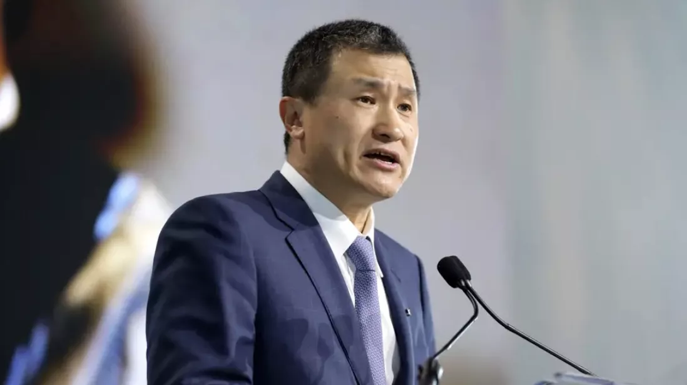
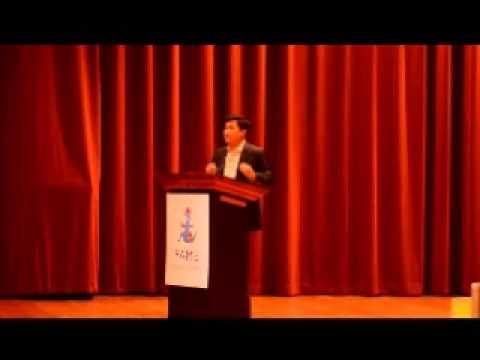

# 李录：2013年于旧金山大学的精彩演讲及学生问答实录

李录2013年于旧金山大学的精彩演讲及学生问答实录.pdf

> 彦鑫：今天的信件整理了李录在旧金山大学的演讲及问答实录。他从在哥伦比亚大学偶遇巴菲特的经历讲起，层层展开，深入阐述了价值投资的三大核心理念，并分享了在俄罗斯经历“休克疗法”后，买入油气公司Gazprom的思考过程。演讲内容兼具思想深度与实战经验，涵盖了人性与[心理学](../articles/61-心理学-经济学最该补的一课.md)、年轻人应该如何做投资、估值、持有多少现金合适、何时卖出、多元化等议题。
> 延伸阅读：[李录：对冲基金喜马拉雅资本的创办人兼董事长（Himalaya Capital）](https://y4pc2g8csc.feishu.cn/wiki/HNtfwecbhi9DfokrKUhcdEINnsb)

> **“从进化心理学的角度来看，人类其实是由‘从众本能’塑造出来的生物。那些能在演化中存活下来的基因，往往具备强烈的群体适应性”**
> **“如果你想在整个市场唱反调，你大概率需要有一种“变异基因”，让你能在孤立无援、被看作疯子的时候仍然觉得舒服。”**
> **“我强烈建议你：最好去研究那些现实中成功的投资案例和历史例子，仔细钻研那些真正优秀的价值投资决策是如何做出来的。”**

**问答环节涉及以下议题：**

- 请问您是如何判断该什么时候卖出一只股票的？

- 请问您在买入之前，会要求多大的“安全边际”？

- 假设你对一家企业未来的盈利能力完全没有洞察——你只能把它当作一家“零增长”的公司来处理，那你愿意为这样的公司支付多少价格？

- 那您现在持有多少现金？

- 您怎么看目前美国国内哪些行业估值最高、哪些最低？

- 能不能具体谈谈您是如何做研究、如何找到那些价值只反映真实价值10%的标的的？

- 在构建投资组合时，您如何看待多元化的作用？

- 当你遇到一个非常有信心的投资机会时，你的持仓比例应该控制在什么范围内？你需要考虑哪些因素？

#### **以下是李录演讲全文**

没错，画质就是这么模糊...

我自己的职业生涯，某种程度上可以说是从一次偶然的经历开始的。当时我还在哥伦比亚大学读书，有一天，被朋友拉去听了一场讲座。那时我刚到美国没几年，英语还不太好，主讲人的名字听起来像是“免费午餐”或“巴福”之类的（笑），让我一开始完全没意识到他是谁。但那场讲座的主讲人其实是沃伦·巴菲特，那次经历彻底改变了我在美国的生活轨迹，也让我走上了后来这条我无比热爱的投资之路。

所以，今天能回到这样的环境里，和学生们直接交流，我感到非常高兴。

今天我想稍微谈一谈“价值投资”这个主题。这个理念的基本框架，虽然已经有几十年的[历史](../articles/60-历史-向死人学习.md)，但我认为，直到今天，它依然和当年本杰明·格雷厄姆在哥伦比亚大学首次提出时一样具有现实意义——那已经是六七十年前的事了。

价值投资其实就是**三个基本**的核心思想：

**第一，股票不是一张可以任意买卖的纸张，它代表的是一家公司的一部分所有权。**所以，评估股票的价值，其本质就是评估这家公司整体的价值。

第二，**所有的金融资产价值，其根本都取决于未来现金流的折现**。也就是说，你必须对未来有所判断。但问题在于：未来本身是不可预测的。而既然不可预测，你就要给自己留有“安全边际”——这样即使你的预测是错的，也不会全盘皆输。

举个例子：你做了一个判断，有 90% 的概率你是对的，可是一旦那 10% 的情况发生了，它就是 100% 的现实。所以，**你需要以足够低的价格买入**，这样即使未来的发展完全不利于你，最坏的情形出现，你也仍然能“活下来”。

这并不意味着你不会亏钱，而是说即使你亏了，也不会亏得太惨，以至于被“淘汰出局”。因为投资，其实是一场长期游戏，可以贯穿一个人整整一生的职业生涯。所以，你真正需要做的，是**确保自己能一直留在牌桌上，长期参与这场游戏**。

**第三个核心理念，就是“市场先生”。**你需要用一个特定的思维框架来看待市场：当市场情绪与自己背道而驰时，不要焦虑不安，而要把它当作一个**神经质的、情绪化的‘市场先生’**——时而疯狂、时而抑郁，极不理性。这是格雷厄姆经典的比喻，也帮助我们更冷静地看待市场波动。

这三条，其核心都围绕着一个朴素的道理：**你想以低于价值的价格买到某样东西**。你要买得划算，买得有“便宜”。这听起来很自然，人人都想这样做。但问题是，如果所有人都想“占便宜”，那岂不是所有专业投资者都会变成价值投资者？

但事实恰恰相反。**真正按照价值投资原则去实践的人，在整个投资行业中，其实只是极少数**。绝大多数人持有不同的理念，我在这里替他们简要概括一下“另一种”主流投资观点：

首先，是的，股票在法律上确实代表的是对一家公司的部分所有权。但**从实务角度，它首先是一张可以随时交易的纸**。因此，所谓的“成功投资”，就是看你是否能成功预测这张纸的价格走势，不论你用的是哪种理论或工具。

第二，这种观点认为，市场值得被尊重，甚至应当被“敬畏”。因为正是通过市场，人们才能发现价值、进行买卖，完成交易。

听起来，这套逻辑甚至比我们前面讲的价值投资还更“合理”、更“时髦”一些。但实际上，我要强调一点：**大多数人都追随的是后者（即短期交易思维），而不是前者（价值投资）**。

所以，当你还年轻、正在考虑进入这个行业时，你该如何选择？我的建议是：**在做决定之前，不妨好好研究各种投资理念和方法的实际结果**。

幸运的是，已经有大量研究数据可以帮助你做判断。我们至少已经有了过去 100 年左右的市场表现数据。**而这些研究几乎无一例外地得出一个清晰的结论：**

> **那些真正按照价值投资原则去做的人，在长期内始终跑赢市场**；
> 相比之下，几乎所有其他策略，要么只是勉强跟上市场，要么长期严重跑输。

当然，你可以质疑这些研究结果，但我认为它们提供了非常有说服力的证据。那么问题来了：如果这些研究真的表明，价值投资是一种优越的方式——而且这种投资理念早在七十多年前就已经被阐明，长期被成功实践，并被像巴菲特这样的投资大师广泛传播——那为什么依然**只有极少数专业投资者真正采用价值投资**呢？

这背后其实有一个深层的原因：**人性与心理学**。

在价值投资中，你必须具备一种特定的思维方式：**即便你做足了研究，逻辑严密，但市场与你对着干，你也要能够心安理得地“一个人站着”**。这正是“市场先生”背后的[哲学](../articles/62-哲学-追求智慧是道义所在.md)。但问题是，这种状态其实**极其不自然，甚至反人性**。

当整个市场都和你对立时，当身边所有人都认为你愚蠢、神经质、错得离谱，而你却坚持认为他们才是非理性的“市场先生”时，你的行为就变得非常非常“反常”，甚至可能看起来像是在自我欺骗。旁人也很可能会觉得你滑稽可笑、固执异常。而这种孤独、被误解的感觉，是极度令人不适的。

从进化[心理学](../articles/61-心理学-经济学最该补的一课.md)的角度来看，我们其实**是被“顺从”所塑造出来的生物**。几百万年来，我们的祖先——甚至是远古动物祖先——大多是群居的。如果你和群体意见不合、被孤立，那你往往活不过下一次狩猎。所以，**那些能在演化中存活下来的基因，通常都倾向于高度的从众与顺应**。

这种“从众”的倾向，也支撑了人类社会的运转。我们毕竟是社会性动物，社会的和谐需要“共识”“同理心”和“群体纽带”。所以，**如果你想在整个市场唱反调，你大概率需要有一种“变异基因”，让你能在孤立无援、被看作疯子的时候仍然觉得舒服**。

这也是金融市场并不总是高效的一个重要原因。

自从两三百年前“自由市场”理念在现代社会兴起以来，它在“实物商品”与“可定义服务”领域取得了极大成功，[历史](../articles/60-历史-向死人学习.md)证据已经非常充分。凡是采纳自由市场制度的国家，基本都实现了显著的繁荣。

但相反，在金融市场中，几百年来，自由市场体制却伴随着大量的灾难、剧烈的波动和非理性的极端行为。

金融资产在自由市场中，远不如商品和服务那样有效运作。为什么？因为金融资产的本质，是一种预测未来的贴现机制——你试图将未来的现金收益贴现至当下。但我们都知道：第一，我们无法预测无限的未来；第二，我们甚至无法准确预测眼前看不到的近期变化。因此，在金融资产的估值中，难免要掺杂大量的推测、猜想和估计。

当这种不确定性被放大时，金融市场——特别是股市——便会显露出投机和赌博的成分。而我们都知道，在纯粹的赌博场合，如赌场中，赔率往往对赌徒极为不利，而有利于赌场的拥有者。这也正是为什么赌博业如此赚钱。

但即便大家都明知道“赌徒必输”，这也从未阻止人们热衷赌博。人的天性中就存在某种偏好，它让人乐于赌博，即便明知胜算不大。正因如此，在政府许可的范围内，比如美国内华达州、中国澳门，赌博业往往也能成为大生意。

金融市场其实也存在类似的心理驱动机制，这也解释了为什么它不能像实体商品和服务市场那样高效运行。2008–2009年金融危机，就是这一[历史](../articles/60-历史-向死人学习.md)长河中最新的例子之一。而这也并不意味着我们找到了一种更好的制度来替代市场。

正如丘吉尔曾说过的那句名言：“民主制度或许很糟，但和其他制度比起来，它是最不糟的。”金融市场也是如此。它的确不完美，在处理金融资产时尤其如此，远不如在商品和服务市场中那么有效。但它依然是我们目前已知的、最可行的方式之一，尤其在促进资金流动、支撑现代经济运转方面，它至关重要。

而这，正是对真正的价值投资者提出的挑战。你必须能够克制自己，不要频繁下注。你要清楚，金融市场本质上就不是那么“好使”。但是，在很多时候它的运行还是“过得去”的。你真正该做的，是**等待那些极端时刻的到来**——只有在那种时机下，你才应真正出手下注。

这样你才能确保两件事：**第一，你拥有足够的安全边际**；**第二，即使全市场都与你对立，你也能独自坚持自己的判断**。

做到这一点，需要极强的纪律性——必须始终坚持**只在拥有足够大安全边际的前提下才行动**。几乎所有成功的价值投资实践者，都有这一共同特征：**他们下注的次数极少，但每次出手，都要求极高的安全边际**，这样一来，即使市场走势不利，他们也不会感到不安。更重要的是，他们往往能把握住那些**几乎无需费脑思考的好机会**。

而这正是大多数人最难做到的部分——他们普遍缺乏那种必要的纪律，尤其是在心理层面。

你会发现，在牛市中，**几乎所有人都会自称是“价值投资者”**。他们买入某只股票，仅仅因为它看起来比他们心中的“[内在价值](../articles/03-内在价值-价格背后的真实重量.md)”低了 20%，当股价上涨时，就自我吹嘘说自己是聪明的、成功的、理性的价值投资人。

但如果市场走势反过来，仅仅 20% 的折价，往往就在误差范围内，很快就可能被市场抹平。他们就成了第一批“尊重市场、顺势而为”的人——而这其实恰恰说明：**他们根本不是真正的价值投资者**。

所以，当你看到这种行为模式时，基本可以判断这不是经过深思熟虑的价值投资行为。

作为学生、年轻的分析师，或者一个对金融感兴趣的人，**我强烈建议你：最好去研究那些现实中成功的投资案例和历史例子，仔细钻研那些真正优秀的价值投资决策是如何做出来的。**

我刚才从机场来时和 Asnar 聊天，他提到了他最喜欢的一只俄罗斯石油股，这让我想起了一个特别经典的价值投资案例。90 年代早期，你们有些人可能知道，当时俄罗斯经历了“休克疗法”，几乎一夜之间进入了自由市场体制。政府在极短时间内完成了国有资产的私有化，包括当地的**石油公司、天然气巨头 Gazprom**等。

这过程发生得如此突然，以至于**大多数人甚至都没来得及搞清楚这些资产是怎么回事**。

很多在这些公司工作的人，甚至包括一些拥有这些“所有权凭证”的普通公民，其实都搞不清楚那些凭证是什么。有些人上门用现金向他们收购这些凭证，而现金是他们能直接理解的东西，于是他们就很害怕错过这个机会，索性卖掉了。

因此，在某一时刻，这些代表股份的凭证被交易的价格极其低廉——到底有多低呢？先别说盈利能力了，**就看资产负债表上的油气储量数据**，当时油价的四五年平均大概是每桶 20 美元，而资产负债表中每桶探明储量的账面价值却被严重低估。

有多低？你还记得吗？**有时候只按账面价值的 1 分钱交易，有时候甚至是半分，也就是说每桶探明储量只按 10 到 20 美分交易**。这还不算公司的盈利能力，仅仅是资产价值而已，价格都已经跌得荒谬可笑。

我当时就觉得，这可能就是所谓的“安全边际”吧——**即使考虑到俄罗斯的政治局势，这也是超低的价格**。此后这些股票的价格一路上涨，先是涨到 20、30 美分，然后是 50 美分，再到 1 美元，甚至曾短暂涨到 2、3 美元。

但几年后，亚洲金融危机爆发，俄罗斯也发生了货币贬值，原来以 2 美元计算的价格看起来一下子不那么稳妥了，因为卢布一度贬值了 **90%**。但即便如此，如果你是以 10 美分买入的——也就是账面价值的 1%都不到——即使汇率崩盘 90%，你仍然赚了 10 倍的钱。

这就是极端情况下，“安全边际”如何真正发挥作用的一个好例子。你只有在这种极端情况下依然能扛住冲击，并最终赚钱，那才是真正的价值投资。

再举个例子：几年之后，也就是在 1997-1998 年，国际市场上的原油价格一度跌破 10 美元，并持续了几个月。当时的五年平均油价大概还是 20 美元左右。

要知道，当时世界上大多数油田的生产成本就高于 10 美元——除了沙特、部分海湾国家和俄罗斯的几个区域，大多数地方的油公司如壳牌、BP 等，在这个价格下都是亏损的。

而且当时我们还没有找到可以真正替代石油的能源。所以，当时市面上其实有很多石油公司，**即使在 10 美元的油价下都还能盈利，而且资产负债表上还有大笔现金**。你甚至可以按资产拆算到每股价格。

类似这种情况，当时其实举不胜举——一个又一个安全边际极高的案例，都值得你深入研究学习。

我从 90 年代中期开始进入这个行业，大概是 1994、1995 年左右，到现在将近 20 年的时间里，其实从未遇到过完全没有投资机会的阶段。**每个时期，我都总能找到一些让我兴奋、觉得诱人的东西。尤其当你管理的是一笔较小的资金时更是如此——因为你面对的是全球十几万只证券、主要是股票，在这种广阔的池子里，总会有那些具有足够“安全边际”的机会。**

当然**，最理想的情况不只是资产便宜，而是你能买到高质量的资产——即那种具备持续盈利能力的资产，也就是能带来复利增长的“现金流机器”。**换句话说，如果你既能以便宜的价格买入，又买到了一家具有稳定盈利能力、持续复合增长能力的公司，那就是投资中的“圣杯”。你可以[长期持有](../articles/06-长期持有-坐等伟大公司复利增长.md)，不管市场行情涨跌都不用在意。

这种机会存在吗？我认为确实存在。也许对于大额资本来说比较难，但对于一笔较小的资金来说，这样的机会依然非常多。如果我是今天的学生，手里有几万美元，我会非常乐意在当前这种市场环境中去寻找这些机会。

当然，如果你管理的是一大笔资金，就会面临许多全球性的挑战，这里就不展开讲了。但如果你操作的是一笔相对较小的资本，小市值市场里仍然有大量类似的优质投资机会。

我举一个例子，供你进一步研究看看是否有趣。在韩国，有一种证券叫“优先股”，本质上就是没有投票权的普通股，通常支付略高的股息，但不具备表决权。**有意思的是，这些优先股在某些情况下的交易价格，居然比对应的普通股低 70%~80%。**

而在这类优先股中，有几家公司是拥有长期[护城河](../articles/08-护城河-宽且不断变宽的护城河.md)的企业，几十年来始终保持收入与利润的复合增长，是典型的“[现金流](../articles/10-现金流-能拿出来再分配的钱.md)机器”。这些公司本身有强大的盈利能力、清晰的扩张机会，其优先股的交易价格却只相当于公司真实价值的一小部分。

你甚至可以直接比较它们的普通股（带投票权）价格与优先股（不带投票权）的价格。而实际上，这些公司本就是由家族控股控制投票权，普通股和优先股在本质上几乎没有区别。但即便如此，优先股依然以高达 80% 的折价在交易。

我不是在说打个八折的那种折扣——我是说**打两折，按一美元值二十美分来交易的那种机会**。如果你相信普通股反映的是公司的真实价值，那这就是一笔天大的交易。

我的观点是：这样的机会，在各类证券中都可能出现。所以，**如果你现在刚开始职业生涯，还很年轻——如果我是你，重来一次，我会先深入研究过去市场在某些小众资产上出现极端定价的经典案例**，那些时候就会出现巨大的安全边际。即使你最后亏了点钱，你也还能留在牌桌上。**这才是关键：即使有波折，你还能活下来。**

所以你要研究这些[历史](../articles/60-历史-向死人学习.md)案例，然后再看看今天的市场上是否有类似的机会。**其实任何时候都存在这种机会**，而且这和人类的基本心理结构密不可分。**只要人性不变——而我相信几百万年来我们变化不大——那这样的投资机会就会一直存在。**

这对年轻人来说是个令人鼓舞的事实。如果我是你，我今天一定会像二十年前坐在你们的位置上一样感到兴奋。祝你们好运——好，现在我开始接受提问。

#### **问答环节**

**提问者：请问您是如何判断该什么时候卖出一只股票的？**

**李录：**

这是个非常好的问题。**什么时候卖，取决于你当初判断这只股票价值的依据是什么。**

比如在我前面提到的例子里，**价值的基础是公司的资产价值**。那你就需要定期重新评估你的投资情境——包括它的上行空间和下行风险。因为情况是会变的。

比如我之前提到的俄罗斯本地油气公司 Gazprom，那是我买得最便宜的投资之一。但**我买入两年后就卖掉了**。虽然当时它的价格仍然是账面价值的 10%~20%，也就是八九折的巨大折扣，但我觉得这种折价**在当时的环境下是合理的**。

到今天它们可能还是在大幅折价交易——我不确定最新数据，你们可能比我还了解。**但相较于其他国家的公司，我对这类折价的“安全边际”要求更高。**

那次之所以卖出，是因为最初是遇上了极端机会——比如 99% 或 99.5% 的折价——几乎是天赐良机。那样的机会本身就是极罕见的“偶发事件”。

如果我们讨论的是基于“收益”的投资决策，那我通常不会太急着卖出。因为如果你判断正确，公司盈利会持续增长。而每次卖出股票时，其实你都等于“付出”了30%到40%的利息——因为你触发了资本利得税（联邦加州税一起算可能就这么多了，而且这个比例还可能会上升）。**所以只要你不卖，其实就是在无息、无风险地“向政府借钱”。**

而只要这家公司背后的业务仍然保持稳定、持续增长，那么我会觉得没有必要急着卖出。**但如果股价真的涨到了极度高估的水平，或者经营环境发生了变化，那当然就需要重新评估并做出调整。**

这也是投资有趣的地方——市场和环境总是在变。**正因如此，这场游戏才如此令人着迷。**

---

**提问者：请问您在买入之前，会要求多大的“安全边际”？**

**李录：**

这其实还是取决于你买的是什么样的资产。**如果你买的是非常高质量的资产，那你对资产“账面价值”的安全边际要求就可以放低一些。**

为什么？因为你对未来的**盈利能力**要求更高。你是希望它未来不断产生[现金流](../articles/10-现金流-能拿出来再分配的钱.md)的。如果你能比别人更了解这个行业、更懂这家公司、或者你在资产的结构和价值判断上有**独到的洞察力**，那么你就可以承受账面上看起来没有那么“便宜”的买价。

所以，**关键在于你对企业未来的认识是否深刻，是否独特**。这种“认知优势”会在你心中形成一个别人看不到的安全边际——即便对旁人而言，这个价格似乎已经不便宜，但对你来说，它是非常有吸引力的。

我自己的观点是：**你能获得的安全边际越大越好**。你应该追求一个非常、非常充足的安全边际。

---

**提问者：假设你对一家企业未来的盈利能力完全没有洞察——你只能把它当作一家“零增长”的公司来处理，那你愿意为这样的公司支付多少价格？**

**李录**：

就拿我提到的俄罗斯案例来说吧。当时我对俄罗斯几乎一无所知，也有很多理由保持怀疑，所以我必须要求**99%的折价**（才会考虑出手）。**如果折价只有80%，我会感到非常不舒服**。

而事实上，后来那90%的“折价”被汇率变化吞噬了——虽然之后又长回来了。所以每种情况都不一样。

**如果我理解这个国家的外部环境、企业管理、文化背景，我可能会觉得70%到80%的折价已经是非常不错的价格了。**

所以我必须说，每一个决策都是**情境相关**的。

---

**提问者：听起来这真是个非常高的“交易门槛”。**

**李录**：

这也是为什么你**不需要频繁出手**。要成为一个长期成功的投资者，你得能忍受长期的“按兵不动”。

**你并不需要频繁操作就能变得极为富有，这正是这个游戏的魅力所在。**

你可以一直在学习，但大多数时候什么也不做。如果你贸然操作，在没有足够安全边际的情况下买入，那你可能会亏得很惨，**这远比什么都不做要糟糕得多**。

而当你真的找到了足够大的安全边际去下注时——只要判断正确，**你的回报往往也会非常惊人，甚至远超你的预期**。

这就是为什么你要学会等待那些“好球”，而不是频繁挥棒。

---

**提问者：那您现在持有多少现金？**

**李录：**

这得看具体时期，**会根据市场上的机会而变化**。

---

**提问者：我叫Jenny，来自伯克利， 您怎么看目前美国国内哪些行业估值最高、哪些最低？**

**李录**：

我认为，要成为一个优秀的投资者，**你并不需要什么都懂，也不需要表现得好像你对每只股票都了如指掌**。

事实上，**你真正有深度认知的范围往往是非常小的**——就像巴菲特所说的“[能力圈](../articles/11-能力圈-知道自己不知道什么.md)”。

所以每当我听到有人说“某个行业被高估了，另一个被低估了”之类的话时，**对我来说那听起来并不严谨**。

在投资中，你最不希望的就是出现“知识错觉”。虽然“自负”这个词听起来太强烈了，但我认为：**越是诚实的人，越容易在投资上成功**。

我从未见过一个在认知上自负的人，能在投资这场长期游戏中取得持续成功。

---

**提问者：谢谢您的分享。您刚才提到，寻找金融市场中那些严重的价格失真，以便抓住巨大的投资机会，能不能具体谈谈您是如何做研究、如何找到那些价值只反映真实价值10%的标的的？**

**李录：**

在我自己的职业生涯中，我发现灵感其实来源非常广泛，没有固定的路径。**只要你保持好奇心、持续学习，并和其他聪明、理性的投资者保持良好的交流关系**，你自然会接触到很多有意思的投资想法。在当今这个时代，由于[监管](../articles/64-监管-社会球场上的裁判员.md)要求的推动，信息披露非常透明，我甚至不觉得奇怪——你完全可以仅凭公开的信息就找到极好的投资机会。真正难的，是如何判断什么才是一个好的机会。

你问我建立信念的过程是什么样的，是不是像“灵光乍现”的那一刻？我喜欢这样描述一个想法的“信念感”：**当你能找到最聪明的反对者来挑战你的观点，而你能用逻辑说服他，甚至比他更好地驳倒你的想法时，你就可以说自己对这个观点是有某种程度上的信心了**。当然，即使如此，你也应该把自己局限在一个很小的“[能力圈](../articles/11-能力圈-知道自己不知道什么.md)”内，专注于自己真正了解的领域。随着经验的积累，你的[能力圈](../articles/11-能力圈-知道自己不知道什么.md)会慢慢扩大，但这应当是一个缓慢的、渐进的过程。我认为，**诚实的自我认知**，是成为一名优秀分析师和成功投资人的前提。

---

**提问者：我想请问您关于投资组合构建的问题。我们上一节课讨论了很多关于多元化的重要性。我感觉您个人更偏好集中投资，和一些其他著名投资者类似。那么在构建投资组合时，您如何看待多元化的作用？**

**李录：**

你无论如何都需要一定程度的多元化。原因有两个：第一，你可能判断错误；第二，即使你判断正确，未来的结果本质上也是一个概率分布。举个例子，你可能有 90% 的信心某个事件会发生，但如果那 10% 的意外情况真的发生了，你总不能因此“出局”，对吧？所以，你需要适当的分散投资。

但与此同时，我们也要承认——真正属于“无脑买入”的极优质机会，是极其稀有的。你往往需要等待很久，才等到一个“好球”。而一旦你真的遇到了这种机会，那可千万别为了去追求所谓的多元化，而放弃了你苦等多时才出现的珍贵机会。

本质上，投资就是一个[机会成本](../articles/05-机会成本-用最好的选项做标尺.md)的游戏。每一个新的选择，都必须能在比较中胜过你已有的头寸。如果它做不到，那就没有理由去做所谓的“分散”。因此你最后会集中在少数几个非常好的、你有高度信念的机会——坚定持有，任其增长。

---

**主持人：在你提到的这个例子中，其实你刚好点出了我所强调的核心：当你遇到一个非常有信心的投资机会时，你的持仓比例应该控制在什么范围内？你需要考虑哪些因素？**

**李录：**

我想说的是，所有投资决策都应该从“[机会成本](../articles/05-机会成本-用最好的选项做标尺.md)”的角度来权衡：**我还能用这笔钱做什么？**——而现金本身，其实就是一种非常重要的资产。如果我找不到任何更好的机会，或者说找到的其他机会都不如持有现金有价值，那我就会选择继续持有现金。

所以我想说的是，我从不介意在找不到理想投资机会的时候持有大量现金。同时，一旦我发现一个真正优秀的投资标的，我会让它在整个投资组合中占据较大的比例。而其他一切都要与我手中已有的资产做比较，特别是与现金比较。

有时，持有现金本身，就是一个“自下而上”的研究结果——我始终相信这点。

**主持人：**

好的，非常感谢你，祝你一切顺利！我们感谢李先生今天的演讲以及他对本次大会的贡献。我们现在将进入五分钟的休息时间，随后将开始最后一个小组讨论环节，主题是“另类投资”。

（全）
