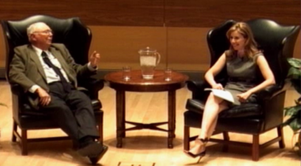

# 查理芒格：2010年密歇根大学演讲

2010年9月

### 芒格2010年密歇根大学演讲：人生潮水有顺有逆，不要费尽心思预测潮汐，毕竟我们要游很长一段时间

2010年9月，查理·芒格回到自己的母校密歇根大学，在罗斯商学院开展了一场别开生面的演讲。

出生在奥马哈的芒格作为一名数学专业的本科生进入密歇根大学，在此期间他又接触了[物理学](../articles/57-物理学-临界质量与硬科学的尺度.md)，从那时起，他就把[物理学](../articles/57-物理学-临界质量与硬科学的尺度.md)视为解决问题的最高标准。

二战期间，查理离开大学去陆军机场服役，服完兵役后，他又获得了哈佛法学院的学位，之后前往加州从事法律工作，1962年，他与合伙人共同创立了Munger,TollesOlson律师事务所（芒格在1965年离开）。后又与沃伦·巴菲特联手经营了一家非常成功的投资合伙企业——伯克希尔哈撒韦，这成功的背后是芒格职业生涯价值观的体现——耐心、努力、理性。

此次演讲分为三个部分，第一部分是主持人埃文介绍玛丽·苏·科尔曼校长、查理·芒格以及贝基·奎克，第二部分是芒格与贝基的对话环节，第三部分是现场观众问答环节。

贝基2001年加入CNBC，是CNBC标志性早间节目的联合主播，负责报道华尔街的各项新闻，在采访知名投资家的活动上经常看到她的身影。

整场对话长达2个小时，芒格金句频出火力全开，他直言华尔街只会追逐利益，美国会计师们更是糟糕透顶，他也表示自己非常赞同使用太阳能以及大力发展基础设施，他还大肆赞美日本、新加坡两个亚洲国家的优异表现，肯定了亚洲面孔在全球巨变中的付出与贡献，此外，他还分享了自己关于囤积黄金、律师行业、人性弱点等话题的见解。

虽然是一场十多年前的演讲，但话语之间我们感受到了芒格的洞见力与大智慧。

就如同玛丽·苏·科尔曼校长所说，查理·芒格是这个时代最睿智、最敏锐的思想家之一，是投资界的传奇人物，他的《穷查理宝典》是必读书籍之一。她最喜欢芒格的一句话是“让你行至巅峰的是能力，但让你驻足于此的是性格。”

在这场交流中，芒格用极度通透的人生智慧，分享对于漫长人生中，时有经历的困难时期应如何安度。

他有一句话也很适合当下，对于我们必须面对的正在发生深刻变化的世界秩序和周遭的生活，甚至很多糟糕的时刻。

他说，**“我认为享受生活的一个要义就是认识、面对且适应变化的本来面目，不管喜欢与否。”**

这也是聪明投资者将这场小众但经典的对话精译出来，分享给大家的初衷，希望有获得和共鸣感。

### 不预测潮汐，尽力做一名优秀的泳者

**贝基：**

非常感谢大家今天的到来，在这里看到这么多人真是太好了。如果观众有任何问题，都可以举手，或者向我扔东西，试图引起我的注意（笑）。我们先谈论一些关于经济的问题，但显然当下的经济环境，想参与其中是较为困难的，但是查理，您作为伯克希尔的副董事长，肯定有很好的看问题的视角。所以当面对这么多不同的公司时，你觉得现在对经济最好的预测是什么？

**芒格：**

沃伦和我一样，我们并不是通过准确预测宏观经济而取得成功的。**我们的原则是竭尽全力做一名优秀的泳者，因为潮水有时会顺着我们，有时又会逆着我们，我们不会费尽心思去预测潮汐，毕竟我们计划要游很长一段时间。**我建议你们所有人都应该保持这样的态度，因为很少有人能成功预测宏观经济周期，当然肯定有一部分人会偶然做到。

这场比赛很难吗？为什么不尽可能地采用你擅长的游泳姿势呢？毕竟在漫长的一生中，你会遇到很多你人生中的顺潮和逆潮。有了专业底子，每个人都会对经济有一些想法，但我想让你明白，这些想法对于成功预测宏观经济没啥可信度。换句话说，这些想法可能没什么价值。但如果在经济低迷时期，就业率以惊人的速度反弹，我会非常惊讶。

我只会通过一个个合理的生意模式，看企业怎么保护它的资产负债表以及提升赚钱效率，这些我认为更有可信度。

与之前的情况相比，现在是一个糟糕的就业市场。近几十年的大部分时间都是这样。你们中的一些人将会进入这样糟糕的状况，但我觉得你们的态度应该简单，都应该说“那又怎样？总有顺潮和逆潮，人生还有很长的路要走。”

你要始终站在自己这一代人的立场上，对生活发生的所有事情，努力且从容地应对，且坚持下去。如果你能行至巅峰，你会分享人类文明里程碑的荣耀时刻。**在你的一生中，要得到你想要的东西，最好方法就是让自己配得上。**

这世界还没疯狂到总是给那些不配位的人奖赏，你想想是不是这个道理？

所以，要坚持不懈，不要气馁。

今天早上我给别人讲了一个我觉得就业市场真正非常糟糕的例子。我叔叔弗雷德当年以优异的成绩从哈佛大学建筑学院毕业。上世纪20年代，他在奥马哈小有成就，在那里他设计了教堂、各种小型建筑，一年可以赚8千到1万美金。这在当时可是一笔巨大的收入。

30年代的时候，整个奥马哈市每月仅有3万美元的预算投入到建筑业中，其中一些还只是用于维修工作。建筑师们找不到工作，包括我的建筑师叔叔弗雷德在内，所以他搬去了加州。在加州，他做一些杂活赚一份较低的工资；当情况更糟时，他又去了洛杉矶，为了省钱，做了洗衣工。但他不认为这有失他的身份，反而做得很好，从来不向任何人抱怨。在他31-34岁期间，他每月的收入是108美元。现在情况没有那么糟糕了，他在格伦代尔市以每月25美元的价格租到了一整栋房子。

当1936年联邦住宅管理局创立的时候，他参加了公务员考试，成为了洛杉矶FHA的首席建筑师，这是一个兼具责任、趣味和文明传承有关的工作。他有了一个漫长而快乐的职业生涯。他从不气馁，从不自怜自艾，我从没听他抱怨过什么。

**在我漫长的一生中，我发现了两件事绝对不能做：**

**一是永远不要让自己感到难过和愧疚，即使你的孩子死于癌症，也不要让自己自怜自哀；**

**二是永远不要嫉妒，这是七宗罪中唯一没有任何乐趣的，选一个其他的（罪）吧（笑）。**

所以遇到困难时，你要尽你最大的努力，这样顺境就会在适当的时点到来，经济上的麻烦也会离去，因此我认为就业市场在很长一段时间内表现糟糕对我们来说是幸运的。但同时我也认为在某些市场，最糟糕的时刻还没有结束。

### 目前的就业市场远没有上世纪30年代糟糕

**贝基：**

你认为现在的就业市场和30年代那会儿一样困难吗？

**芒格：**

目前情况远没有30年代那么糟糕，与30年代相比，现在简直算是天堂。我在30年代生活过，真的难以置信，没有社会安全网，当时人们搬进彼此的房子，这就是家庭，体现的是儒家思想。我的祖父把他的房子分成两半，让我的一个叔叔搬了进来；我的另一位祖父用他仅有的1/3优质资产拯救了他女婿的银行。很多家庭都很困难，但大家都在努力坚持，最终也都做得很好。所以我认为前面还有很多麻烦，**如果你觉得自己的一生很长，那么我认为适当遇到一些麻烦也是一种优势。**

**贝基**：

为什么你认为就业市场在未来一段时间内仍然很糟糕？只是没有建立起对应的需求吗？还是说公司要缩小规模减少损失？

**芒格：**

汤姆·弗里德曼说，这就像一辆没有备胎的汽车要在炎热的沙漠中行驶300英里，所以我们必须要使用所有安全的标准技巧。而现在，我们也要在没有备胎的情况下，穿过这该死的沙漠。所以我们为什么要为我们无法解决的问题而烦恼呢？我们要做的就是尽自己所能。

### 华尔街的会计师们令人失望

**贝基：**

在场的很多学生可能都来自商学院，他们会有一种很真实的感受，就是华尔街是一个糟糕的地方。

安德鲁·罗斯·霍金今天在《纽约时报》上写了一篇专栏文章，他说我不认为华尔街是一个邪恶的地方，但高盛可能是（笑），他确实认为华尔街有一些坏人。你对此有何看法？

**芒格：**

华尔街有更多令人遗憾的行为。权力往往会导致腐败，赚快钱往往也会导致腐败，所以我不认为这对华尔街来说是件好事。白痴和傻子用荒谬的话术出售劣质的抵押贷款，是非常令人遗憾的行为，这钱赚得太容易了。而成年人本可以解决这个问题，比如会计师，但他们完全辜负了我们，顺便说一句，这个职业没有任何明显的逆转迹象，我还没有见过有哪个会计师会对自己造成的麻烦感到丝毫羞愧，但这种影响是巨大的。

想象一下，当安然公司来到证券交易委员会说，我们要把未来20年里复杂合同中遇到的所有问题立即转化为收益，通过签署两份文件，资产负债表上就会有2800万美元的资产，多么荒诞！

美国证券交易委员会是由一众优秀的会计师领导的，他们在很好的大学学习过，但为什么还会出现这样的会计准则？他们到底在想什么？怎么可能有人在没有意识到人们会被会计准则诱惑且无法抗拒的前提下，对人性有更加深入地了解？

这太恶心了，而且他们还不觉得羞耻，也没有人责怪他们。银行的坏账核算体系都是精心设计的，市场每到景气顶部，坏账都会归零。哪个疯子设计出了这样的会计体系？我不是在开玩笑，这也不是拙劣的模仿，这些都是我们国家公认的会计原则。

**贝基：**

为什么你认为这些没有得到足够重视？所以你认为巴塞尔协议III是个笑话吗？

**芒格：**

有些会计师为了取悦那些开支票的人，很多专业会计师事务所里都是些过度使用数学的会计师。

他们希望一切都处于平衡，他们不认为人类行为系统制定规则是不合理的，他们太数学化了，在与人打交道时不够理性。就像华尔街的CEO们喜欢宽松的会计标准，都希望数字是好看的。

会计师就像裁判和球员，所以他们必须是成年人，这样才能防止不好的事情发生，但会计师都不想成为成年人，因为这意味着责任，意味着我必须做好这件事。

他们不确定自己是否知道这个道理，他们退缩的原因有很多，但这是这个职业在上帝面前的责任，他们让我们非常失望。他们让我们失去了裁判。

**贝基：**

这听起来感觉那些CEO们本质上都是坏人，他们不会遵守规则，除非有人拿着棍子盯着他们。

**芒格：**

我确实认为CEO文化是促进那些非常有竞争力、非常有动力、非常积极地完成他们想要做的事情的领导者们。

当别人失败的时候，你不会失去理智，当别人赚钱的时候，你也不会[嫉妒](../articles/25-嫉妒-唯一没有乐趣的罪.md)，否则这都会带来巨大的问题和危险。

你真的认为他们会从抵押贷款交易中赚到这笔钱吗？当你把不存在的款项放入资产负债表上时，你就会赚钱吗？

当你伸手去拿的时候，它就会像错过一样慢慢消失，这是一种完全不负责任的体系。

你不能责怪不幸。就像你说的那样，成年人的职责是防止不当行为。

有人说，你不能因为老虎的行为而去责怪老虎，你得雇个称职的看守。

### 高效利用太阳能并大力发展基础设施非常重要

**贝基**：我们为什么不谈谈解决方案呢？现在有巨大的推动力可以找到修复经济，尤其是修复就业市场的办法。

那就是总统在上周公布了他的减税计划，并提出了一些激励措施。你觉得这是正确的计划吗？

**芒格**：我其实有点反对我自己的这个党派，因为我觉得我的税有点太低了，我不认为我们需要最后一轮减税政策，我也不认为对冲基金管理者的个人所得税率应该比出租车司机低。我真的觉得这很疯狂。

我对工作方面的税收并不感兴趣。你要知道我是在上世纪30年代生活过，当时我是一个非常善于观察的男孩。

在很长很长一段时间失业率高达25%以及就业极其不足的经济里，建筑师沦为洗衣房打工仔，已经算幸运的了。

现在我们如此积极地使用这些“武器”，但过度使用肯定是非常危险的，这就是让我担忧的原因。如果你问我会怎么做，我会开展你见过的最大的基础设施项目，从可再生能源中获取能源。我指的不是玉米，这应该是大家最一致的想法之一（笑）。

即使[历史](../articles/60-历史-向死人学习.md)上我们曾用玉米做过燃料。你可以说，提出这种想法的人根本不值得坐在谈判桌上。但从根本上说，快速利用太阳能以及创建庞大的基础设施，是一个非常合理的想法，而且我们现在知道如何实现这一切。

我认为国家也会支持，因为人们已经意识到了把注意力集中在一些大的、重要的、明智的事情上的重要性。

**贝基：**

短期内可能不会体现，如果是对生活已经非常困难的消费者征税。

**芒格：**

我认为，如果我们借钱并建立基础设施，这显然是在做正确的事情，但如果是借钱做别的，那就很危险。

所以如果你用这些钱做一些真正有价值的事情，那就不那么危险了。我认为基础设施肯定非常有用，这肯定是需要的，这会让我们朝着正确的方向前进。

我认为全球变暖并不是主要问题，换句话说，在我看来碳氢化合物消耗太快才是主要问题。为了养活地球上现有的人口，我们需要大量的碳氢化合物作为杀虫剂，大量的碳氢化合物用来小麦种植，还要大量的碳氢化合物用来制作肥料，其中主要是固氮。我们没有好的替代品，虽然像紫花苜蓿这样的植物已经可以固氮了，但我们需要一万亿吨的肥料啊。

因此，我认为不减缓碳氢化合物的使用是不负责任的。要做到这一点，正确的方法就是大规模地加速可再生能源的使用，这是一种非常合理的刺激。我不相信我们的意见会不统一，毕竟谁会反对太阳能以及大量的清洁能源呢？

**贝基：**

在这方面，可以说你把钱用在了刀刃上，也就是[比亚迪](../articles/46-比亚迪-押注一个把事情做成的人.md)，该公司目前也在研究电池动力汽车。

可以在我国以及其他国家推广的解决方案，我们大概到什么程度了？

**芒格：**

我认为太阳能显然会变得相当便宜，而且技术上是可行的。正如弗里曼·戴森所说的那样，这并不重要，如果你额外花费5%的GDP，也就是2年的增长，就能让系统正常工作。我认为这些都会实现，只是希望它能更快更理性地实现。

我们已经被那些在错误事情上漂白的人分散了很多注意力，所以我不确定像阿尔·戈尔（美国政治家）这样在技术上无知的人是否有资格谈论这个话题（笑）。

**贝基：**

你认为我们有希望能摆脱每个人都在推动自己的想法这一现状吗？当你谈到能源时，有些人认为它是风能，有些人认为它是太阳能，有些人认为它是天然气，或者有人认为它应该是核能。

**芒格：**

我想最终大家会使用太阳能，因为铀的供应不是无穷无尽的，也不是完全触手可得的，但太阳是丰富且[可靠](../articles/36-可靠-让自己配得上信任.md)的，因为它是一个来源，所以我觉得我们是幸运的。复活岛上的人们没有阳光来解决他们所遇到的问题，所以他们基本都灭亡了，同时他们的所有其他资源也都被耗尽了。

这也是我们要面临的一个问题，因为上帝给了我们一个永远用不完的极好的选择，这是一个巨大的好处，在场的年轻人应该感到高兴，因为人类文明的主要技术问题基本已经解决了。

我并不是说解决这一问题的工作量不大，但我们至少知道如何建造传输损耗低于10%的高压输电线路了，知道能源如何转移了，也知道哪些方法更加便宜了，但如果我们一定要花费高昂的代价，其实也是可行的。

没有什么是不可能的，这是对你们所有人的祝福，因为你们还有很长的路要走。

### 短期激励制度需要被改变

**观众1：**

到目前为止，我们一直从华尔街谈论到更大更长期的能源倡议和政治，这都源于我们国家建立了一个短期的激励制度大公司的管理层总是关注下个季度的收入，政客们也总是关注下一个得分点是什么，然后制定实施计划以保证任期结束后仍能继续很好发展。你建议如何克服这一点，将我们的系统从短期激励和规划转变为更长期的视角，不仅是在理论层面，更多是在行动层面。

**芒格：**

短期的激励确实是个大问题，如果你把短期激励和没有道德风险联系在一起，当然会出现问题。但如果不解决人类的[激励机制](../articles/28-激励机制-永远别低估它的力量.md)问题，就很难修复这一系统。**所以把重点放在激励上是完全正确的。**

我认为现有系统的演变是反常的，当好人变坏时，系统是反常的，因为系统结构就是这样设置的。

如果你经营着一家大型的连锁商店，那么你很容易因为自己的马虎而丢失东西，从某种意义上说你会让很多好人变坏，你将会创造出一个不负责任的系统，这会制造出很多麻烦。

如果是我，我会改变整个系统，当然没有人会以芒格的风格做事，年轻人将不得不以现在的方式生活，并一次次地抨击它。

你是对的，无论是对政治家还是对管理层还是对其他所有人来说，这都是一个非常严重的问题。

但我认为这不是必要的，因为世界上其他国家都还在关心下个季度的GDP，但伯克希尔并不在乎，有人在乎吗？

现在，你可以说我们精心构建了我们的系统，以至于我们不必生活在那些疯狂的激励下了。

我对自己并不是特别信任，但我比那些怀着不正当动机做坏事的人要好，**正确的做法会是让自己受到的诱惑越少。**

你付给董事的钱越多，董事付给CEO的钱就越多，社会[心理学](../articles/61-心理学-经济学最该补的一课.md)的规则就是这样的。我们应该以不同的方式来构建这个（激励）系统，因为它现在根本不起作用。

**贝基：**

所以你没有给伯克希尔的董事支付很多？

**芒格：**

是的，因为我们不喜欢这种文化。我们应该改变所有的这些激励措施。

**贝基：**

所以伯克希尔的办公室远离华尔街，这会有什么不一样吗？远离竞争对手，以自己的方式运营是不是更容易？

**芒格：**

我们诞生于美国中西部，我认为我们有更好的文化，这可能是一种自负。我始终觉得如果你处在一个疯狂的地方，那里有很多竞争和不正当激励，那么你就很难保持自己的理智。

我父亲曾经和我讲过一个关于他的故事，我觉得非常好，我永远不会忘记。

他是哈佛大学法学院的毕业生，在内布拉斯加州从事法律工作。

他去南达科他州狩猎，和他一起去的那些人都注册成为了南达科他州的居民，为了节省5美元的狩猎许可证。

当时是每个人5美元，那可是一大笔钱，但我的父亲作为一名律师，克制住了自己，但差一点也签了虚假许可证。

所以当环境和文化改变时，我们很容易被拖着走。

**因此，当周围的一切都在失去理智的时候，你要像吉卜林一样保持头脑清醒，这是一个非常好的习惯。**

想想那些陷入安然风波的人，很多都自杀了，或者被羞辱。

如果你幸运地避免了这件事，那就去寻找一个合适的场所工作。

如果你在密歇根大学医院工作的话，你不太可能再往南方了，你也不必大老远跑到印度的贫民窟去帮助特蕾莎修女。

因为你在这儿没有那么多疯狂的诱惑，只有目标，以及让每个人都热情、上进和疯狂的氛围。

这很难不陷进去的，我的父亲也是，差点就签署了在南达科他州5美元狩猎许可证的虚假申请。

我见过两位大学校长因开支账目过于宽松而堕落，我也见过不少部长因各种不幸而下台，所以我们就该受他们影响吗？虽然我们很容易受到错误方向的诱惑。

当我们在一条有巨大漩涡的河流上顺流而下时，不要离漩涡太近，离它远远的。

如果你觉得文化很疯狂，你不必卷进去，如果你不小心进入了，你也可以离开。比这更好的是，**你要是个聪明人，你可以看看哪个地方的文化不会诱你犯错，你可以跟你仰慕的人、价值观健全的人在一起，做任何事都是很有趣的。**

如果你很清楚哪些是你想与之一起工作的人，那就告诉他们，这样会获得有利的结果。

### 文明遇到的99%的威胁与麻烦都来源于过于乐观的会计

**观众2**：

会计行业到底发生了什么？我们能做些什么来解决这个问题？

**芒格：**

部分是因为他们出卖了自己，部分是因为他们担心当不得不做出更加困难的决定后，要承担相应的责任。

这是一个非常非常困难的问题，但可以通过改变法律和规则来很容易地实现，但这将影响很多美国人。文明遇到的99%的威胁与麻烦都来源于过于乐观的会计。**我们应该有一个更加保守的会计体系。**

美国证券交易委员会的一名会计师提出按市值计价会计的疯狂计划时，我不想称它为按市值计价，我更愿意称之为一个神话。一起保佑会计吧，如果哪家会计师事务所灭亡了，那是罪有应得。这又扯到另一个话题上了。到一月份我就87岁了，所以我给你们指个方向，你们去解决经济问题吧（笑）。

### 过去100年人类取得了巨大的成就

**观众3：**

鉴于你认为这个体系仍在迅速崩溃，以及对失业的展望仍然相当可怕。考虑到过去10年的回报，以及我们现在所看到的，考虑到更长时间的跨度，你会建议年轻人把他们有限的储蓄投入到市场上去吗？

**芒格：**

从长期来看，我更乐意持有普通股，并按照政府债券的[利率](../articles/66-利率-资金的重力与估值的温度.md)来挑选，所以这对我来说是个简单的问题。

你应该根据你的[机会成本](../articles/05-机会成本-用最好的选项做标尺.md)作出决定，你可能会在不方便的时候突然需要钱，包括其他突发情况。

看看过去100年（20世纪1900年到2000年）里都发生了什么，人均生产总值很难衡量，但从一个长的维度看，人们生活水平提高了，在1900年到2000年之间可选择的选项简直太棒了。

想想电力、电视和广播的广泛分布，想想你可以开车或者乘坐廉价的喷气式飞机在世界各地旅行，想想炎热夏天里的吹凉风的空调，想想广泛传播的信息。

过去的100年里的成就真的令人难以置信，我不认为接下来的100年里会有这么高的成就，因为对于人类的需求来说，这些成就已经算非常巨大了。我认为未来要有更多的改进和选择。

我仍相信我们还是值得活下去的，还是会有很多好事发生，比如人类寿命更长，底层人民更加自由等等，发生的一切都难以置信。但除此之外，黑死病对幸存者是有益的（笑）。

所以我认为现在不是气馁的时候。

### 相信年轻一代可以应对更多挑战

**观众4：**

我认为我们这一代还无法应对投资方面的挑战，因为我们把最聪明的人送到了华尔街，送到了法学院，而不是让他们研究数学与科学，所以我非常好奇我们这一代是否能够接受挑战？

**芒格：**

我认为你们这代人能够应对很多挑战。

虽然挑战在不断发生变化，但与我这一代相比，你们这一代在解决方案方面的贡献更大，你们一定会胜任的。

### 囤积黄金是非理性行为，还是建议关注权益资产

**观众5：**

查理一开始谈到了高潮和低潮，即使政府和美联储已经非常积极地使用了他们所能用的武器，但我们现在仍处于低潮。我的问题是我们怎样才能不陷入滞胀，即日本在过去10年、15年所面临的那种停滞呢？不持有股票，而非持有黄金或大宗商品是个好主意吗？

**芒格：**

我对黄金没有丝毫兴趣。我喜欢研究人类系统中什么是可行的，什么是不可行的。如果你有能力去理解这个世界，那么你就有道德和义务成为一个理性的人，而我觉得囤积黄金并不是一个理性的行为。

我建议你还是关注一下权益资产。

**观众5：**

我再重新表述我问题的第一部分，美国会重蹈日本在过去10-15年的覆辙吗？长期经济还是会增长的吗？

**芒格：**

答案是可以，就像我相信洗礼，因为我见过。日本已经证明，一个先进的国家在经济萧条之后可能还会经历很长一段时间的完全停滞。那我们会像日本一样吗？我们会做得更好？

我想我们会做得更好，但我不认为当我们遇到麻烦时，会像日本那样处理得很好。

日本是一个非常礼貌、顺从、令人惊叹的地方。如果面临很长一段时间的停滞期，地球上你很难找到比日本处理更好的国家了，他们采取了非常正确的行为准则。

如果美国面临很长一段时间不增长，可能会很紧张，所以我希望我们不会这样，但美国目前的生活水平如果在相当长的一段时间内原地踏步，这会是一场悲剧吗？

美国和日本是不同的地方，有着不同的系统，美国国民与日本国民也不一样，但我们是有据可依的，因为日本已经经历过了。

### 很多制度让时间和人才滥用，应该把精力花在真正重要的事情上面

**观众6：**

我的问题与经济以及长期话题相关，我们显然有着重大的养老金负债和重大的医疗负债，考虑到市政当局资金不足，我们应该如何解决这一问题？

**芒格：**

这是个可怕的问题，我们的确有一些难忘的道德和行为失败，由于操纵伎俩被滥用，一些人获得了不公平的高额养老金。这是人类的天性。

这让偷窃变得容易，人们会去偷窃，每年都有人可以从就业率极低的拉美裔人贫穷社区获得60万美元的补贴，这种情况下算是在偷窃。

谈到我们国家债务占GDP的百分比，用于医疗保健和养老金方面的无备用金负债，就现值而言，远远大于我们所报告的数值。如果我们像日本那样没有增长，我们将面临严重的社会紧张局势。

这对年轻人来说不是很好吗？因为你又能解决有趣的问题了，但事实是这是个非常严重的问题。

我不认为世界最终会用增值税来兑现社会保障承诺，可能是因为我年纪太大了，所以我不希望是这样子，但它可作为一项非常有用的出口税收补贴。

我们需要一个巨大的国际收支赤字，征收增值税是出口补贴的一种合法方式，由于没有增值税，我们现在在贸易方面处于不利地位。

**贝基：**

但这是一种很激进的税收方式，除非你不会介意你的税收变高。

**芒格：**

我不知道它有多激进。

**贝基：**

如果你是低收入人群，你可能被迫要花更多的收入来养活自己。

**芒格：**

不，可以有免除和抵免措施。

**贝基：**

如果他们慢慢地逐渐地提高退休年龄，你觉得可以吗？

**芒格：**

理智的人可能都不会同意。我会先把基本的社会保障放在一边，处理其他有麻烦的大问题，比如没有资金投入的一些承诺。有很多错误行为使得一个仅剩三年寿命的人还要接受一些人的政治恶意，每月要拿走他30美元。对我来说，这是对善意和时间的愚蠢分配，所以我会把精力花在真正重要的事情上面。

我经历过90%的所得税时期以及撒谎避税的时期，我非常讨厌，我不想回到那个阶段。我认为50%的税对一个忙碌的外科医生来说很多了，我们从不在乎他赚多少钱。而且我也认为，我们太偏袒管理对冲基金的投资人。

有人说你对所有这些数学和科学人员进入衍生品交易感到不满吗？

是的，我特别失望。

我这周收到一个家伙的来信，他拥有计算机科学和数学等等所有这些高等专业的学位。他在一家对冲基金工作，有3亿美元的多头和3亿美元的空头。他使用计算机算法，某种程度上是由密码破译技术设计的。6年来，在对公司基本面和资本主义信仰一无所知的情况下，他已经赚了很多钱。

他是个聪明的人，他知道他处在一个病态的、糟糕的体系里，所以给我写了这封信。他还说他只想要一只股票，那就是[比亚迪](../articles/46-比亚迪-押注一个把事情做成的人.md)，他很高兴我也买了，所以他觉得我们一起做了一件很棒的事。我觉得出现这样的事情是对人才的巨大滥用。如果由我来管理世界，我会通过一项法律，让所有人都可以做一些更有成效的事情。

### 希望能有更多像Costco这样的实干企业

**观众7：**

我是一名MBA二年级学生，很想听听你对影响力投资的看法。

一方面，你的同事中鲜有人参与旨在通过慈善来解决社会问题的“捐赠誓言”活动。

另一方面，有些人投资于能源、教育和医疗以期获得经济和社会回报。

对于这类投资活动的看法如何？

**芒格：**

这不是我另辟蹊径。总体而言，我认为Costco比洛克菲勒基金会为社会文明做的贡献更多。当一群非常聪明的人聚集在一起努力做慈善时，我会谨慎怀疑。

当然这可能是我的偏见，不那么客观。我见过很多优秀的机构，都致力于让这个世界变得更好，但我也见过很多诸如世界银行的慈善机构，并没有太大作为，比起它们，我会希望我们拥有更多像Costco这样的实干企业。

或许你的想法更好，但如果你和我一样抱有憧憬，我想你最终会认同我的观点。

### 当机会来敲门时，必须大胆把握

**观众8：**

你认为我们现在进入的新时期，是由于技术发展带来的市场泡沫导致的吗？

**芒格：**

我认为未来你可以期待更多繁荣，虽然我不确定会有多么繁荣，但我可以告诉你，最好的应对方法，就是去克服一切。我很幸运有一个先驱般的曾祖父，虽然我们未曾谋面，但我听闻他早年在爱荷华州白手起家的经历。后来他成功了，管理着镇上最大的一家银行，很有名望，是个乐善好施的人。然而这都是我的曾祖母让他这么做的，他自己是不会主动这么做的。

他从百般艰难和困苦中获取成功，俨然一名披荆斩棘的勇士。回顾他漫长的一生，我发现他取得成功并无什么不同寻常。他反复叮嘱后辈们说，真正的机会永远掌握在少数人手中。

**人们往往会错失改变命运的巨大机会，他告诉我当机会来敲门时，必须大胆把握机会。所以面对困难，请不要退缩。**

纵观伯克希尔哈撒韦的发展[历史](../articles/60-历史-向死人学习.md)，如果你想找出20个最好的交易，那我们近四十多年中平均两年才有一个好的交易，说起来恐怕会贻笑大方。但是我们一直在努力，因为生活不会馈赠我们无限的机会。

### 世界巨变中亚洲人变得越来越重要，要适应变化的本来面目，不管喜欢与否

**观众9：**

美国的生产、市场、低成本制造等都是环境变量，所以如果要在科技和医疗等智力资本上提供附加值服务，应当如何改革教育制度以维持竞争力？

**芒格：**

你所说的是一个非常重要的现象，我们需要对亚洲力量的崛起充满敬畏。

想要实现贸易自由，就必须要依赖政府的作用，你描述的问题对密歇根州这样以制造业为支柱的地区来说非常困难。

早些年，本田汽车在密歇根州雇佣的都是韩国工人，因为他们比美国人更勤奋，一周工作84小时，不会过度加班，只是日复一日地上班，永不停歇。当韩国人开始变得富有后，中国人和越南人也开始这么做。

这是一种潮汐力量，极具影响力。

我很难讲我们在改变教育制度方面能做些什么。以伯克利的[工程学](../articles/58-工程学-安全边际与备用系统的思维.md)院为例，其中75%以上是亚洲面孔。加州在这些才华横溢的亚洲人的支持下奇迹般崛起，这非常令人惊讶。

我是一家大医院的董事长，医院的地理位置不太好，但这个位置是我故意选的。直到现在，医院仍正常运转，声誉依旧。我的医院里有一个会编程的医生，我们都知道编程非常复杂，那位是来自中国的[物理学](../articles/57-物理学-临界质量与硬科学的尺度.md)博士，还有两位来自哈佛大学的博士，都是亚洲面孔。在这些亚洲面孔的帮助下，纵使世界瞬息万变，加州也不会倒下。密歇根州也有一些不同肤色的人，只是不像加利福尼亚这么多。

我认为我们正在经历一种世界的巨变，亚洲人变得越来越重要，而我们变得越来越不重要。

我年轻时，那些拿着相机对我拍照报道的都是德国人。今天在我面前摄像的却都是日本人，他们赢得了把摄像机举到我面前的机会。

我欢迎所有改变。我们不得不应对世界上有着廉价劳动力的制造业，以及亚洲人对现代资本主义的快速而轻松的适应性，它们正如潮汐力量一样源源不断涌来。

我完全支持这种改变，我们都不可避免地要面对它，所以我们最好习惯它。

**我认为享受生活的一个要义就是认识变化，面对变化，适应变化的本来面目，不管喜欢与否。**

回到现实世界，密歇根州不会像以前那样主宰世界汽车市场，接力棒已经传递。雅典再也不会是世界上所有文明的领袖，罗马不会，伦敦也不会。

[历史](../articles/60-历史-向死人学习.md)经验告诉我们，如果你有幸领跑，最终你必将接力棒传递下去。这是生活的铁律，也是人类世界的运行规则。

从生物学上讲，人固有一死，这是自然法则。如果你不喜欢这个规则，那显然这个战场不适合你。

### 一味资助生活艰难的人是很危险的一件事

**观众10：**

日本虽然有长期的停滞，但现在变得更好更公平，所以美国社会也会如此。

**芒格：**

哈佛大学一位教授认为，像日本这样的同质化社会，有着一大群不同宗教信仰、不同态度、不同文化、不同背景的人，整个社会运行起来会更容易。

因此，我们的处境是，在美国这样的社会中处理政治问题，将比在日本更为困难，这是显而易见的。我们目前看到的只是冰川一角。像在法国，人们是反对核电站的，显然那里存在各种疯狂的文化基因。我认为这是另一个问题，我们必须适应它，并抱有兴趣，但这更多是针对经济状况而言。

社会压力将会持续增加，以一个富裕的家庭为例，生意兴隆，不断壮大可能会滋生亲人间的相互算计与憎恨，但在财富不断积累的过程中，他们更多地会沉浸于这种相煎太急的博弈。自积累资源起，家族企业往往会形成豪门恩怨，这种案例数不胜数。成倍增长的繁荣容易使一无所有的人眼红而心生妒忌。

无独有偶，这种事情在政治中也经常发生。既然棘手，我们不妨去思考问题更有趣的另一面。

奥巴马总统颁布7亿美元救助政策。你认为这些钱应当用于纾困，但从政府的角度看，就好比学生贷款用于那些面临丧失抵押品赎回权的房子，而不是用来建设华尔街的金融事业。

但我不认为你是对的。为了拯救文明，并解决住房、学生贷款和其他问题，我认为这是绝对必要的。

幸运的是，这两届联邦政府都非常有勇有谋。

所以我们不应该对此不满，而是谢天谢地，上帝保佑，他们做到了。

我们不知道前方会有什么危险潜伏。

我甚至不会去想那会有多么糟糕。德国人是一个相当文明的民族，爱因斯坦从德国天主教会那里获得了高额的小学教育补贴，他是在资助下读完了小学。

我们结束了希特勒独裁，结束了频遭破坏的经济，结束了货币制度被扰乱的一切。世事难料。

所以我认为，当你遇到这样的麻烦时，你不应该去抱怨求救，这是于事无补的，你应该将它当作是上帝的恩赐。

两党的政府人士是为我们服务的，所发生的这些都要归功于我们每一个人。

对于其他人的选票，就会出现这样的情况。如果你只是开始救助所有的人，而不是告诉他们要适应文化的消亡，你就需要对他们说，你们应该应对改变。

在20世纪30年代，巴迪和我的家人住在一起，因为很多这样的家庭会搬到同一栋房子里，他们会一直穿同样的衣服，这就是文明的一部分。

我们不想要一个向普罗大众伸出援手的文明社会，不能去对政府说，“这个世界不是我所期望的，请给我些援助。”

所以我认为只是把钱花在那些生活比以前更艰难的人身上，是很危险的一件事。我们日益艰难，但生活本就如此。

人们认为拯救整个银行系统所做的一切都是错误的、把大量的钱塞给现在缺钱的人都是明智的，这种看法是很危险的，因为**这是我们每个人都必须接受和应对的。**

### “邪恶之所以会取得胜利，是因为善良之人无所作为。”

**观众11：**

对美国医疗保健行业未来发展方向的看法如何？对中国等亚洲国家呢？

**芒格：**

中国在医疗保健上的支出只占GDP的一小部分，而我们人均GDP在每年增长2%或3%的前提下，却在老龄化等问题上的GDP支出比例很高。虽然医疗保健是一个全新的议题，但我认为这根本不是主要问题。

我认为，我们在医疗保健上花费相当多的钱很合乎情理。人老了就会患上关节痛等各种各样的疾病，去医院治疗和住院的费用又很昂贵。

如果这是文明社会对于金钱资源的配置，我不认为这是一个偏执的方案。我们的医疗保健系统确实如此，激励并不恰当，我们国家许多医院的医生都让人们从疗养院住进了医院。

假如每人每天45美元，有10个病人，那就是450美元。事实上，他们在消耗病人本应通过服务得到的资源。病人需要得到大量的治疗和休养，因而在医疗保健中有很多资源的浪费。

解决这个问题的一个方法是防止滥用职权。而现实是，医院里的一些医生滥用医疗系统，却没有人阻止这种行为。

**正如伯克所说，邪恶之所以会取得胜利，是因为善良之人无所作为。**但在美国，有些人正在干预，以阻止其中一些滥用的行为。**我们必须理性地识别并采取措施。**

我想讲述一个关于人性的精彩故事。

我有一个在南加州医院担任医务主任的朋友，医院里有一群来自医学系统各个分支的非认证麻醉师，在那里麻醉科掌管着医院的一切事务。

我的朋友看到他们制造并掩盖了三起完全不必要的死亡。

他知道这会毁掉自己的生活，于是他裁掉他们，并对医院体系进行了改制，他毁了很多家庭，他毁了很多收入，清理了医院门户。

20年后他把这个故事告诉我，说：“那些我清理过的人和他们的朋友都再也没有和我讲过话。”

他愿意带着所有这些恶意，站在上帝视角主持公道。

或许你会质疑，他为什么眼睁睁等到第三起死亡发生才动手？或许是他认为打草惊蛇需要用更大的代价来完成改制。

这是一个闪着人性光辉的故事，是一个关于智慧、美德和胜利的故事。

然而好人不是总会赢，即使是斗牛比赛中，输赢也都很常见。

### 律师这个职业是一个你去向任何地方的好的起点

**观众12：**

我是法学院的二年级学生，我有时会思考，我为什么要上法学院？我为什么不学科学？学文科后悔了吗？但从更积极的意义上说，由于我们仍然年轻和乐观，我也会思考我们能扮演哪些有用的角色。

我想知道就法律行业而言，特别是针对我们这群即将成为新律师的人，如何让法律行业变得更好，以避免最近这样的危机、拥有一个更好的法律系统？

**芒格：**

对于那些不想解科学难题，也不愿意日常面对血肉横飞的病人的人来说，法律职业一直是一条上升通道。

它具有一定的灵活性，你可以从法律行业起步，从事多种不同的活动，你也可以离开法律行业，去往别的领域。

在美国，法律职业分化得异常奇特。

小镇上一个普通的小律师，通过做些离婚办理、收集遗嘱等工作，一年挣6万美元，这是一种相当艰难的谋生方式。

知名律师事务所的律师愿意每周工作70到80个小时，以这样的强度持续工作9年，熬成合伙人。当成为合伙人以后，你应当砥砺前行，因为这就是你的奖励，你会赚很多钱。这个世界上真的存在一种以大量时间换取金钱的文化。一些破产案例会让我想起一群鬣狗在非洲大陆上伏击一具尸体，在我看来，这根本不像是一个有学问的职业，倒像是鬣狗在工作。

因此，法律行业有很多地方不尽如人意，但也有很多正确之处，其中有大量的机会让你去过一种非常有意义的生活，并且名利双收。如果这不是你想做的，你也可以从这里起步去向任何地方。

不过我在司法机构中没有看到很多滥用，我认为我们美国有一个非常清正廉洁的司法机构，这对我们来说是一件幸事。我认识的每一位法官都很善良正直，他们在法庭上表现也都越来越好。

律师是一个非常有趣的职业，我自己就是从这儿起步的。我的父亲和祖父也都在法律系统。我的祖父在他所在城市担任唯一的联邦法官长达37年。

回顾[历史](../articles/60-历史-向死人学习.md)，林肯是律师，约翰·亚当斯也是律师，他们都是很好的榜样。有多少案子是林肯亲自处理的呢？5000例。

显然他是活跃在律师行业中的一员。

**贝基：**

如果你读的是商学院而不是法学院，你的职业生涯会有所不同吗？

**芒格：**

我们无法同时从事多个职业。但显然如果我更早开始从事现在的工作，我会有更多的钱。

最终，当你不得不放弃什么的时候，把它积攒起来也无可厚非，所以我不后悔。

我不会质疑过去，而是从过去中学习，为未来做决定。**我允许自己犯错，因为任何人都会做出很多愚蠢的决定。在我的生活中，我确实有过很多愚蠢的决定，只是不像大多数人那么多罢了。**

### 关于如何让人变得理性，去看看新加坡的成功例子

**观众13：**

我有一个关于理性和行为的问题，你刚谈了很多问题，包括滋生不正当激励的系统是如何形成的，所以你能否设计出一个让人变得理性的体系？

**芒格：**

柏拉图没能成功解决这个问题。解决这个问题的关键在于你想要制度有多么民主。

我最喜欢新加坡的政治制度，因为它成功适应了特殊的环境。我认为新加坡有着世界上最成功的政府体系，让一个小国实现从无到有的跨越。但就算是天使也会犯错，他们不幸引入了衍生品交易。

不过这并不意味着我希望将新加坡的制度引入美国。我只是认为，新加坡这种习惯于对野蛮生长的事物采取严厉措施的治理方式很是正确。在美国，我们倾向于等到事情恶化后再去解决。在一个问题尚可解决的时候处理它，和等到它无法解决的时候再去处理，哪个更好显而易见。

或许你会争辩这是个愚蠢的问题。但我们有一个在很多方面都相当不负责任的体系。平均而言，我认为我们的中心城市是最难治理的，因为很难去权衡一个体系公正和人的感受的临界点。如果制度严厉到人们难以忍受，人们是无法通过正常途径去解决问题的。

这当然不能用于已经存在的庞大的文明国度。或者你解决了，但那是未来50年甚至100年以后才可以考虑的事情。

我觉得我们的系统运行得还算比较好。

我可以讲讲我来到密歇根大学修读政治学的故事。我是个不寻常的学生，并不是说我长相不寻常或穿着不寻常，而是我常常不寻常地认为我比教授懂得更多。我跟随一位可爱的左派政治学教授学习政治学。人们都说，投票的人越多，系统就会运行得越好。**用逆向思维思考后，我不确定当很多人不投票的时候文明是否会表现更好，所以我写了一篇绝对政治正确的论文，而且得了A。**

密歇根大学不仅把医院运营得很好，还很好地培养了学生们的智慧。如果你去看新加坡可怕的疟疾问题，会发现它是一个沼泽排水沟的问题，排水系统可不会关心小鱼小虾的死活。毒品是个社会问题，新加坡在世界范围内寻找解决毒品问题的正确方法，最后在美国找到了。这难道不是一件有趣的事情吗？想象一下，有人在新加坡看书看到美国的方法可以用到新加坡，因为美国采取了军队般严格的毒品管控政策。

新加坡任何人在被需要毒品检查时，会被立即执行，如果没有，那么就必须接受严厉的强制戒毒，从而远离毒品。

新加坡的统治者做出了许多正确的抉择，以便让这个国度变得更加繁荣强大，清晰地知道他想让哪些人来，也致力于使文明开放到能够吸引到那些人来。事实证明新加坡成功了。

新加坡的中国人和马来西亚人的比例大约是7：3，几乎每个中国人都觉得自己比马来人更优越。

统治者认为人们散布谣言非常危险，于是就颁布了一项不能说某些人天生优越等诸如此类言论的法律。

我认为这对新加坡来说是一项非常明智的法律，虽然侵犯了一小部分的言论自由。他（[李光耀](../articles/40-李光耀-芒格的另一尊半身像.md)）对婚姻的看法很有趣。

这家伙头脑聪明灵活，在高中成绩排名第二，比他高0.1分的学生是个女生，但他没有遵循亚洲人的规则，选择漂亮但无脑的美女，而是娶了那个比她高0.1分的女生。

他们的儿子现在是新加坡总理，同样是一个非常成功的人士，也是一段非常成功的[历史](../articles/60-历史-向死人学习.md)。

所以我无法回答你的问题。你可以去看看**李光耀的个人生平，可以说这是史上最有趣、最有教育意义的政治故事之一，是一段难以置信的历史，你会学到很多受益匪浅的东西。**

所以我的答案是，不要问我，去研究一下[李光耀](../articles/40-李光耀-芒格的另一尊半身像.md)的工作和生活经历吧，你会大受震撼。
