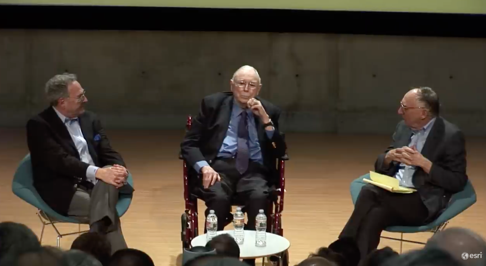

# 查理芒格：2020年雷德兰兹论坛对话实录

## 开场

**主持人**：欢迎各位，查理，欢迎加入我们雷德兰兹大家庭！

**查理·芒格**：很高兴能来这儿。

**主持人**：我一直很喜欢这种略显尴尬的开场时刻——你本该迈步上前，哦，看来该我先开口了。

女士们，先生们，这是一个难忘的夜晚。我有幸和查理见过三四次面，一次是在他汉考克公园的家里，偶尔他也会来和我们交流，真的非常难得。我就直接从一个有意思的问题开始吧，查理。你在很多地方都有投资，比如米尔谷、圣巴巴拉，你住在汉考克公园，有时还说帕萨迪纳是你的第二故乡，在克莱蒙特也有不少投资，现在又在雷德兰兹投资了。你为什么会投资雷德兰兹？你对这里有什么看法？是什么吸引了你？我能看出一种规律，圣巴巴拉、米尔谷、帕萨迪纳、克莱蒙特还有雷德兰兹，背后有什么共性吗？

**查理·芒格**：我对这个地区本来就有天然的好感。1943年我在加州理工学院读书时，就常来这一带。我的第一任妻子和妹妹都曾就读于斯克里普斯学院，所以我对这里非常熟悉。当然，我也接触过很多热爱这里大学的人，一开始就对这里情有独钟——比如山边的橙树，怎么看都喜欢。不过我在这里投资纯属偶然。几十年前，一群虔诚的犹太人搬到了我住的社区，他们都非常成功。

有一天，一个17岁的年轻人乔来到我家，给了我一本希伯来语的《希伯来圣经》。你们知道，芒格（Munger）听起来像德国犹太姓氏，在德语和英语里都有“小贩”的意思，所以乔觉得我可能会读希伯来语圣经，也不算完全离谱——但我当然不会。我和他聊了起来，一来二去就认识了阿维，看着他长大。阿维没上过大学，有轻微的注意力缺陷障碍，但智商极高。他为此很担心，我对他说：“阿维，别担心，你不需要上大学，肯定能成功。”现在他32岁了，有四个孩子，生意做得非常成功，事实证明我是对的，他确实不需要大学文凭。阿维，站起来挥挥手打个招呼呀！

阿维的公寓管理生意里有个主要客户，让他很不满意，我觉得他的不满合情合理。因为我很信任阿维，有一天就对他说：“为什么不甩掉那个客户呢？你帮我找些公寓吧。”我们看的第一批公寓就是我在这里买下的那些——就在阿拉巴马大道尽头，那些漂亮的公寓，环境真的很棒，住户里有一半都在埃尔斯特里工作。

**阿维**：有一天我正坐在那儿，他给我打电话说：“能出来聊聊吗？”我当时还不太清楚查理是谁，就说：“当然可以。”就这样，我们的友谊开始了，这段经历充满激情，也很有趣。

**查理·芒格**：我和阿维、他的合伙人鲁本一起，买下旧公寓翻新，其乐无穷。我们的理念是：如果房产得到妥善打理，就不可能没有收益。而公寓管理行业里，很多人只会榨取房产价值，只做最低限度的维护——这对长期投资者来说是愚蠢的错误。阿维和我都认为，买下房产后应该立即进行改善。我记得第一年左右，我们就在四个项目上花了60万美元种树。

这问题问得正合我意，但杰克，你可能是出于好意才这么问的。我知道这对我来说会有很好的回报，所以我不该邀功，因为从经济角度来说，种树也完全符合我的利益。当然，就算没有经济利益，我可能也会这么做，但我没法证明这一点。我们就是这样来到这里投资的。我喜欢这里的山、树和这里的人，也喜欢这里优秀的大学。一开始我并没有特意从全世界选中雷德兰兹，只是这个公寓项目刚好引起了我的注意。但我来之后才知道，这里有一家叫ESRI的公司。

我这辈子都是靠铅笔、钢笔和计算器过日子，性格沉稳，自从19岁后就再也没碰过微积分问题。所以我完全是个依赖老式[常识](../articles/22-思维模型讲义11-客观理性与常识.md)和简单算术的人，根本不了解像ESRI这样的软件公司。如果早知道有这家公司，我买这个项目时肯定愿意多花钱。能有这样一家不断招聘、规模庞大的雇主在这里，真是一大幸事。

阿维很聪明，我没建议过他，但他自己就制定了一套公寓租赁规则，比如租金担保、首付要求等等。不过ESRI的新员工未必都能满足这些要求，阿维一看情况，就把ESRI员工的这些租赁要求全免了。谢谢你，阿维，我真的很感激。但话说回来，他也不算多么高尚，这只是明智的商业决策——他自己可能都不知道，这到底是出于善意还是贪婪，反正怎么管用就怎么做。这些事情的成功，是多种有利因素共同作用的结果。

我和杰克一样，对设计和建筑很感兴趣，这纯属巧合。我叔叔毕业于哈佛建筑学院，我毕业于哈佛法学院，这辈子我自己建过不少房子，也参与过各种建筑项目，所以做和杰克的专业领域相关的事，对我来说更像是一种爱好。看到这么漂亮的校园和这么成功的公司，**我也深感认同一个观点：人生中想要得到某样东西，最可靠的办法就是让自己配得上它。把这个观点用到生意上，就是要真正善待客户。**ESRI能有今天的成就，显然是因为他们非常善于服务客户——这一点我又没什么功劳，毕竟善待客户比短期投机赚的钱更多。我可不想装作比实际更高尚的人，因为对我来说，符合道德准则的事，往往也能让我的钱包受益。这辈子我一直都是这样，我所学到的所有道德准则，恰好都和我的经济利益相契合，能处在这样的境地，我非常幸运。而能在ESRI这样的公司工作，你们也非常幸运，因为很多雇主其实并不合格。

## 关于公司收购与投资哲学

**主持人**：你和沃伦在职业生涯中收购了很多公司，考察过的公司可能有几千家。判断一家公司是否优秀，你们的核心[哲学](../articles/62-哲学-追求智慧是道义所在.md)是什么？我并不是说你们的收购都完美成功，我知道并非如此，但你们评估投资或收购标的时，遵循的核心原则是什么？

**查理·芒格**：我们看问题的方式很特别。**我们想收购的，首先得是本质上非常好的生意——就算是笨蛋来经营，也能勉强维持。然后，我们希望这家“笨蛋都能管好”的公司，能有一个极其优秀的管理者。一家好公司配上一个好管理者，这才会让我们心动，而且这种模式非常有效。**当然我们也会有例外，但很少。沃伦有时候会说，你必须在“好公司”和“好管理者”之间做选择——虽然这说法不太政治正确，但他更倾向于选好公司。他想要的是那种优势极强的生意。我当律师时，有个朋友说：“如果一家公司经不起一点管理失误，那它就算不上什么好生意。”我们就喜欢那种经得起很多管理失误的公司——但当然，我们不会真的去搞砸它。这就是我们的准则，虽然不能保证百分百成功，但肯定比大多数人的方法管用。有些好公司和好管理者，我们也会拒绝，因为时机或条件太苛刻。

我这辈子很幸运，但也有过一次经历：我曾担任一家非营利医院的董事长，那真是个烂摊子——竞争对手太多，市场地位太弱，问题一大堆。我说：“这对我有好处，能让我体验现实世界的挫败感。”接下来的40年里，真是苦乐参半，挫败感从来没消失过。就像沃伦说的：“如果一家公司本身就有‘艰难’的名声，就算遇到有机会展现才华的管理者，最终留下的还是公司‘艰难’的本质。”一旦生意开始走下坡路，就很难再翻身。判断一家公司或一个人，从来都不是容易的事。如果你的孩子让你失望了，那就只能祝好运了[笑声]。

## 关于商业合作与双赢理念

**提问者**：你之前提到过，和朋友做商业交易时，你有自己独特的方式。能跟大家分享一下你的理念吗？你是想追求全胜，还是有其他原则？

**查理·芒格**：不，完全不是。**人生中真正管用的，是“双赢”——这需要你体谅对方的想法和需求。只有双赢，才能长久持续。**你想想梅奥诊所的手术室，整个团队都互相信任，没有那么多钩心斗角，每个人都知道该做什么、想做什么，该找谁帮忙，各司其职。我们就是想建立这样的双赢关系。我在[好市多](../articles/48-好市多-把省下来的每一分钱都还给顾客.md)（Costco）担任董事，[好市多](../articles/48-好市多-把省下来的每一分钱都还给顾客.md)被认为是个“强硬的买家”，但我不这么觉得。很多小供应商靠和[好市多](../articles/48-好市多-把省下来的每一分钱都还给顾客.md)合作发了财，因为[好市多](../articles/48-好市多-把省下来的每一分钱都还给顾客.md)始终坚持双赢——对客户双赢，对供应商双赢，对员工也双赢。每个人都必须受益，否则就行不通。几周前彼得也在这里，有人见过他吗？他是我非常要好的朋友，也是个彻底的双赢经营者。我这辈子最不想与之竞争的人就是彼得，**他把客户照顾得无微不至。除了价格，我从没听过有人抱怨他的生意——其他方面都无可挑剔。**

## 关于慈善事业

**提问者**：拉里，我有个问题。事先声明一下，我们后台已经聊过这个话题，我觉得你对美国慈善事业的看法很出人意料，是我之前没考虑过的。能跟大家分享一下吗？

**查理·芒格**：我这辈子发现，欧洲没有美国这样的慈善文化。欧洲只有荷兰，人们会像我们这样经常性地大额捐赠。荷兰35%的土地都在海平面以下，他们为了修堤坝，必须互相帮助。而美国呢，拓荒者们当年在充满敌意、危险重重、气候恶劣的环境中开拓疆土，每个人都必须互相扶持。所以我认为，**荷兰和美国之所以有浓厚的慈善传统，都是源于共同的困境。这是美国的一大优势**。如果我们搬到意大利、法国或德国，可能会觉得那里的人很自私，因为他们没有这样的捐赠传统。我自己参与慈善活动多年，这已经成为我人生中很重要的一部分，也让我的生活变得更有意义。我觉得那些不参与慈善的人，其实是错过了很多。

**提问者**：你是怎么做慈善的？我注意到你有自己非常明确的方式，我觉得很有意思，也想听听你的分享。

**查理·芒格**：不是所有人都喜欢我的方式，因为我每天都会收到很多求助信，我通常都会直接丢进垃圾桶——尤其是不认识的人发来的。因为我知道，一旦开始回应，就会收到无数封信，永无止境。和所有人一样，我也有自己更感兴趣的领域。我做慈善时，总会把自己的想法和资金结合起来。我的态度有点像麦克纳马拉当年对中国人说的话——那时候中国还处于没有“中国特色”的共产主义阶段。麦克纳马拉代表世界银行给中国提供资金时说：“我想让你们知道，我推广的理念，比这笔巨额资金对你们的帮助更大。”事实证明他是对的——在共产主义中加入一点自由市场元素，就让8亿人（后来增长到10多亿人）摆脱了繁重的体力劳动和温饱不足的农业生活。他们以前的生活和中非人民差不多，而现在，中国已经有了庞大的中产阶级，人均GDP从300美元增长到1万美元，发生了翻天覆地的变化。理念的价值远大于金钱。当然，也要归功于中国人自己——就像那位老共产党人说的：“不管黑猫白猫，能抓住老鼠的就是好猫。”他们看到新加坡的华人，把一片疟疾横行的沼泽地变成了近乎天堂的地方，而当时中国的很多人还过着没有厕所、极其艰苦的生活。那位老共产党人说：“我想让中国变得像新加坡一样。”他真的做到了。我觉得他值得赞扬。我这辈子觉得，新加坡的发展是世界政治史上最有趣的案例之一，[李光耀](../articles/40-李光耀-芒格的另一尊半身像.md)很可能是有史以来最伟大的国家缔造者之一。当然，他有时候会用一些强硬的手段。他上台时很年轻，周围全是痛恨他的穆斯林，恨不得把他生吞活剥。他请求世界各国帮他建立军队，但除了以色列，所有国家都拒绝了。他心想：“我被穆斯林包围着，怎么能接受以色列的军事援助呢？”最后他想了个办法——接受援助，但告诉所有人，那些军事顾问是墨西哥人[笑声]。你看，这就是他成功的原因。他有一句没有文学美感但非常有道理的口头禅，反复说：“找到管用的方法，然后去做。”[李光耀](../articles/40-李光耀-芒格的另一尊半身像.md)就是这样，非常务实——找到管用的，然后执行。

**提问者**：我想追问一下，你觉得慈善是人的本能——天生就有帮助他人的意识，还是后天学到的品质？

**查理·芒格**：我觉得慈善的动机有千千万万。我观察到一个很有趣的现象：我认识很多品行不端但赚了不少钱的人，他们一开始捐款是为了炫耀，但20年后，他们真的变成了有爱心的人。**在很大程度上，你假装自己是什么样的人，最终就会变成什么样的人。**见过太多这样的例子后，我觉得“伪善”也并非全是坏事——这虽然不是什么普遍的观点，但我确实看到了伪善带来的很多好处。我自己也总是试着假装比实际更优秀一点——不过不会太过分。

## 关于阅读与自我教育

**提问者**：听说你每天读一本书，是这样吗？

**查理·芒格**：谢谢关心。我可能不是逐字逐句地读，更多是浏览。生活就是这么巧，总有人给我送书，甚至完全陌生的人都会寄书给我，所以我几乎再也不用自己买书了。年轻时，我会根据《纽约时报》的书评专栏订书，现在都是别人送的，而且往往送的都是我想看的。我很惊讶，有些人居然这么了解我的阅读喜好。

**提问者**：阅读对你的人生有什么影响？

**查理·芒格**：这对我来说太完美了。我不认为你把每个爱读书的小男孩拍拍头，说“约翰尼，尽情读吧”，就能把他变成亿万富翁——如果真有这么简单，亿万富翁就遍地都是了。但阅读确实给了我巨大的帮助。通过阅读和算术，你能吸收海量知识，而且可以按照自己的节奏来。有人跟你说话时，可能说的是你不想听的、已经知道的，或者语速太快、太慢，但阅读不一样，你可以自主掌控，简直是上帝的馈赠。**如果你擅长自我教育，阅读就是最好的方式。当然，那些大量阅读的人，会拥有巨大的优势。**

**提问者**：这对教育有什么启示？你兴趣广泛，通过各种方式获取知识和见闻，但你觉得未来教育的趋势是专业化，还是至少要保持通识教育？

**查理·芒格**：专业化对大多数人来说，是最稳妥的晋升路径。这就是为什么外科医生知道的越来越多，范围却越来越窄——这种专业化会得到回报。如果你结肠有严重的瘘管，你肯定不希望给你做手术的医生还在研究普鲁斯特或政治学。世界奖励专业化，这是可以理解的。但我从来都不喜欢这样，我热爱吸收新思想，是个狂热的读者。所以我决定，靠做自己喜欢的事谋生——也就是跨领域思考。我不建议其他人这么做，因为**最稳妥的方式还是深耕某个领域。在我们的体系里，如果你什么都懂一点、什么都不精通，很难成功**——就像你同时做耙草坪的活，肯定做不好。

**提问者**：我想拉里想问的是文科教育的作用，你怎么看？

**查理·芒格**：文科教育当然有巨大的优势。如果你学好了自己的母语，这会是非常有用的技能；掌握生活所需的基本算术，也是一项巨大的天赋。**只要你擅长语言和基础算术，就能应对很多事情**，不需要太多其他东西。我从加州理工学院毕业后，就再也没碰过微积分，70多年了，完全忘光了——不过我当年可是微积分高手。但语言和算术这些基础技能，永远不会过时。如果你不断打磨这些技能，就会学到比大学课程更重要的东西——学习的方法。当我想了解某件事时，就会自己去钻研。比如我在哈佛法学院时，搞不懂为什么文鲜明牧师邀请人们参加一个周末活动后，他们就变成了被洗脑的“僵尸”，一辈子都那样。哈佛法学院没人能给我解释清楚，所以我就说：“我自己来弄明白。”我妈妈教过我一首童谣，里面有句类似“自己的事自己做”的话，我就想着：“就算花很长时间，我也要搞清楚。”最后我终于弄明白了：**他们并不是刻意设计的，而是通过实践摸索出了一套心理技巧——把这些人集中在一个充满压力的环境中，同时运用多种心理手段，到了某个临界点，人的大脑就会“崩溃”，然后就被改造成了“奴隶”。**这是个很有趣的现象，但没人愿意谈论，因为它背后的含义让人害怕。不过这种“如果别人解释不了，就自己找出答案”的习惯，对我的人生帮助极大。当然，这也给我带来过麻烦——当你进入别人的专业领域，还表现得比他们更懂时，会非常得罪人。我现在比年轻时圆滑多了，但还是挺让人受不了的。

## 关于当下的政治、经济与投资环境

**提问者**：和十年前、二三十年前、四十年前相比，你觉得现在的经济形势怎么样？当下有什么值得关注的变化？

**查理·芒格**：最明显的变化是政治——人们比以前更互相憎恨了。以前我们也有政治仇恨，但现在双方的仇恨已经到了剑拔弩张的地步，非常丑陋。我觉得这么强烈的仇恨很愚蠢。**我这辈子发现，有两样东西对人的伤害极大：一是怨恨，二是仇恨。**对这个世界的现状心怀怨恨，对你有什么好处呢？我见过有人利用怨恨获取政治权力——比如阿道夫·希特勒，他对着德国人咆哮：“我们受了多少委屈”，煽动民众的情绪。我觉得我们双方都已经陷入了太多的仇恨和怨恨，这对心怀仇恨的人本身伤害极大。你可以对政治对手感到失望，但没必要憎恨他——毕竟，在某些方面，他可能和你一样疯狂[笑声]。

**提问者**：这让你对我们这个时代感到担忧吗？你觉得一切都会好起来吗？

**查理·芒格**：政治中一直都有这样的情况。杰斐逊和汉密尔顿就互相憎恨，富兰克林也有自己的怨恨和不满，但他努力保持理智。我觉得现在的仇恨实在太多了——仇恨会蒙蔽你的认知。每个人身上都有闪光点，就算是阿道夫·希特勒，对他的狗、情妇，还有治疗他母亲癌症的犹太医生，都非常好。所以就算你不喜欢别人的政治立场，也没必要对所有人都恨之入骨。

**提问者**：那经济方面呢？和十年前的大衰退相比，你现在担心经济形势吗？

**查理·芒格**：说到衰退，我这辈子可以说是顺风顺水，生活在最好的时代、最好的地方。想想看，1924年出生在美国内布拉斯加州奥马哈市的一个中产阶级白人家庭，我这辈子一直有巨大的“顺风”加持。从来没有哪个时代像这样，解决了这么多问题，治愈了这么多疾病，实现了这么普遍的繁荣和进步。如果2021年出生的年轻男性，还想拥有我这样轻松的未来，我觉得不太可能了，未来会更艰难，这几乎是必然的。我们很幸运，拥有了氢弹这种可怕的武器，却换来了60多年的和平——主要是大国之间的和平，小战争还是有的。我父亲刚打完一场战争，另一场战争就爆发了，而我们这代人则享受了长期和平。我连续70年投资美国企业，这70年非常顺利，成年后美股指数大概涨了40倍——[历史](../articles/60-历史-向死人学习.md)上从来没有过这样的时期。当然，扣除[通货膨胀](../articles/67-通货膨胀-悄悄征收的间接税.md)后，涨幅会小很多，每年大概2%-3%的通胀率，但实际回报率还是有7%-8%。现在的年轻人，未来70年还能有这样的回报率，还能没有大规模战争和重大危机吗？我觉得概率几乎为零。但也没必要绝望，毕竟我们最终都会死，如果连死亡都能接受，那一点经济衰退又算得了什么呢？

**提问者**：那短期来看，现在是投资股市的好时机吗？

**查理·芒格**：**我一直都在投资美国股票。伯克希尔的股票曾三次暴跌50%，但我并不太在意——这大概就是成年人生活的常态吧**。我很喜欢吉卜林《如果》里的一句话：“把成功和失败都看作骗子，一视同仁。”顺其自然就好，有时候运气站在你这边，有时候则不然，这都是游戏的一部分。所以我觉得，只要摆脱那些疯狂的仇恨和不切实际的想法，就没什么大问题。当然，要远离坏人——没人比我更擅长远离坏人了，但我不会憎恨他们。下一代人的日子可能不会像我这么轻松，杰克，就算你重新再来一次，可能也不会像现在这么成功。我可不想回到过去重新尝试。

## 观众提问环节

**主持人**：我们留了点时间给现场观众提问，查理，你愿意回答大家的问题吗？

**查理·芒格**：伯克希尔的年度股东大会上，我一直都接受提问——有时候我可能不回答，但我会听。

**主持人**：现场有麦克风和工作人员，如果大家有问题，举手示意，大声提问就好。有没有人想提问？

**观众1（艾伦）**：非常感谢杰克，能有机会见到查理这样了不起的人，真的很荣幸。查理先生，我很佩服你和你合伙人的幽默感，还有你们在公众面前——尤其是在股东面前的沟通风格。这种风格是后天培养的，还是源于你天生的乡土叙事能力，或是对世界的理解？

**查理·芒格**：我觉得我和沃伦天生就是这样的人。我们小时候都有点书呆子气，不算特别成功，但都热爱幽默，喜欢琢磨事情的运作原理。而且我们都很幸运，遇到了很棒的同事和合伙人。如果我们不是天生性格好，那可就麻烦了。**我觉得幽默感是天生的，后天很难培养。害羞也是一样，你可以稍微克服一点，但本质上还是与生俱来的。**我们在生意中找到乐趣，喜欢我们的生意，也喜欢和我们一起工作的人，更热爱解决问题——如果真的喜欢解决问题，这在人生中相当于多了20个智商点。

**观众2**：谢谢。我想问问，你二三十岁的时候，是什么让你感到兴奋？你当时看到了自己未来的可能性吗？是什么让你充满热情，最终走上了现在这条道路？

**查理·芒格**：我来自一个传统的家庭，父母婚姻幸福，兄弟姐妹关系和睦，父母的朋友也都是很棒的人。所以我小时候的成长环境非常好，沃伦就不一样，他小时候过得没那么开心。我的成功，一部分是天生的，一部分是得益于良好的教育和成长背景。我的祖父芒格，出生在极度贫困的家庭，父母都是内布拉斯加州一个小镇的教师，靠着两份教师工资，每天能从肉铺买肉吃。他小时候兜里只有五分钱，买的都是别人不吃的阿拉莫肉。从那么贫困的环境中靠自己打拼出来，他非常了不起。他是自学成才的，会说希腊语和拉丁语，后来成为了地区检察官、律师协会主席，最后还当上了联邦法官，在首府城市担任唯一的联邦法官近40年，人生非常成功。他生活节俭，还总在别人需要的时候伸出援手，是个很好的榜样。他为人坚定，一辈子滴酒不沾。**有人问他为什么不喝酒，他说：“为什么要把口袋里的钱拿出来，往嘴里塞一些对自己没好处的东西？”**你能理解我为什么崇拜祖父了吧。他还不太政治正确，我父母结婚时，他看着教堂里的宾客，举杯祝酒时说：“看到婚礼上双方都是同一类人，我总是特别乐观。”这话虽然政治不正确，但他的观点很容易理解。我身边有这样的好人，又恰逢和平年代，真的很幸运。我的财务成功，并不是因为天赋异禀——我脑子不错，但远算不上天才，能取得这么大的成就，是因为我学到了一些基本的“技巧”，很多都是从祖父这样的人身上学到的。

**观众2**：能具体说说这些技巧吗？

**查理·芒格**：**比如我总是习惯逆向思考。**我在空军当天气预报员的时候，怎么应对新任务呢？天气预报员就像读X光片的医生，很孤独——半夜在飞机库里对着气象图分析，给飞行员提供预报，很少和其他人交流。我当时想：“我怎么才能害死这些飞行员？”大多数人不会这么问，但我想知道最容易让他们丧命的方式，这样才能避免。最后我想明白了，只有两种可能：一是让他们遇到飞机无法承受的结冰天气，二是让他们飞到机场关闭的地方，导致燃油耗尽。所以我对这两种风险格外警惕。如果科比·布莱恩特身边有我这样的人，他可能现在还活着——那样的死亡太愚蠢了。这种[逆向思维](../articles/21-思维模型讲义10-逆向思维与检查清单.md)的技巧，我可能就是从祖父那里学来的。**祖父会对我说：“游泳多久都可以，但要离岸边近一点。”**听起来很简单，但充满智慧。很多代数问题也是这样，逆向思考就能轻松解决，正向思考反而很难。

比如有人问我“怎么帮助印度”，我会先想“怎么最容易伤害印度”，通过这种[逆向思维](../articles/21-思维模型讲义10-逆向思维与检查清单.md)，能得到更好的结果——也就是关注它的脆弱点。我还有很多这样的技巧，比如高中和大学参加预备役军官训练团（ROTC）时，学到了射击的技巧：先打一发远的，再打一发近的，然后就能精准命中。我从来没真的发射过迫击炮或炮弹，但这个思维技巧我用了一辈子——**比如判断风险范围时，先找出上限和下限，再精准定位。**我年轻时当律师，有个客户在南加州拥有一片丘陵牧场，爱迪生公司想穿过他的土地铺设新的地役权，他们已经有了一些地役权。客户聘请了橙县顶尖的房地产评估师，认为这片地役权值25万美元，但评估师说：“抱歉，你的牧场只值12.5万美元。”客户来找我说：“查理，你能跟这个老评估师讲讲道理吗？”我分析了一下，发现评估师犯了错。他是按照评估学校教的方法，二维思考：先算出每英亩的价值，再乘以面积，再考虑地役权对剩余土地的损害。但我对评估师说：“你得用三维思维，上帝给了我们三个维度。”爱迪生要建的是大型输电塔，而这片丘陵地的合理开发方式是沿着山顶规划，把输电塔建在山谷里，会彻底破坏土地的规划——这才是最大的损失。评估师却不以为然，说：“我不会改变我的结论。”我对客户说：“你得解雇他，我给你找个会思考的评估师。”**最后我们拿到了60万美元——这其实并不难，因为爱迪生的工程师们本来就是用三维思维考虑问题的。**很多人就像那个评估师，根本不懂自己的业务，因为他们不注重思维技巧。如果你能养成回归本质的思维习惯，就能看到很多简单的真相。

**观众3（约书亚·吉莱斯皮）**：谢谢拉里、杰克和查理。查理，我和你一样，对投资被低估的资产很感兴趣，但我特别关注的是那些不打算上大学的低收入年轻人。对于这个群体，你有什么具体、实用的建议，能帮助他们改善生活？

**查理·芒格**：我觉得你不能只给年轻人一些泛泛的建议，就指望他们自动成长，就像杰克种的树，不是随便浇点水就能发芽的——很多人天生就没有“发芽”的潜力。**我的方法是：找到那些有潜力的人，大力培养他们。沃伦说得更精炼：“我们是把丝绸变成丝绸钱包（我们只做锦上添花的事）。”**[笑声]我们不知道怎么把任何材料都变成漂亮的钱包，只能培养那些本身就有潜力的人。我发现，这些人要么能很快理解你说的话，要么永远都理解不了。他们的思维已经被固有模式固化了，就算觉得你可能是对的，就算你很富有而他们不是，他们还是觉得自己更懂——他们被自己的思维“技巧”困住了。而人生中一个重要的技巧，就是摧毁自己最珍视的想法。我一直都在这么做，会定期审视自己最认同的观点，看看能不能推翻一个。

**观众3**：能举个例子吗？

**查理·芒格**：有个很好的例子。我们公司有个高管，人非常好，工作也很出色，是个精算师，也是我们核心团队的成员。我们认识他的妻子和孩子，都很喜欢他。后来他得了严重的癌症，慢慢走向死亡。在他生命最后的两三周里，他签下的再保险合同非常糟糕——这是我们的一个错误，我再也没有犯过这样的错。人很容易因为太爱朋友，而不愿意在他病重时撤换他，但作为管理者，我们有更重要的责任。[李光耀](../articles/40-李光耀-芒格的另一尊半身像.md)也遇到过类似的事，我非常敬佩他。他在新加坡执政几十年，他最好的朋友犯了道德错误，后来自杀了。朋友的妻子来找[李光耀](../articles/40-李光耀-芒格的另一尊半身像.md)和其他好友，说：“在中国文化里，自杀是极大的耻辱，我们能掩盖这件事吗？”[李光耀](../articles/40-李光耀-芒格的另一尊半身像.md)说：“不行，我们不能掩盖。”他为了维护某些标准，非常坚定。我不知道他做得对不对，但我怀疑他是对的——毕竟他建立了一个国家，而我只是建了个商场。

## 关于慈善项目与建筑理念

**主持人**：我想再问几个关于你在加州大学圣巴巴拉分校（UCSB）慈善项目的问题。你是怎么做到的？

**查理·芒格**：我有个朋友，是多希尼的最后一个孙辈的遗孀——多希尼是加州[历史](../articles/60-历史-向死人学习.md)上重要的石油大亨。她在圣巴巴拉有一个1800英亩的牧场，沿着海岸线有两英里的土地，没有风，气候完美，景色优美，还有鳄梨树和私人湖泊，简直难以置信。但她卖不出去，因为圣巴巴拉的人对土地规划限制很严格，没人愿意公平对待她的财产，而她确实需要卖掉它。我说：“这事儿不难。”我给了加州大学7000万美元，用这笔钱买下了这个牧场——**我知道大学不受当地分区规划规则的限制。就这么一瞬间，7000万美元变成了价值10亿美元的财产，虽然我没得到任何好处，好处都归了大学，但我愿意帮助大学，尤其是能用7000万美元换来10亿美元的价值，这只需要一点基本常识。**现在大学有了建学生住房的土地——不仅是教职员工和研究生住房，上周我刚得到董事委员会的批准，要在UCSB建一座本科生宿舍。我会出资20%，剩下的由大学以3%左右的[利率](../articles/66-利率-资金的重力与估值的温度.md)贷款。这座住房能在5英亩的土地上容纳5000名学生，而且会是世界上最好的学生住房。一个95岁、对住房几乎一无所知的老头，怎么敢说能在5英亩土地上建5000人的住房，还能做到世界最好？其实我之前建过其他住房，没看起来那么无知。我的想法是：建一座10层的大方形建筑，最顶层设计成“空中艺术小镇”，层高很高，能欣赏到绝佳的风景；下面的楼层采用船舶建筑理念，前七层用预制混凝土，地基用现浇混凝土，顶层用好事多建仓库用的巴特勒钢构件——这种设计非常管用。这座建筑里的每一个技巧，我之前都在其他地方用过，只是把它们整合起来而已，听起来很荒谬，但其实很合理。

**主持人**：为什么平均智商160、整天思考未来的大学，自己想不到这样的办法？

**查理·芒格**：这是个很重要的问题。大学并不是在所有事情上都聪明，**它们有自己的盲点，比如土地短缺。加州大学洛杉矶分校（UCLA）、伯克利分校都缺土地——作为世界上最重要国家里最重要州的顶尖大学，怎么会傻到让自己陷入土地短缺的困境？答案就是官僚主义**。总需要有人站出来，做那个“清醒的成年人”，指出这种明显的愚蠢。我祖父会说，让自己变得比必要的更愚蠢，是一种罪过，我对此深表认同。自己脑子里的无知如果能轻易消除，却不去消除，那才是真的愚蠢。这个住房项目一定会实现，我们都能亲眼看到。把船舶建筑理念用在陆地上，其实并不难。我看过设计图，非常巧妙，每个学生都能看到海景。还有一件事：加尔维斯顿的大学建筑规范要求，学生宿舍每人需要多20平方英尺的空间，才能有自己的私人睡眠区域。为了节省20平方英尺的增量成本，就让一群互不相关的人挤在一个房间里，甚至互相呕吐——要知道这座建筑能存在200年，这简直是疯了。所以我设计的宿舍，每个学生都有自己的房间。董事委员会上有个和蔼的女士说：“天啊，我大学时要是有自己的房间，整个大学生涯都会不一样！”这种挤在一起的设计太荒谬了，我要改变它。

**主持人**：你没学过建筑，怎么想到这些设计的？

**查理·芒格**：我不想向你这样的完美主义者承认，但我专挑容易的问题解决。别人把学生塞进一个房间，只需要多20平方英尺就能解决这个缺陷，这种愚蠢的问题太容易修正了。我试过解决难的问题，发现难太多了，所以我只找容易的问题。

## 关于收购喜诗糖果的经历与收尾

**主持人**：你早年收购了[喜诗糖果](../articles/50-喜诗糖果-一堂关于定价权的课.md)，对吗？为什么会做这个决定？

**查理·芒格**：当然。我想坦白一件事，能给大家一些鼓励——这能说明我们年轻时有多愚蠢，差点就错过了这笔好交易。**当时的收购价是3500万美元，喜诗糖果有1000万美元的闲置现金，每年盈利400万美元，其实并不算贵。而且它是一个标志性品牌，由一位70岁才创业的女士创立，背后有很有趣的故事。最后谈判时，我们和对方的报价差了10万美元，沃伦当时总说：“该死的，我只出20.125万美元，一分都不多。”我们差点就放弃了，最后勉强达成了交易。**这是一个非常明智的决定，因为我们刚好够聪明，没错过这个显而易见的好机会。这也告诉我们一个道理：我们一开始都很愚蠢，要一直努力保持理智。如果伯克希尔由我们刚创业时的那个水平来管理，现在早就一团糟了。我们一直在学习，如果没有收购[喜诗糖果](../articles/50-喜诗糖果-一堂关于定价权的课.md)，我们可能也不会持有现在这么多[可口可乐](../articles/47-可口可乐-心理学护城河范本.md)的股票——摆脱那份愚蠢，带来了巨大的连锁反应。

**主持人**：是谁说服你们的？

**查理·芒格**：我有个很棒的合伙人，他是石油工程师。他对我和沃伦说：“你们都错了，这是一家非常棒的公司，你们太谨慎了，这样的公司很少见。”是他改变了我们的想法。所以你看，我们能买下[喜诗糖果](../articles/50-喜诗糖果-一堂关于定价权的课.md)，纯属侥幸，刚好够聪明，没错过这个简单的好机会。不过现在我们比以前聪明多了，我很庆幸这一点。

**主持人**：你之前跟我说过“走正道”的说法。

**查理·芒格**：那是沃伦的名言，我非常喜欢。沃伦总说：“要永远走正道，因为正道人少。”

**主持人**：女士们，先生们，今天的对话到此结束，谢谢大家的到来！[掌声]

（全）
